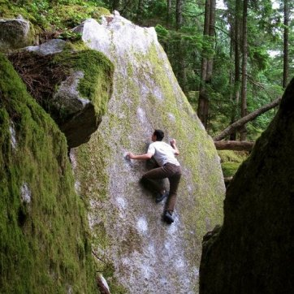
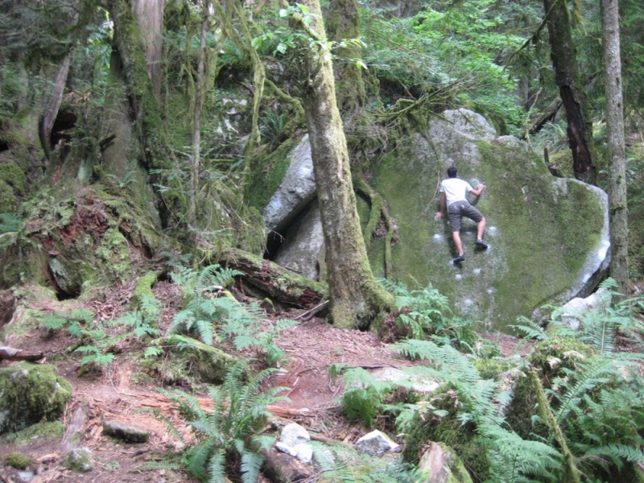
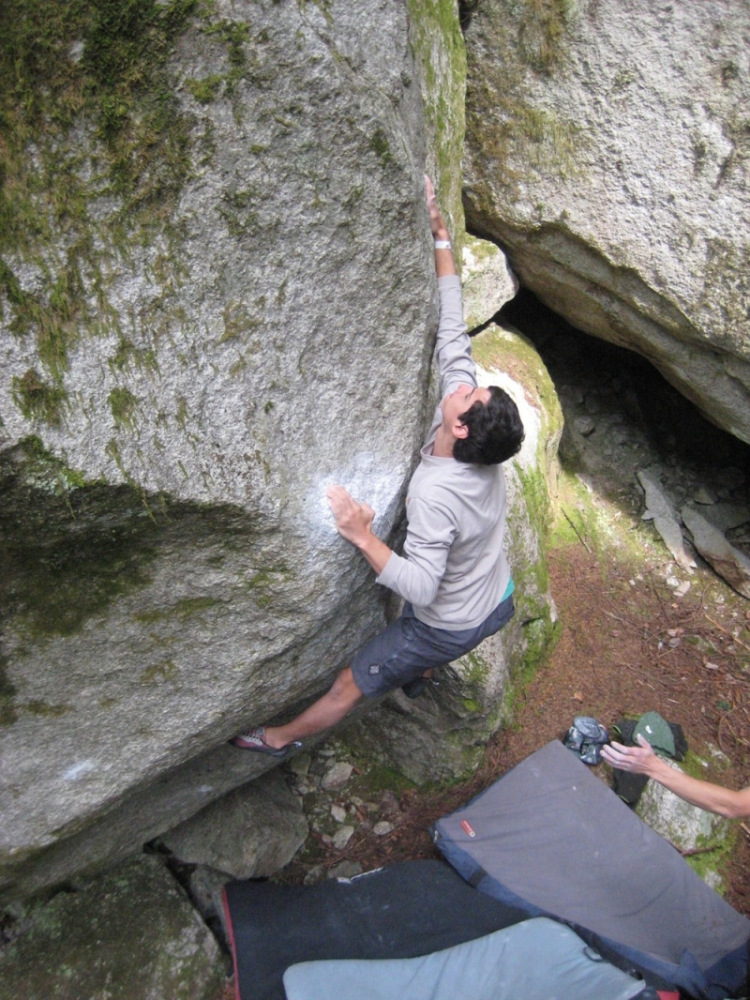

Squamish was the perfect place to beat the summer heat. The forest canopy provides continuous shelter from sun or rain (because it rains year round), keeping the boulders dry and cold. In Squamish friction is your best friend and a trip should be planned around good weather reports.

(Black Slabbath, V7)

(Some warm up slab)

We climbed every day because the weather is unpredictable and spontaneous and you never know when it might rain. A rest day at any of the nearby lakes is also a possibility if it gets too hot to climb. In the summer it stays light until 10:00 or even later, so climbing days are very long. In total, my brother and I managed to climb on 16 of our 18 days in Squamish. We ran around the forest trying to get on as much as possible, jumping on classics, highballs, lowballs, and unnamed climbs. We climbed with a great local Squamish crew and a few friends from back home. They showed us some hidden gems and gave us tips about food and the town. The Squamish style is very different from what we have back home. It's much more balancy, technical and cryptic. It took a few days of getting used to, but we were excited to learn new movement. By the end we managed to snag some classics including Gibb's Cave (V8), Sesame Street (V9), Worm World Low (V10), Velcro (V10), No Troublems (V10), The Fury (V10), The Egg (V11), and countless others. We had a great time and can't wait to get back.

(Velcro, V10)
