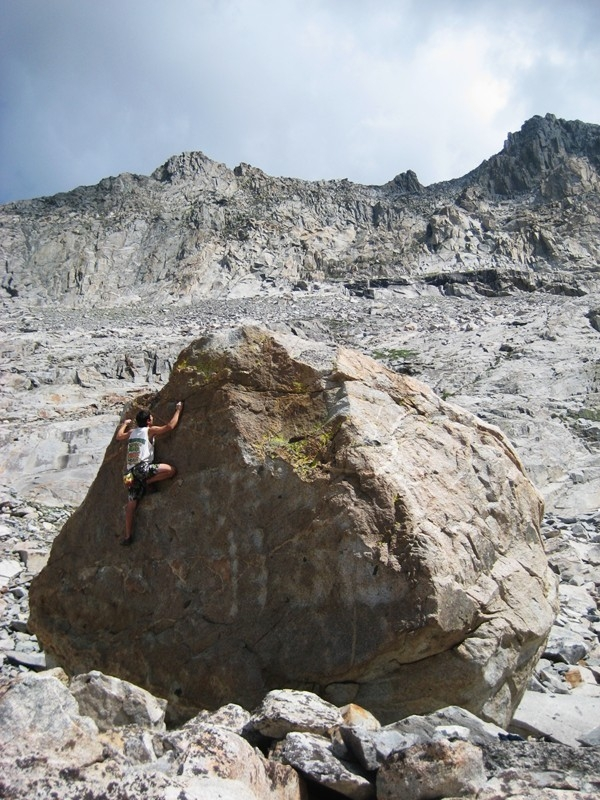
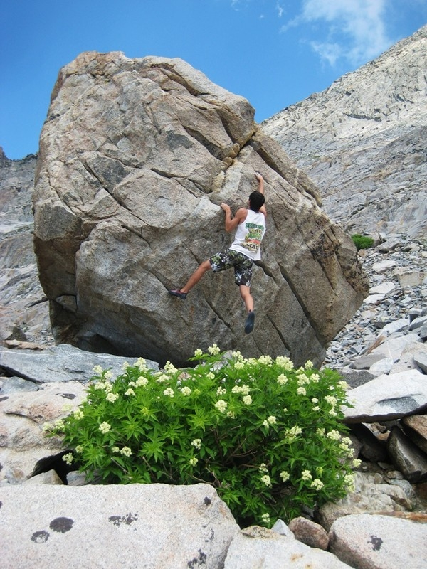
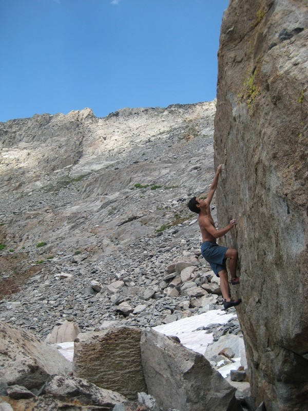
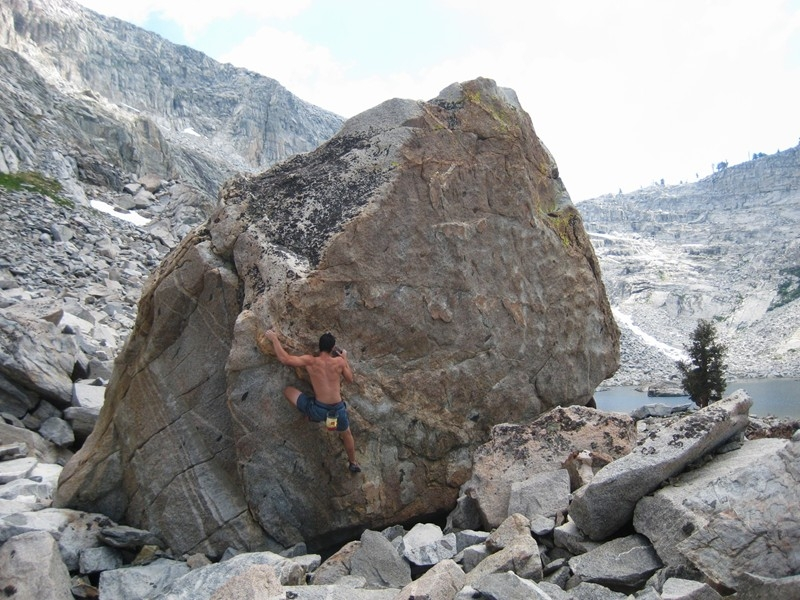
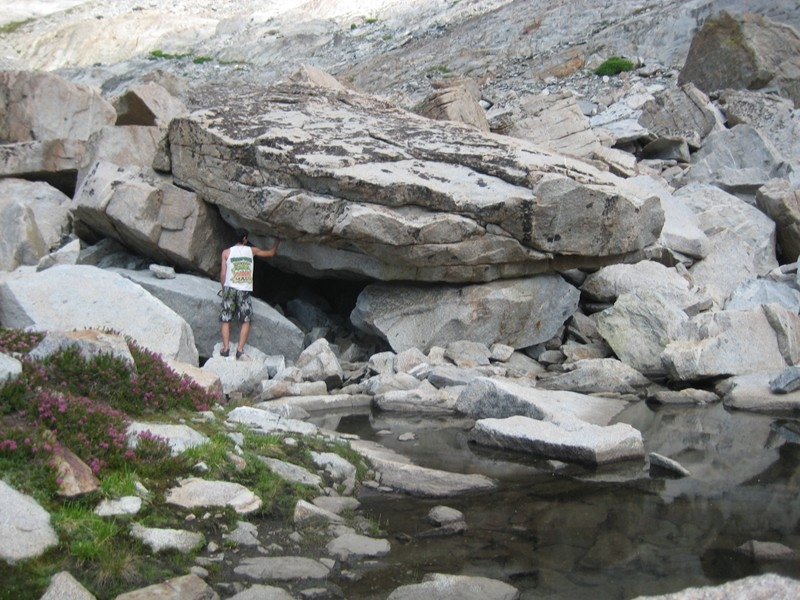

It is hard to find a climbing place during the summer in California that isn't uncomfortably hot. My brother and I headed towards the beautiful mountains of Sequoia National Park in search of new climbs and cooler temps.

There were no boulders near the campsites but just 3 miles up the trail to Eagle Lake we found ourselves amidst a boulder field. The temps were perfect because the hike up to Eagle Lake placed us at around 10,000 feet. In the surrounding area of Eagle Lake were large granite boulders slightly polished by the snow, which was still lightly present in August.

The boulders had proud and obvious lines up solid crimps. The bouldering was fun and in the most beautiful of settings.

