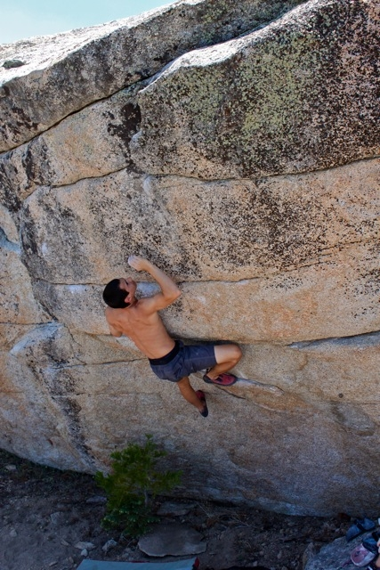
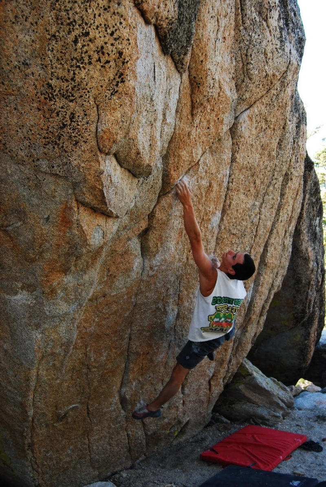
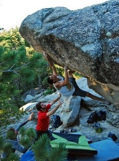

This last Saturday I headed up to Black with a few friends from the gym. We made our way to Hop Scotch early in the morning. It is a great looking climb but unfortunately the temps were not as ideal as we had anticipated even in the early morning. I was forced to make quick work of the sloping crimps before they became too greasy to climb. I sent Hop Scotch (V9), and made my way over to the Tour de France boulder.

Tour de France (V10), climbs up slanting bullet patina slots into a throw and finishes with a interesting top-out 18 feet off the deck. I sent Tour de France after a quick lunch break and we made our way over to climb some moderates.

Isaac Palatt put up a few moderate FAs in the area on the Africa boulder. He than showed me a project he had spotted last weekend when he was up. He said it might be very difficult but I found alternate beta that made the climb doable. I sent the project after much cleaning. It is now called Captain America (V9), and should be in the new Black Mountain guide book coming out soon.

(All photos by Isaac Palatt)
