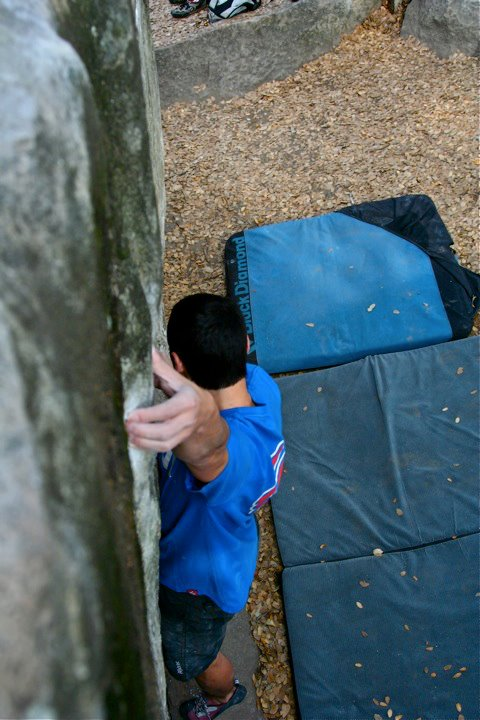
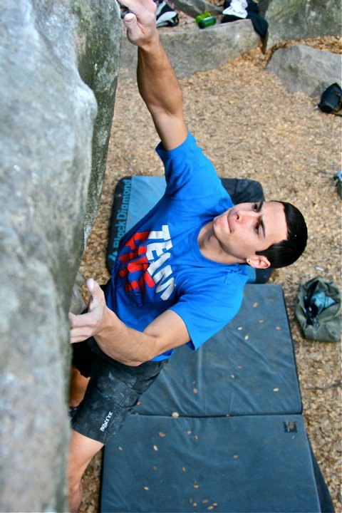
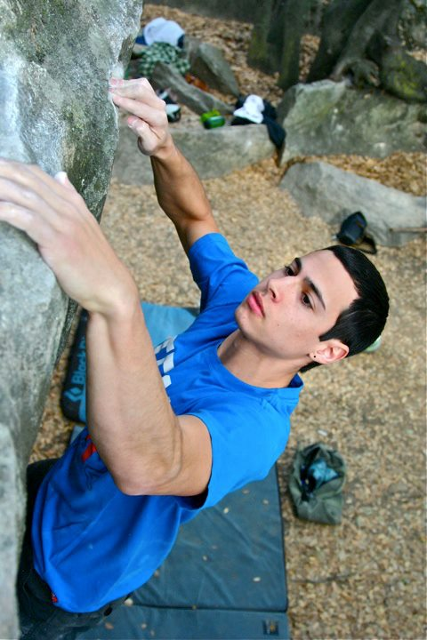
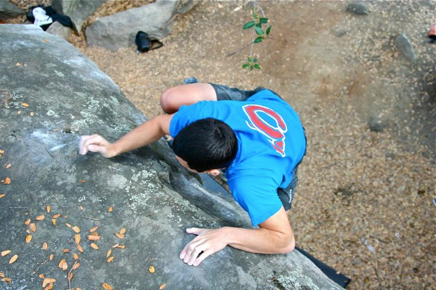
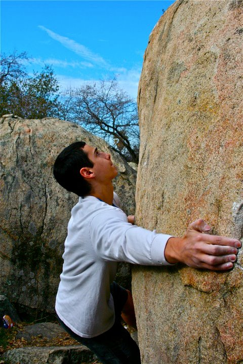
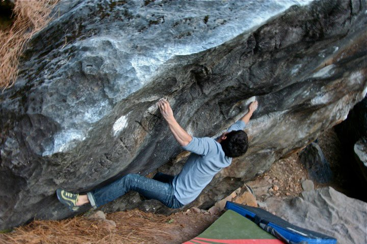
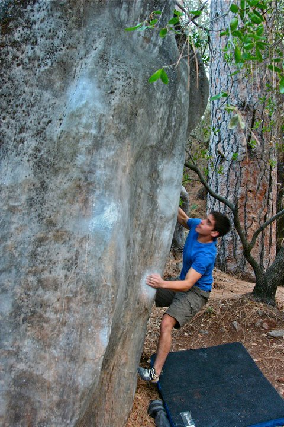
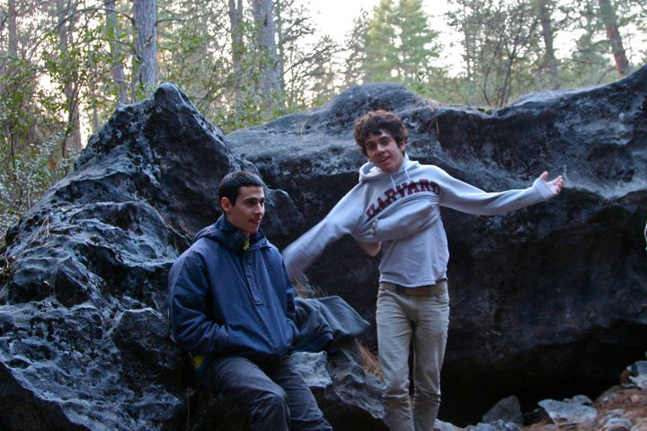

I had to take advantage of this winter's unusually dry weather, so before school got chaotic I decided to check out some new local bouldering areas. The first was Rocklin, a set of boulders hidden in a small park right off a main road. The rock was good, but the lines were not necessarily top notch. Regardless I was happy to get outdoors and snag a couple of fun climbs.

About a week after Rocklin, the local climbing crew (Alex, Damien, Theo and I) headed to Columbia Boulders. These boulders are located in a community college's arboretum, and offer a fairly large amount of climbing material - not to mention a lot of potential for development. For most of the day we stayed at the Triple Cracks boulder, which houses one of California's best V6s.

After playing around on some of the sit starts and variations on that boulder we decided to hike around and check out some more climbs. At the end of the day we realized that this area was definitely worth coming back to.
