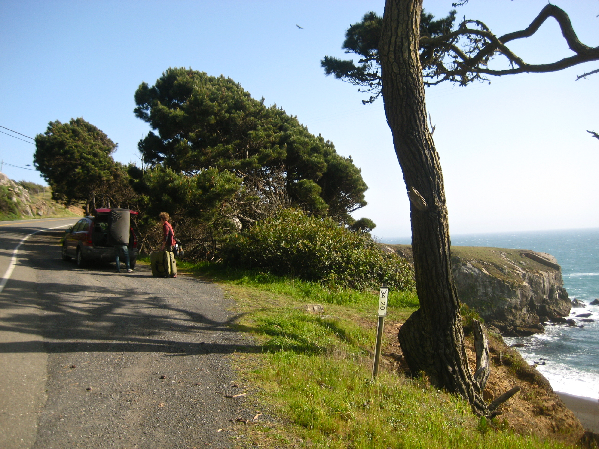*On Saturday I headed to Fort Ross with Damien and Alex. Fort Ross is a little known coastal area in Sonoma County; home to a single beach side boulder. It has many classics ranging from V1 to V10. Below are some photos from the approach.*

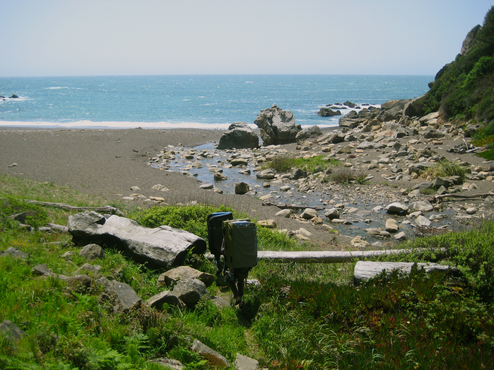

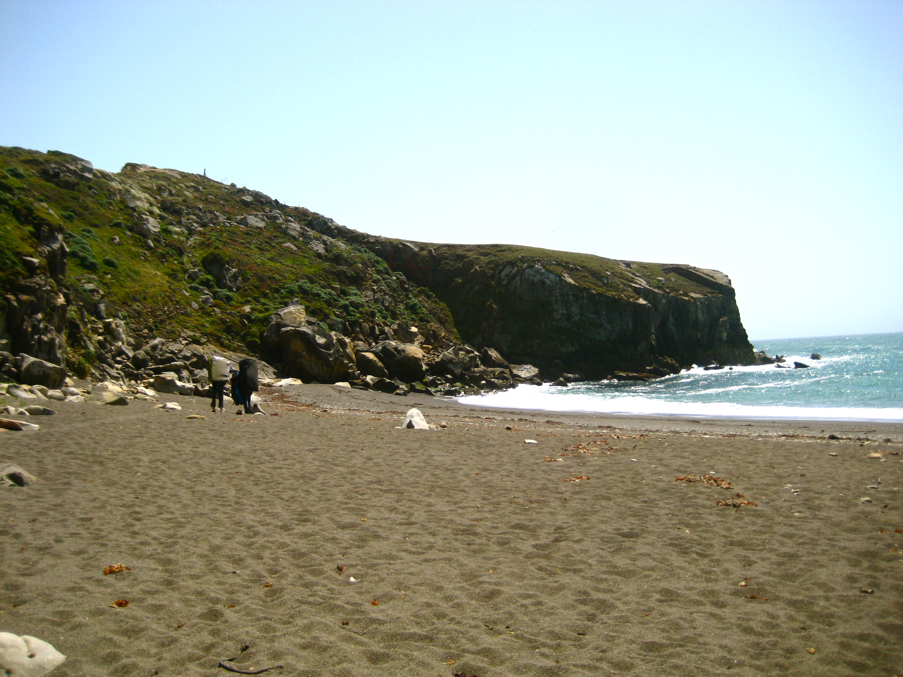

When we got to the boulder Damien pointed out that the sand is exceptionally low. 

This made the fall a few feet longer, and it also exposed some rocks right under the landing.

(In the photo below Alex is standing on the rock that is normally buried by sand)

The only line which we could safely try was the direct face climb Fort Rossta, V6. 

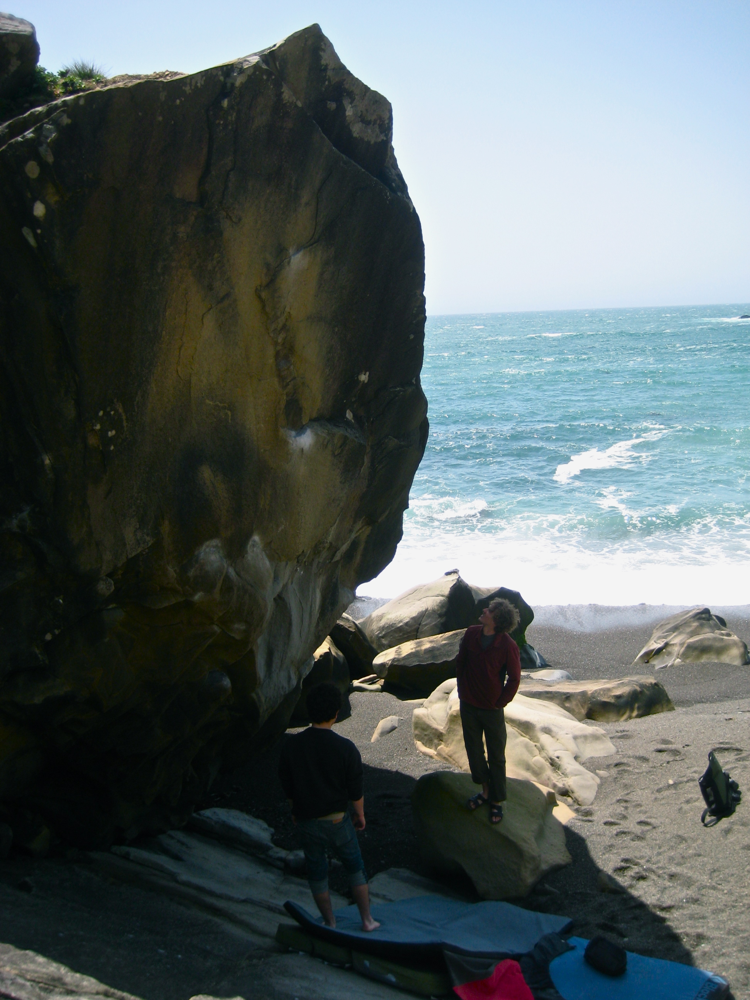*(Trying to figure out the best pad arrangement)*By the end of the trip we all managed to send the climb. Here are some more photos:

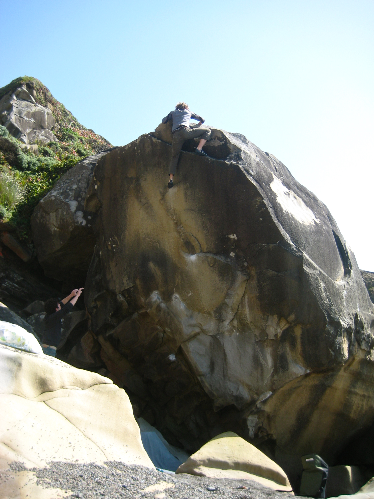*(Alex topping out)*

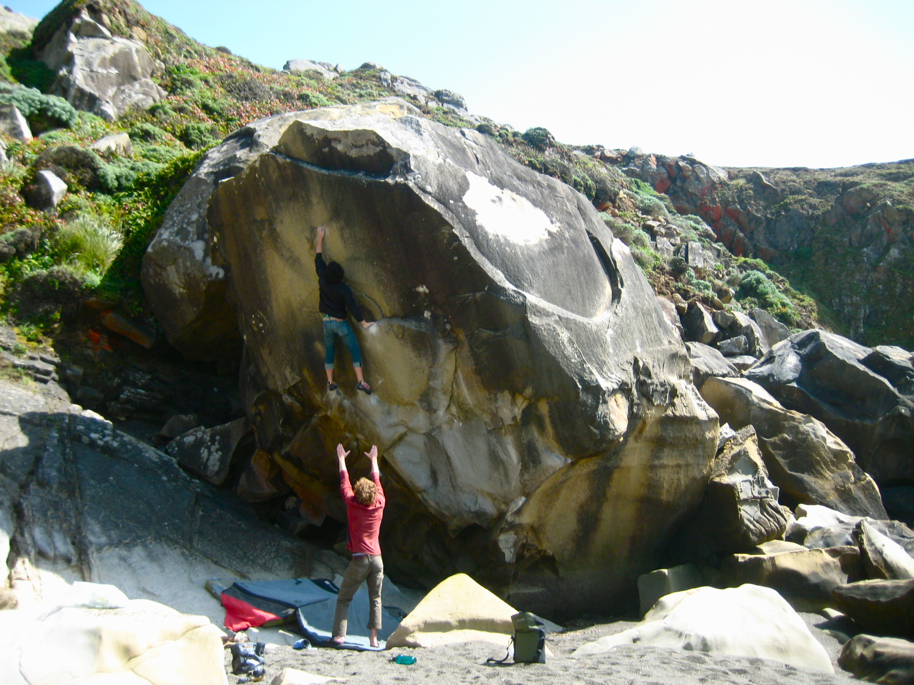

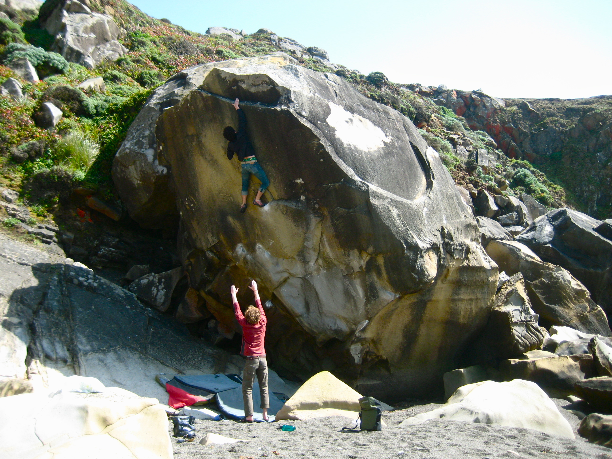

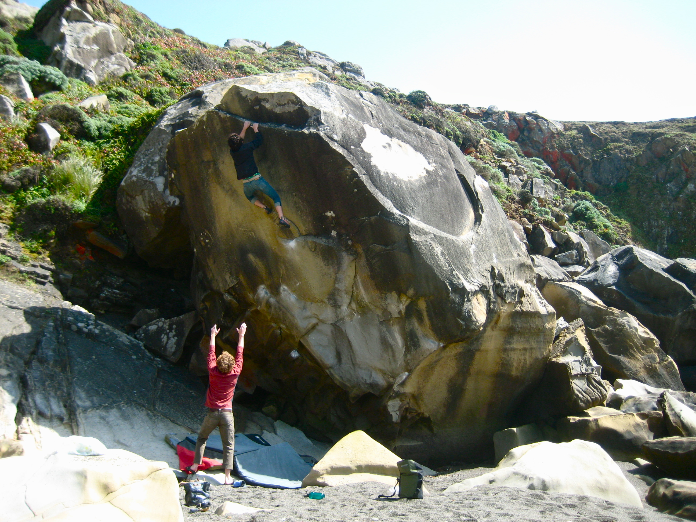

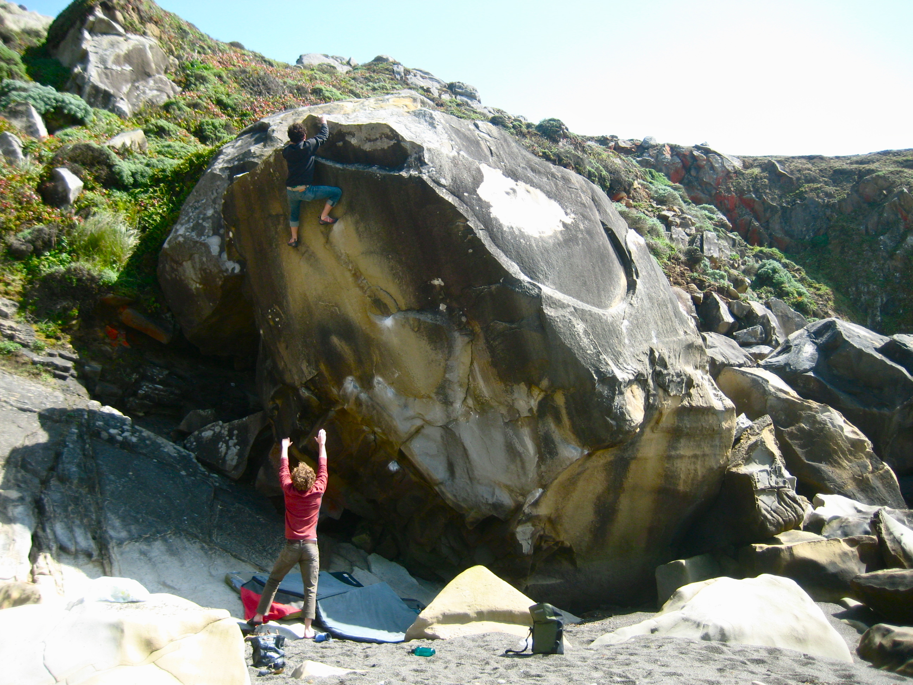

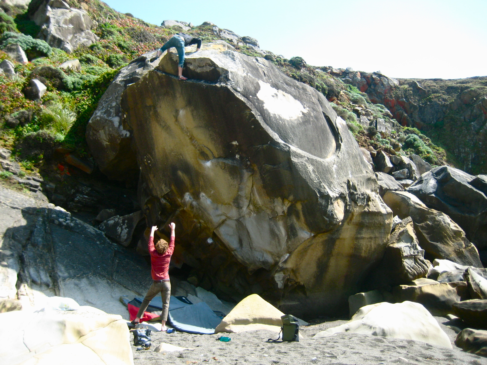

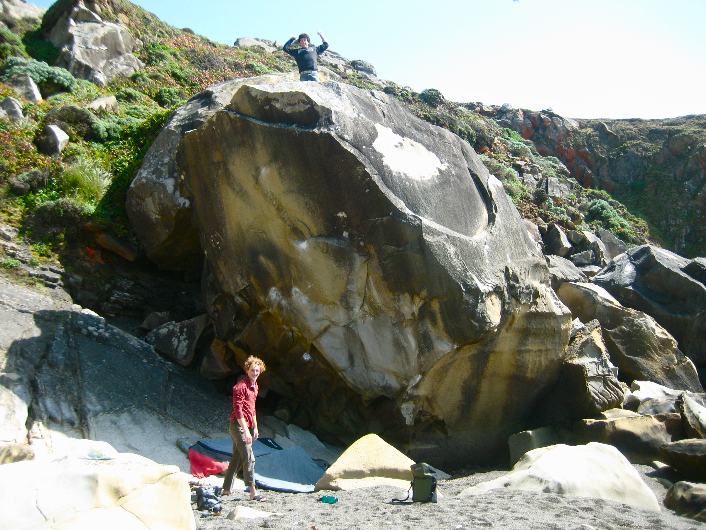*(Damien sticking the crux move, and topping out)*

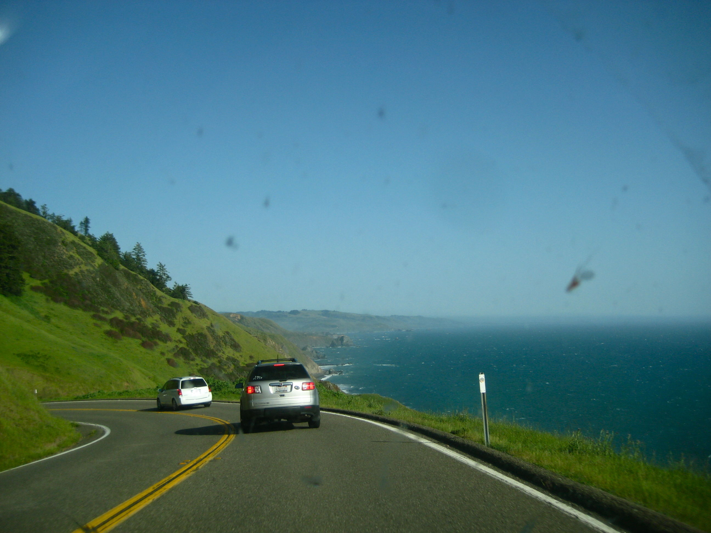*(The drive back)*

\- Eden

