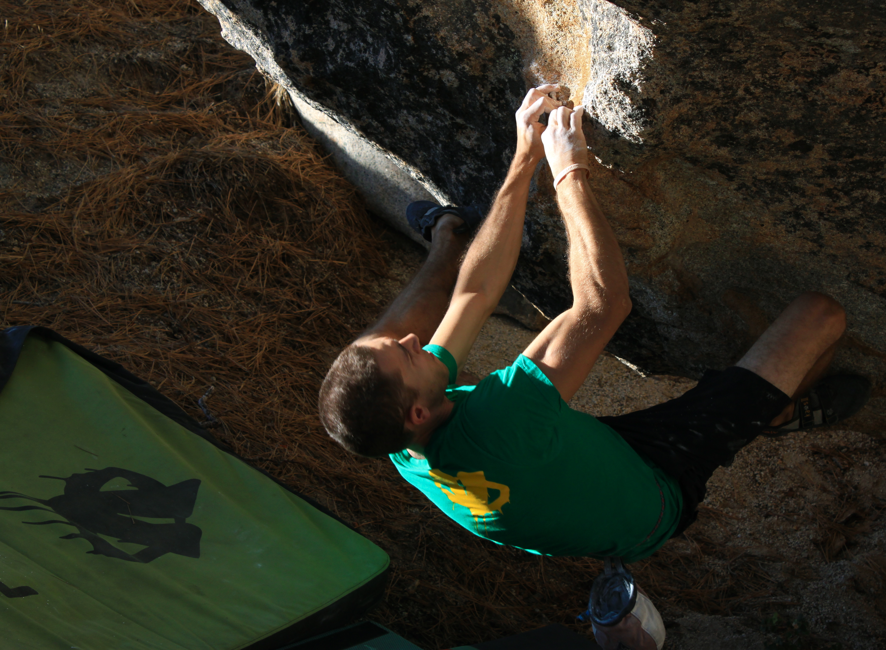
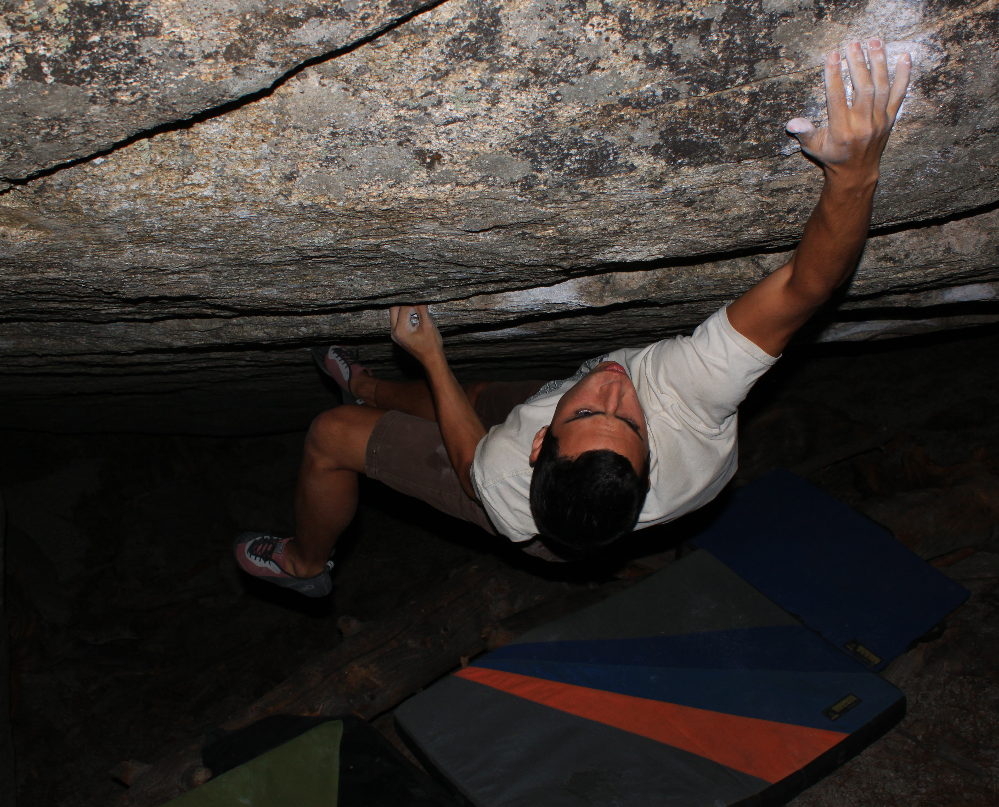
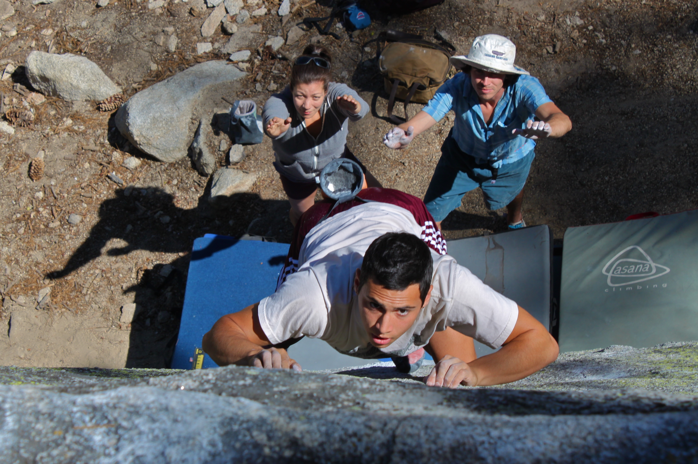
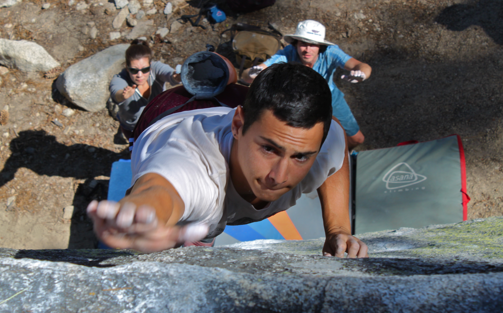

We headed up to Black around midday on Friday. We set up camp, then headed out to Captain's Junk boulder. The giant block is home to many climbs ranging from V2 to a V12ish project. It kept us busy for the afternoon.

As the temps cooled we headed over to the steep underside of the boulder. Brett, Isaac, Itai and I worked on the Vhard project. We managed to climb the problem to the crux move, which we all got close to sticking. But when the lack of light and strength kept us from making any further progress we decided to get on back to camp for some food and rest.

By the time we woke up the next day and headed out to the boulders it was already very hot. We made a pit stop at the boulder basin to jump on Big Greeny and also met up with some more LA folk.

When we were done at the boulder basin we headed up to Born Under Punches, a fun V7. After a lazy session of the problem we ventured further up and in to the mountain to a new location. But by then the heat of the day was at its peak and our energy was waning. Marina, Jake, Brett and Will ended the day by working on a reachy V4, while Isaac worked on his own possible FA slightly up the hill. By the afternoon the heat, along with the thought of Chipotle forced us to pack up and head back home.

\- Eden
