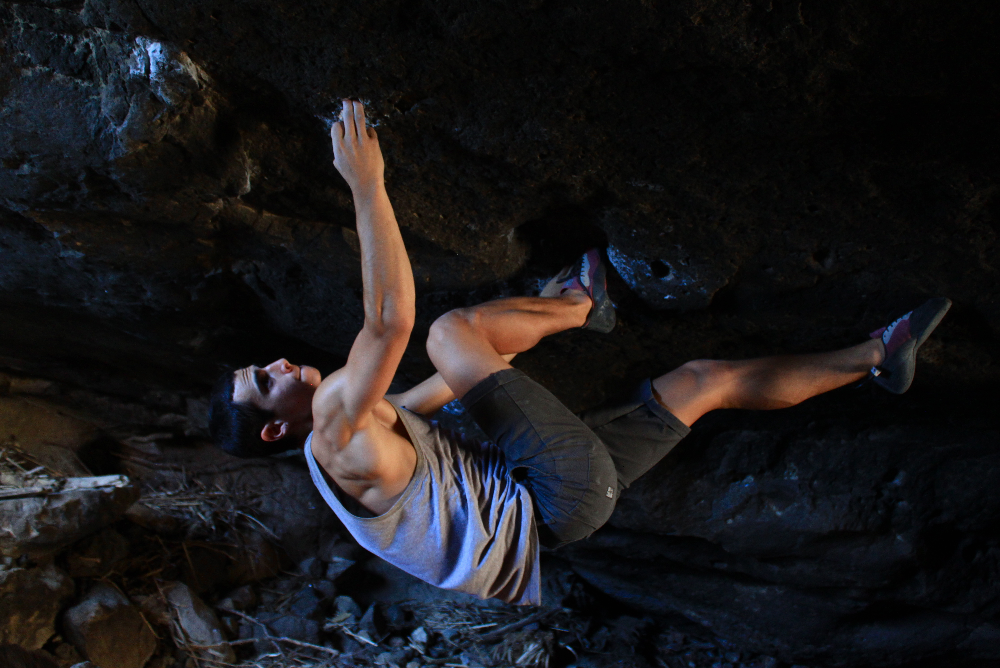

Climbing in 90 percent humidity, 90 degree weather is less than ideal. Isaac, Miguel, Mariana, Eden and I discovered this yesterday while trying some of Malibu Creeks's finest climbs. We still enjoyed the day despite the heat. Here are some photos:

*Eden holding on to the sweating 2 finger roof pocket on Chubs (V11)*

*Itai trying his luck on the Malibu Project (V14).
Photo by Isaac Palat*

*Miguel climbing up the Malibu classic, Ghetto Blaster (5.13b)*

*Isaac figuring out the sequence on a Project*

*Isaac pulling through the next move on the Project*

*Itai, on a roof climb (V3)*

*Itai climbing another pocket overhang (V5)*

\- Itai
