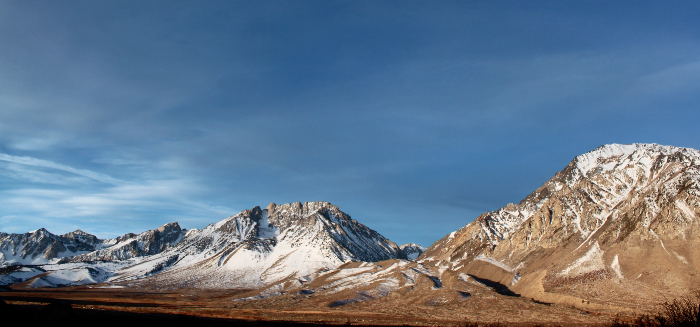
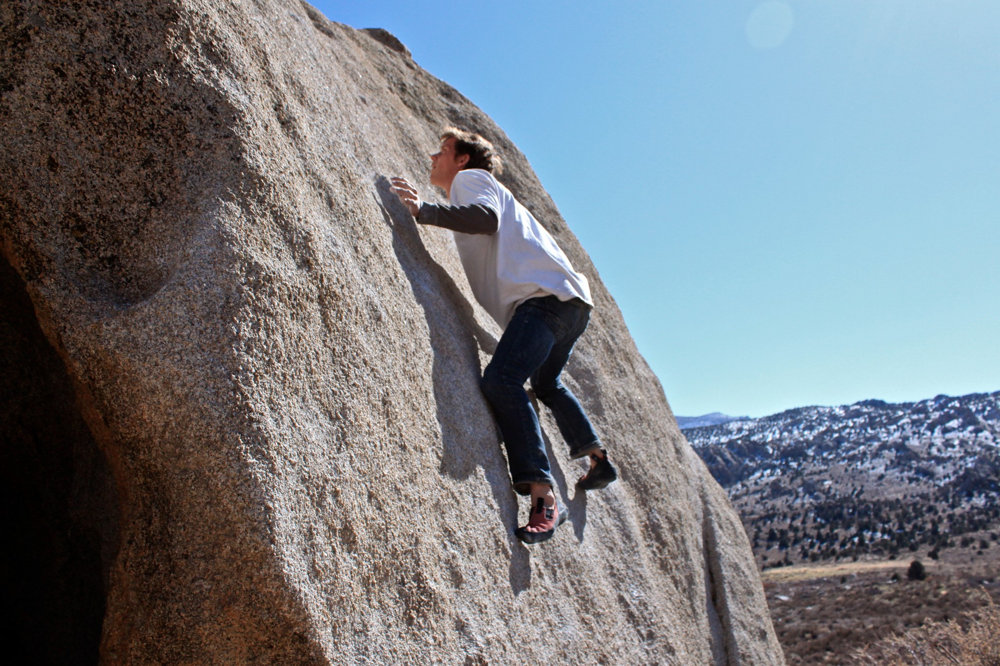
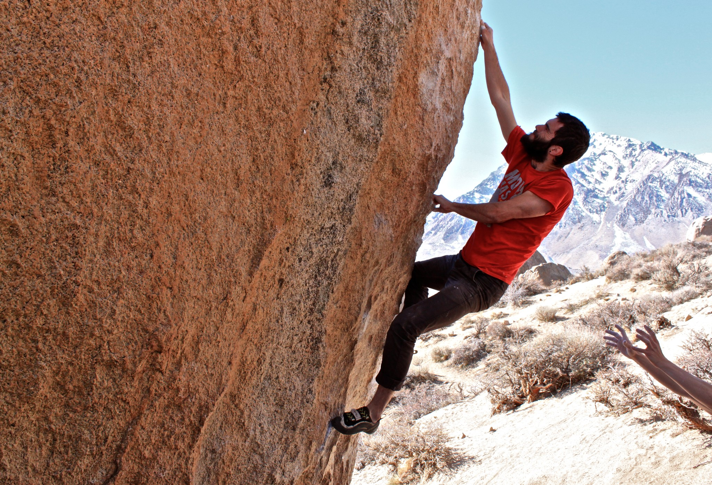
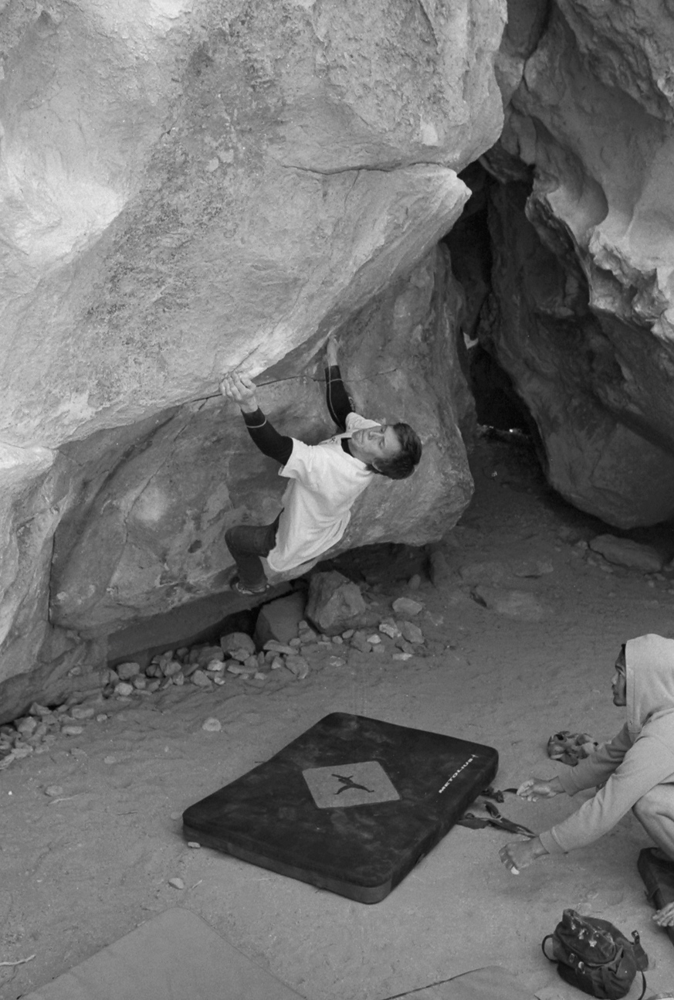
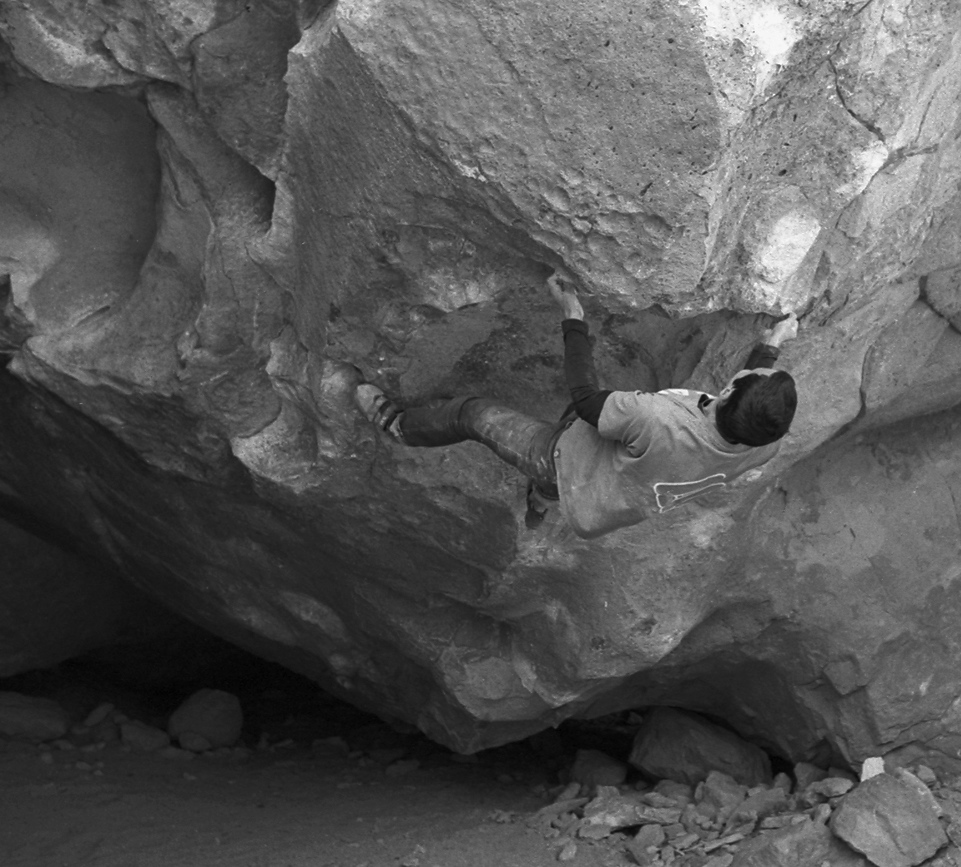
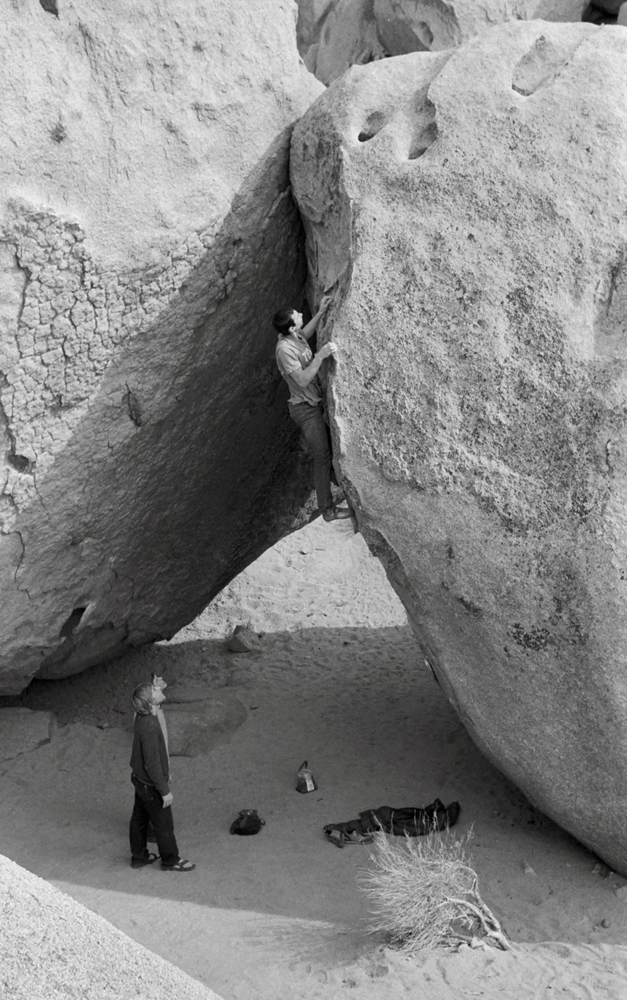
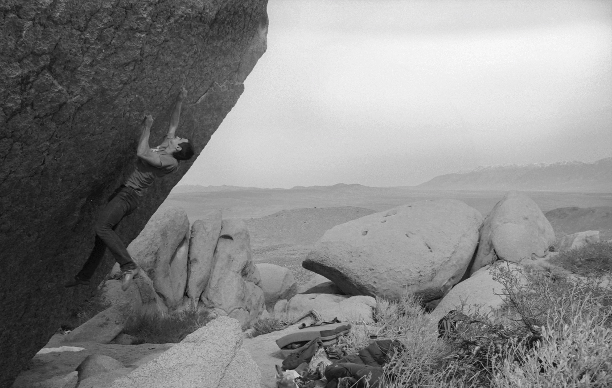

It was a beautiful three-day weekend. The weather was perfect and people flocked to Bishop from all over the country. Despite the large crowds, Jason, Nick, Cody and I still managed to have a great time climbing, heckling and stargazing. Here are some photos of the trip:

*The Sierras*

*Cody, testing his balance on Robinson’s Rubber Tester (V0)*

*Jason snagging the pinch on Soul Slinger (V9)*

*Nick warming down on the jugs of China Doll (V0)*

*Cody, with a last minute send of Last Dance (V9). Photo credit: Jason Morgan*

*Itai, with a last minute send of Standing Kill Order (V10). Photo credit: Jason Morgan*

*Itai finishing up a flash of Queen Sweet Nectar (V9). Photo credit: Jason Morgan*

*Itai attempting The Swarm (V13/14). Photo credit: Jason Morgan*

Thanks for driving, Cody! 

Thanks for the awesome photos, Jason! 

\- Itai

