What started out as a daydream in some lecture hall this spring quarter finally materialized. Cody, Jason, Eden and I set out early one morning to drive nearly the entire length of Interstate 5 towards Squamish, British Columbia.

*The 1,439 mile route from Jason’s house to Squamish.*

My brother and I were returning to the summer climbing Mecca after three years. The little town of Squamish (Skwxwu7mesh) is located about an hour North of Vancouver, at the end of Howe Sound. The adjacent 1,368 foot granite dome, called the Stawamus Chief, boasts some of the world's best boulder, sport and trad routes - and great summer weather, or so we hoped!

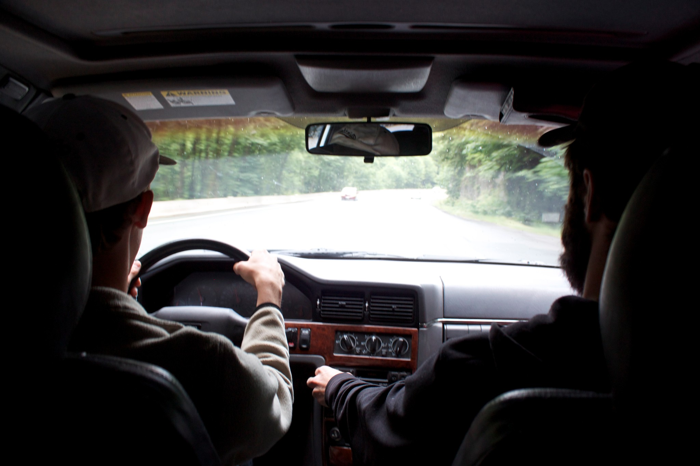*Driving. Driving. And more driving.*

After three days of driving, and short stops in Mt. Shasta, Eugene, Portland, Seattle and Vancouver, we arrived in Squamish, our home for the next 20 days. Unfortunately, we only got one dry day of climbing before a storm came through and held us hostage at the Squamish Adventure Centre. Although we were pretty upset about the weather, it gave us time to recover from injuries. My brother and I had taken several months off due to elbow tendonitis, and Jason had just suffered a (hideous) toe injury. 

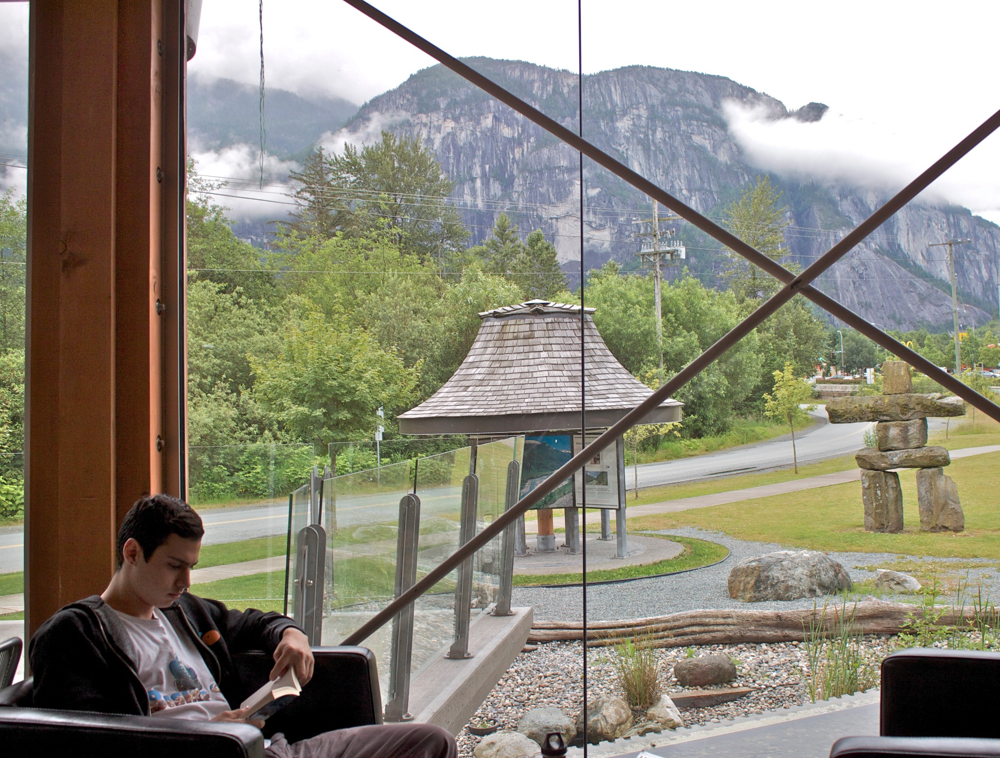*Eden, reading in the Adventure Centre with a view of the soaking wet Stawamus Chief.*

Six days, 15 bottomless coffees and 1,000 pages of reading later, the sun made its much-anticipated appearance, and with it came the rest of our climbing crew. Joe, Sara, Adam and Alex (from Australia) all began to arrive. 

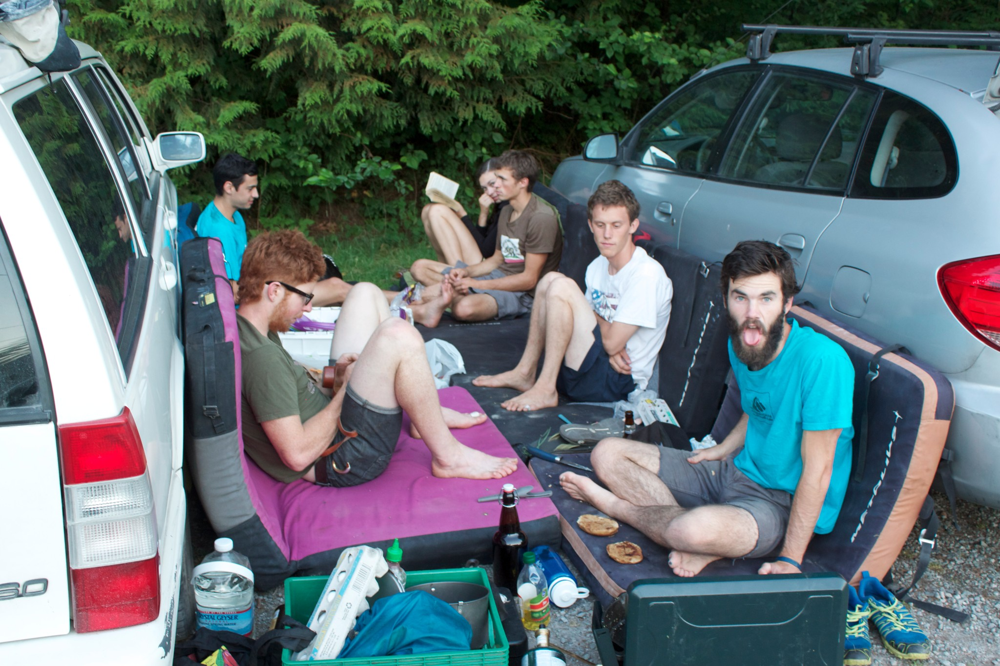*The Lucky Dundees (sans Alex) enjoying the usual crashpad siesta.*

The rest of the trip was thankfully uneventful. We enjoyed the remainder of our days in Squamish climbing boulders, sport and trad as well as eating samosas, breakfast burritos and sweet potato gnocchi. 

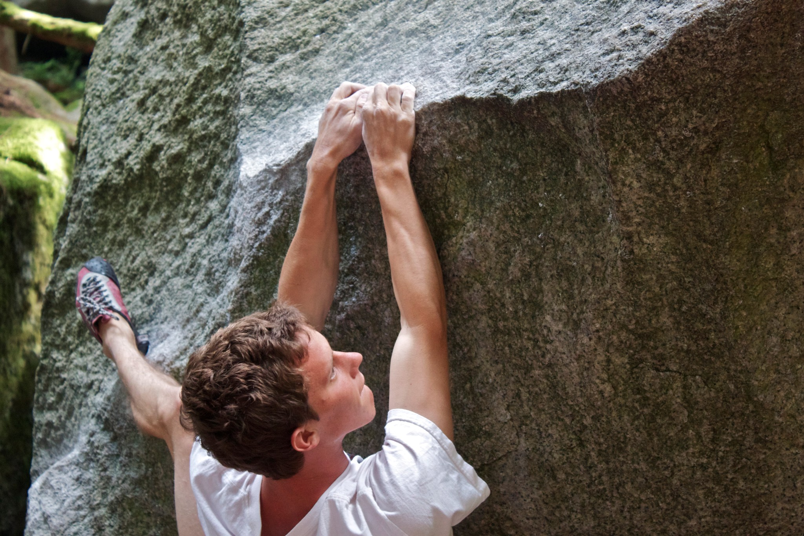*Cody, making it look easy on the Squamish classic, Easy in an Easy Chair, V4.*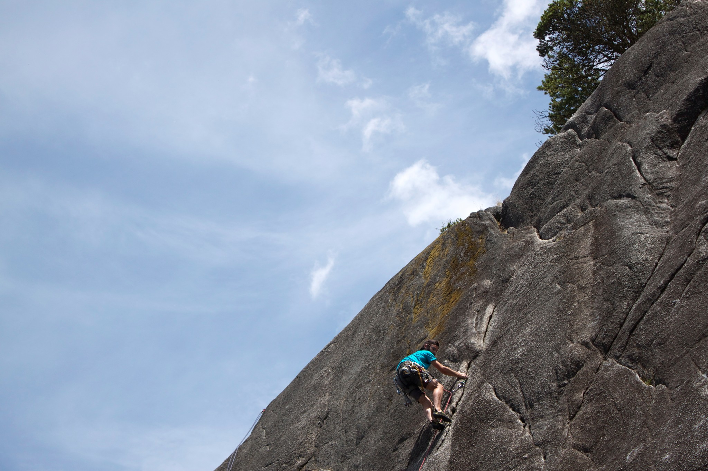*Jason, walking up a route on the Burgers and Fries wall.*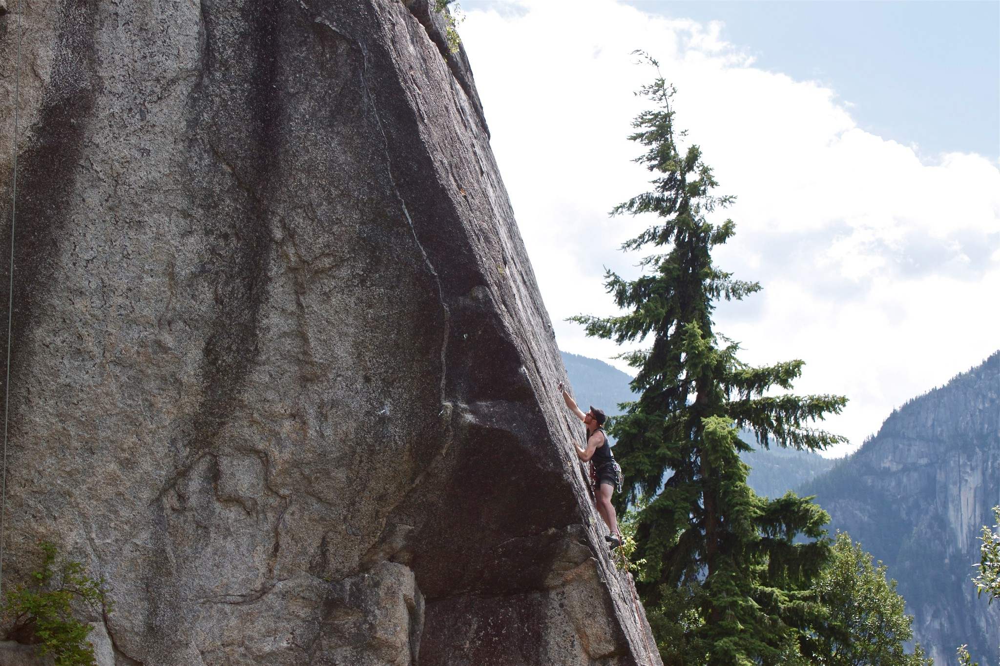*Adam placing some gear at the Smoke Bluffs.*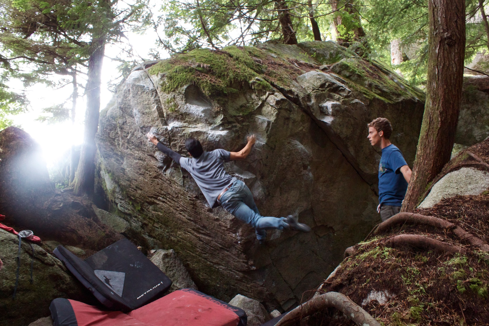*Itai, at full reach on Minor Threat, V6.*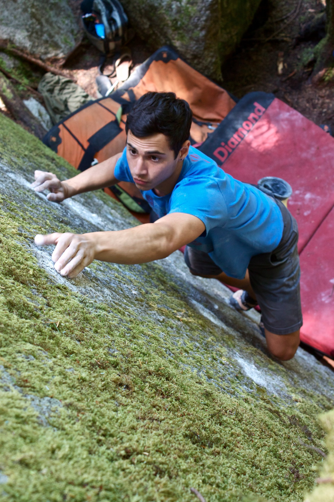*Eden, focusing in on the tiny crimps of Black Slabbath, V7. Photo by Sara Roudebush.*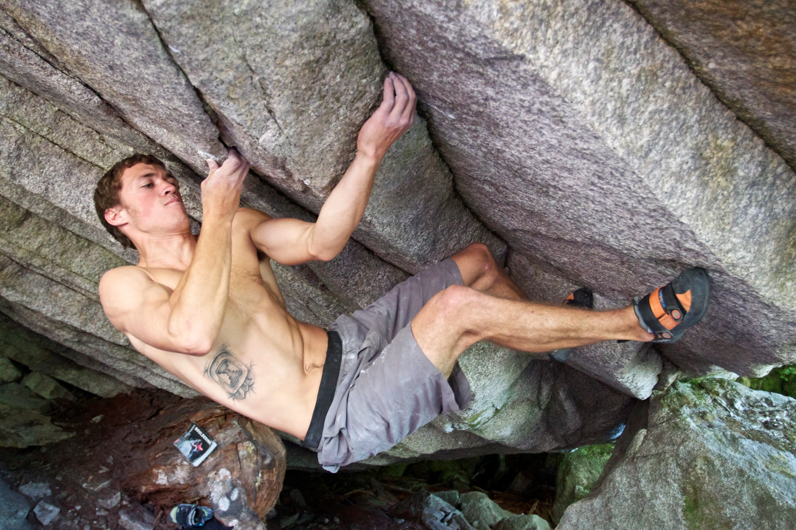*Joe, trying hard on Black Magic, V13.*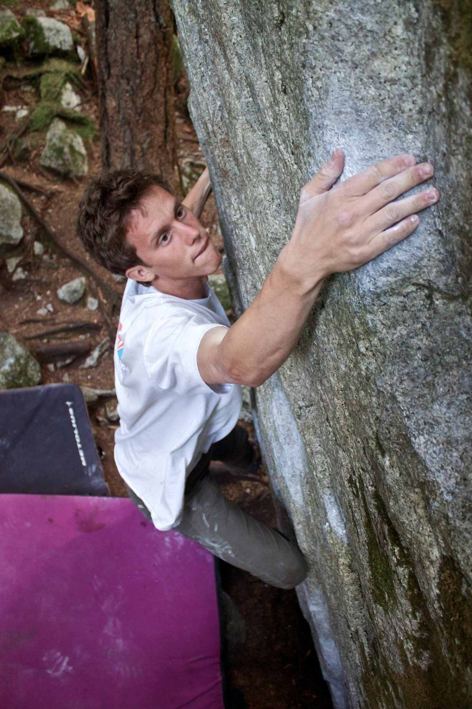*Cody, slapping a sloper on Trad Killer, V4.*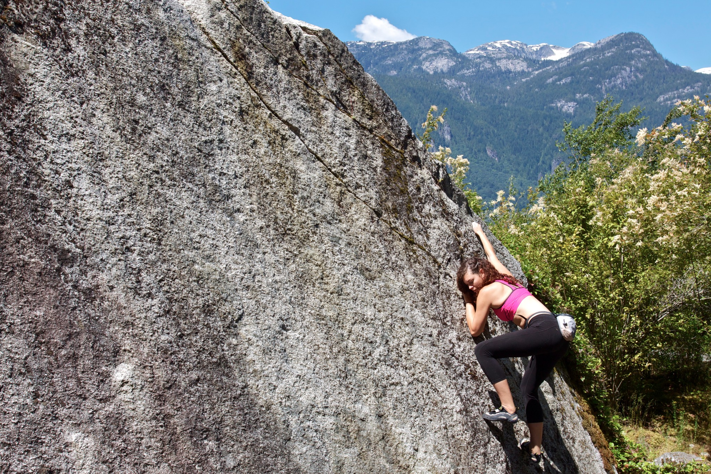*Sara, slabbing it up at the Apron Boulders on a sunny morning.*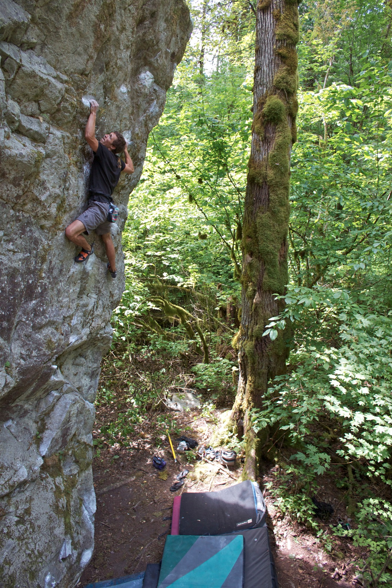*Joe, climbing high in Paradise Valley on Enchanted, V4.*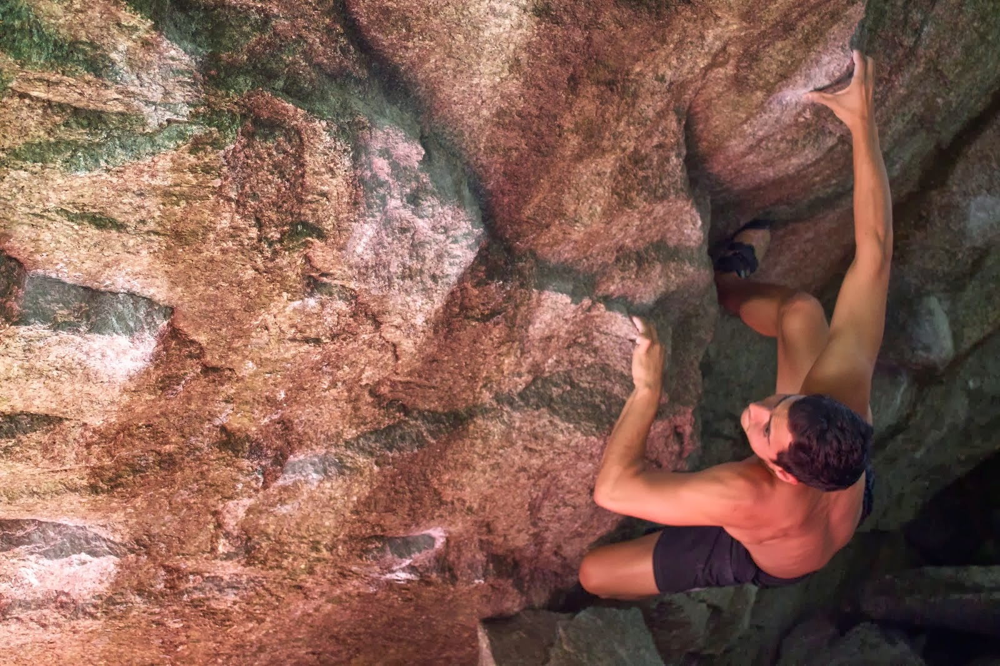*Eden, moving through the crux on Golden Boy, V7.*

¡Gracias a todos los involucrados en este increíble viaje!

And as always, thank you Cody for driving.

-
- Itai

P.S. 

If you would like to learn the correct pronunciation of Skwxwu7mesh, the indigenous name for Squamish, please visit: [Skwxwu7mesh_Pronunciation](http://en.wikipedia.org/wiki/File:Skwxwu7mesh_Pronunciation.OGG)

