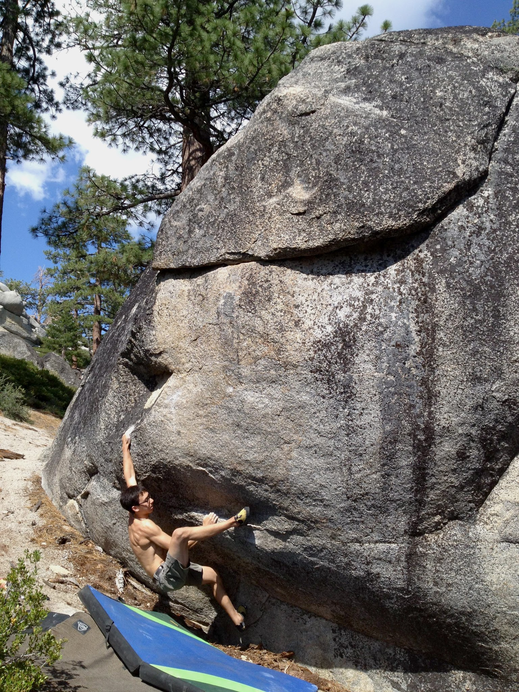
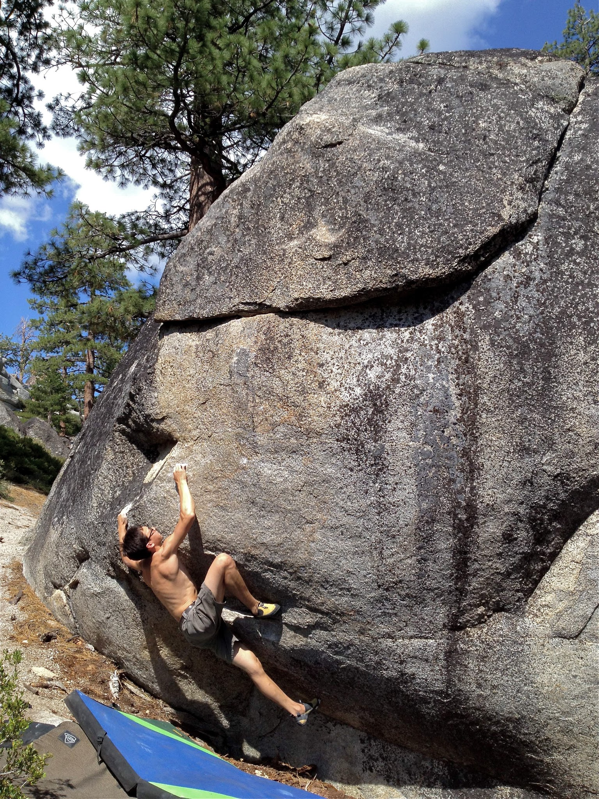
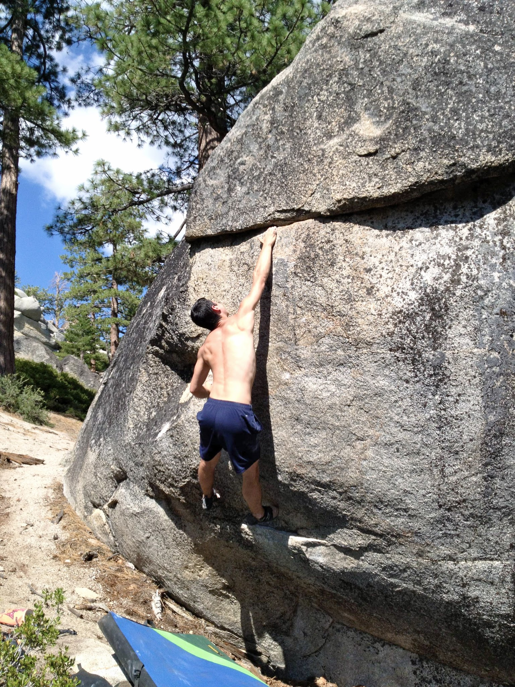

Yesterday morning Chris and I left Davis and headed out to South Lake for a day trip. We had our minds set on trying a problem called Ground Control. But since this problem isn't in the guidebook, we spent a couple of hours searching for it in all the wrong places. We eventually reached out to Noah Kaufman, who got the FA, and he was kind enough to call us and give us good directions.

Here are some photos of our battle with Ground Control.

*Chris sticking the sloper**Chris, about to match the crimp rail**Sticking the crux move*By 4:30 the sun had drained all of our energy and we called it a day - sendless. But we managed to do all of the bottom section, including the crux, so Chris and I plan on heading out next week for another round. Stay tuned.

\- Eden
