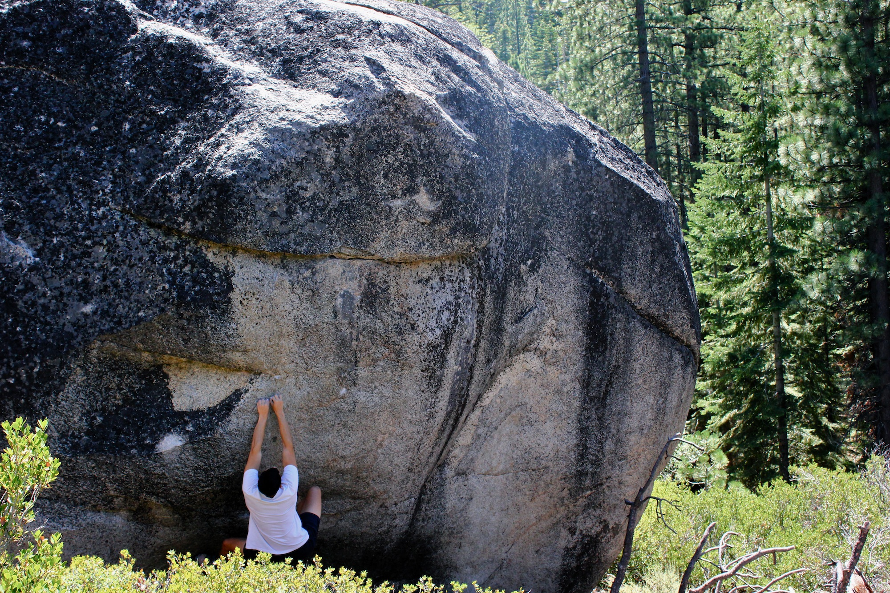
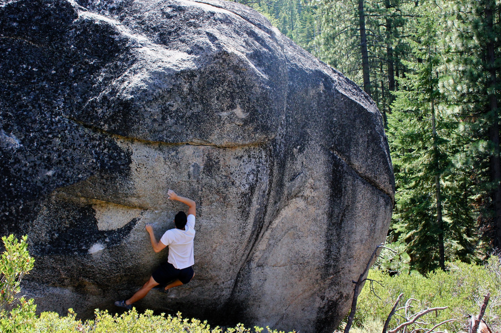
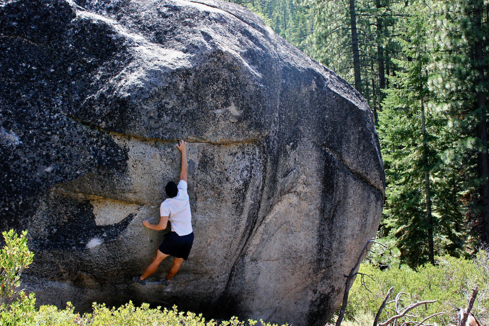
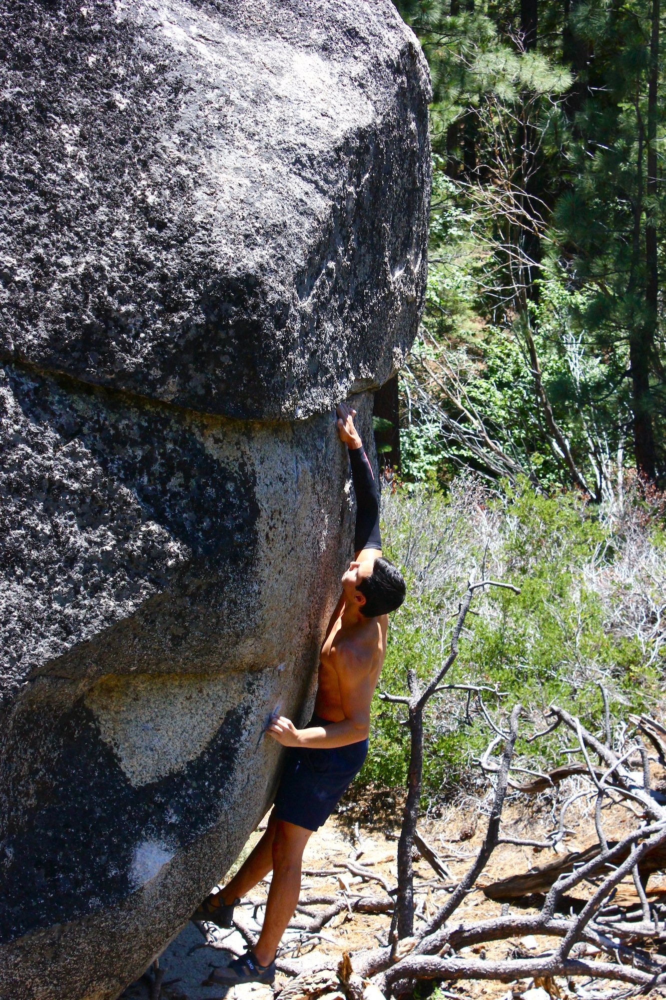
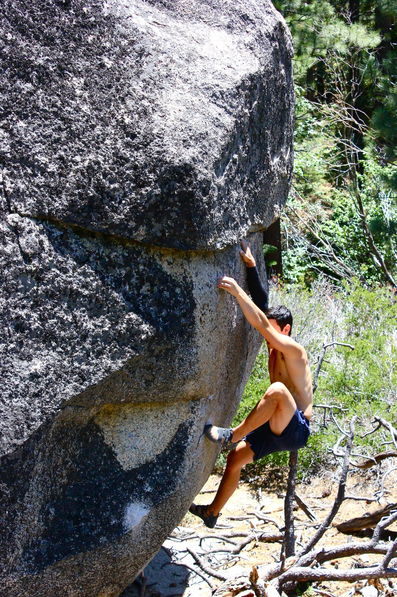
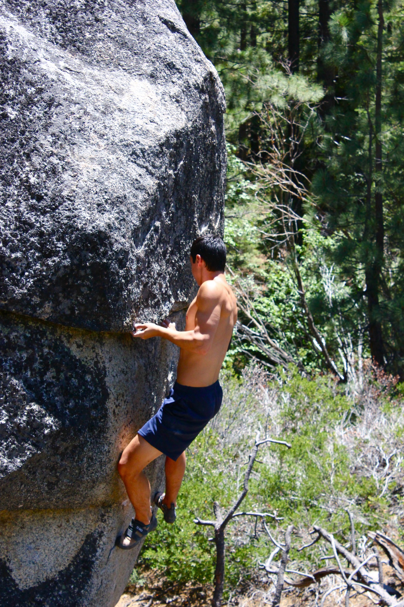
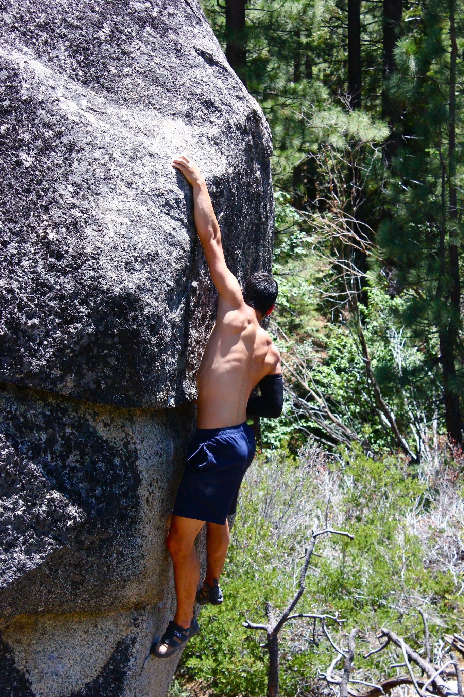
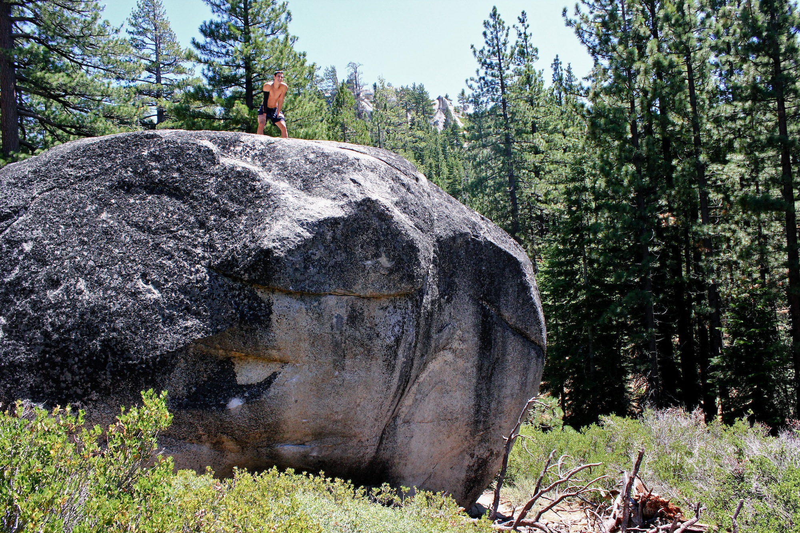

Last Tuesday Chris and I headed back up to Ground Control (V11) to give it a second session.

This time we headed out early and had a couple of hours to work the problem while it was still (partially) in the shade. We decided to warm up on the top section, but found it difficult. The top still felt cryptic and slopey and we had a hard time committing - especially with only one pad below. After a few attempts and a bit of progress we began giving it goes from the start. By the end of the session I managed to snag the send, and Chris got painfully close. Here are some photos (thanks Chris).

Also, if you're interested in seeing a well-made [vid](http://vimeo.com/16855611) of this climb, check out Alex Savage on the 2nd ascent. (<http://vimeo.com/16855611>)

*The crux dead-point*

*The top section*

*¡Mucho Tiempo!*

And thanks again Chris for the great photos!

\- Eden
