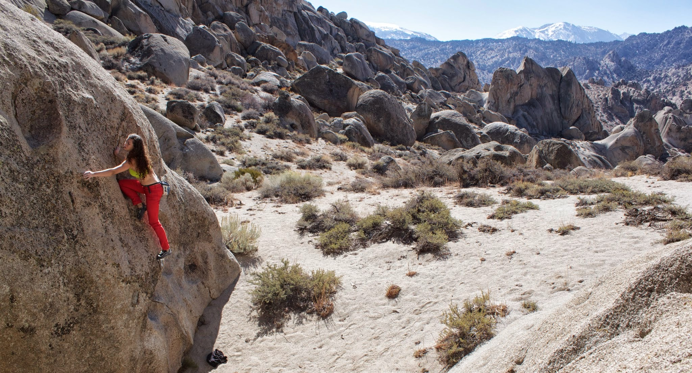

Although we still have beach weather in San Luis Obispo, it is October in Bishop and the temps were looking good enough to venture outside for the first trip of the season. Joe, Sara, Sam and I rendezvoused with Cody, Alex and (surprisingly) Adam at the Buttermilks for a mellow weekend on granite. 

*Joe, trying to find a hold on Saigon Direct (V9).**Sam, enjoying the view from the Grandpa Peabody.**Cody, reaching far on Moonraker (V8).*

We spent most of our time meandering around the main Buttermilks area with one morning spent at the Secrets. The Secrets of the Beehive area is home to some of Bishop’s most inspiring lines. However, we opted out of trying more highballs and enjoyed the unique granite huecos of the Queen Sweet Nectar boulder. The four guys made quick work of Queen Sweet Nectar (V9), while Sara battled some slab on the other side of the boulder. (She also ate all of my dark chocolate covered espresso beans.)

*Sara, trusting her footwork.**A cliché black and white photograph of a mountain.*

It feels great to be back on rock after not climbing for so long. Seems like my tendons might be making a comeback. Stay classy San Luis Obispo.

\- Itai

