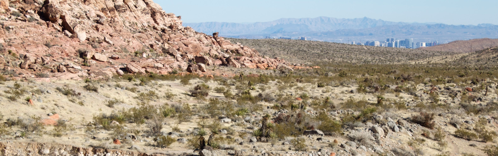
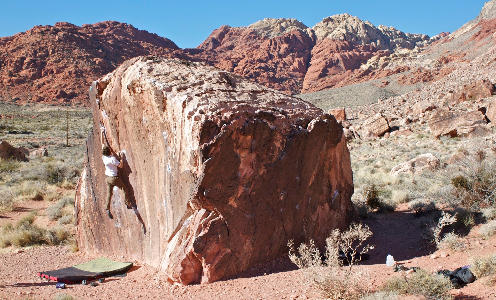
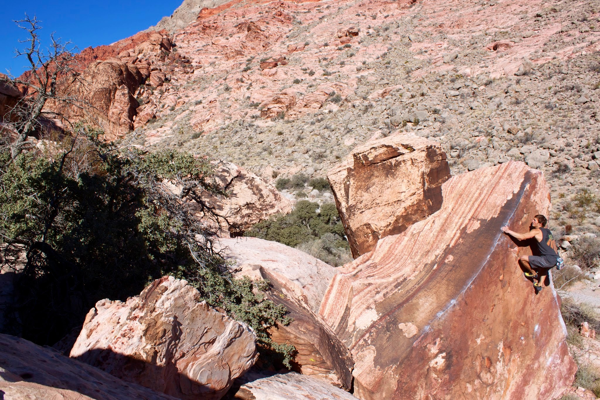
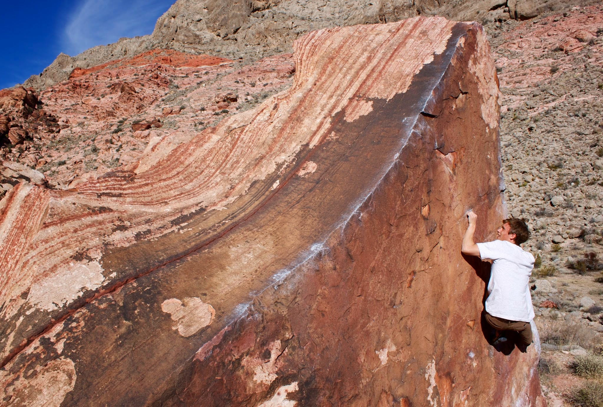
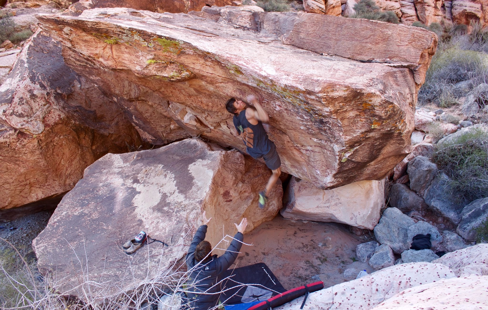
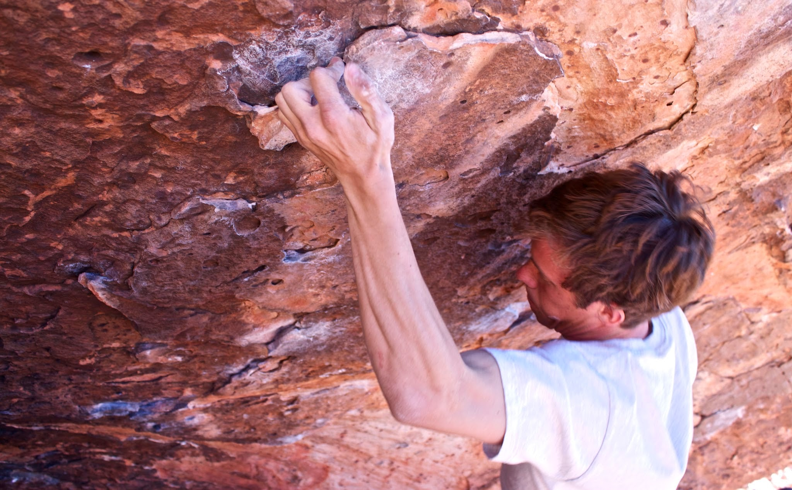
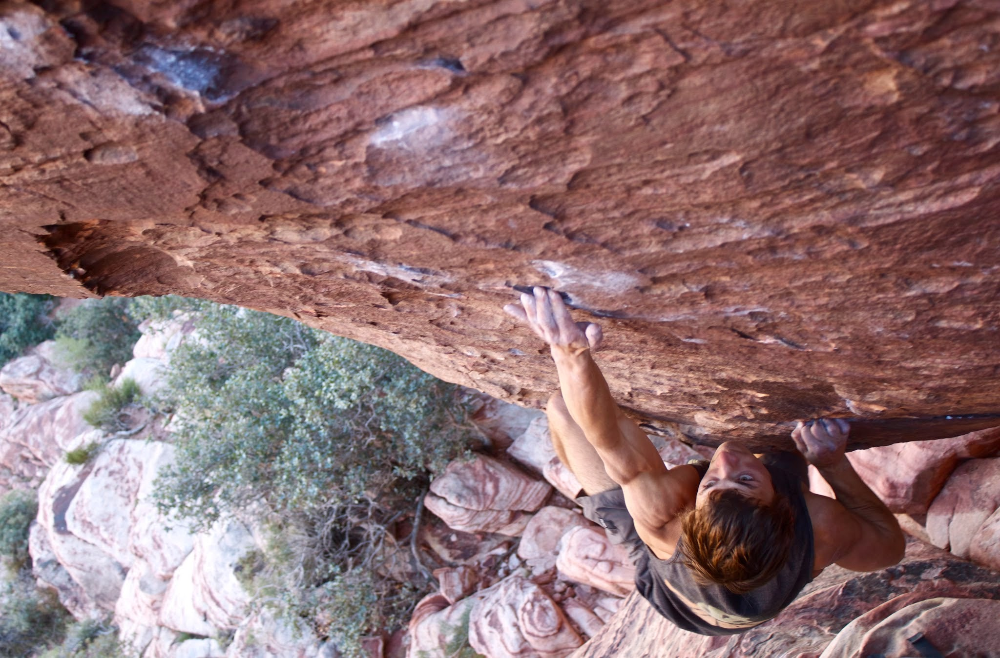
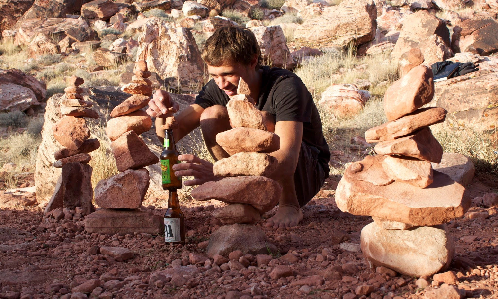

Finals were over quickly this quarter and I was itching to get outside and climb. I picked up Joe and we met up with Cody for a few days of ~~partying in Las Vegas~~ sandstone bouldering.

*The Gambling Capital of the World, nestled away in the desert of southern Nevada.*

We passed by the tempting signs for Bishop, CA along the 58 but continued on towards Nevada. When we arrived in Red Rock, we set up camp amidst some rowdy neighbors and thieving coyotes before sneaking in a sunset session at the Kraft boulders.

*Cody, climbing the Kraft area classic, The Pearl (V4/5).*

It was my first trip to the area, and I was excited to explore some sandstone for a change. Joe, who had been to Red Rock just two weeks earlier, guided us around and showed us some of the best climbs the Kraft boulders and the surrounding areas had to offer.

*Joe, on the tricky arêtes of Pork Chop (V2/3).*

*Cody, on the same.*

*Joe, committing to the throw on Triple Sow Cow (V6).*

*Cody, searching for a foot on his send of Scare Tactics (V10).*

*Joe, with an impressive flash of Vigilante (V10).*

After five days on, it was obvious that we needed a rest. We took a rock stacking siesta before getting in the last bit of climbing and heading back to camp for an early bedtime. We got nearly twelve uninterrupted hours of sleep (the coyote struck again,) before making the drive home.

*The rock climber in its natural habitat.*

Despite our extended trip, we left most of Red Rock unexplored and vowed to return shortly.

I’ll be back!

\- Itai
