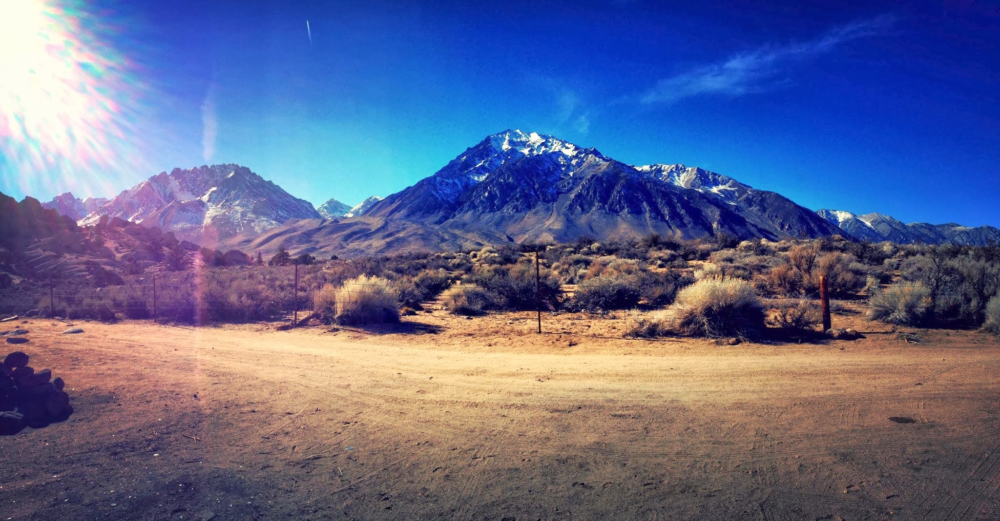
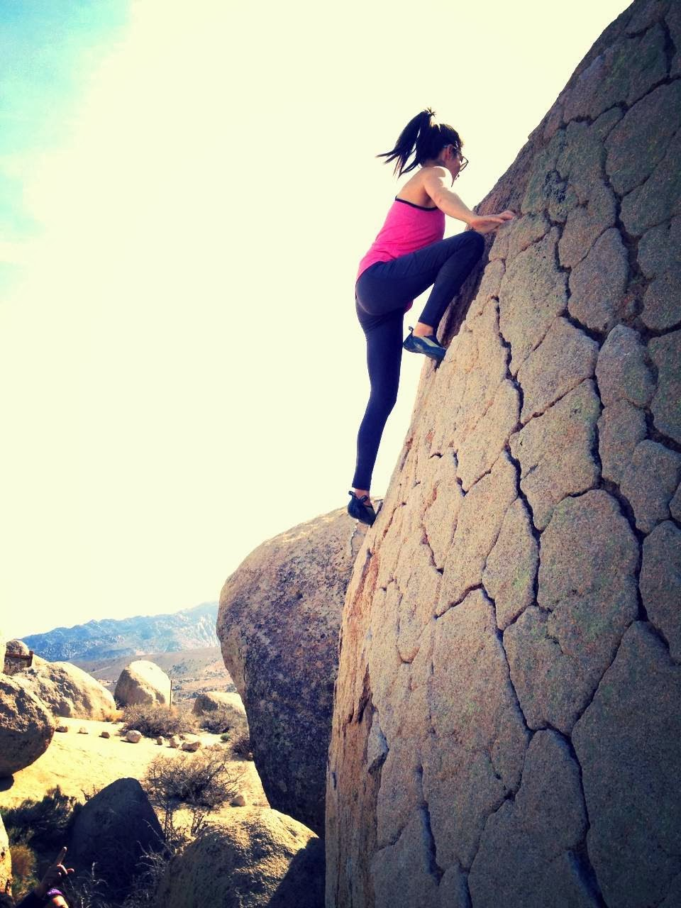
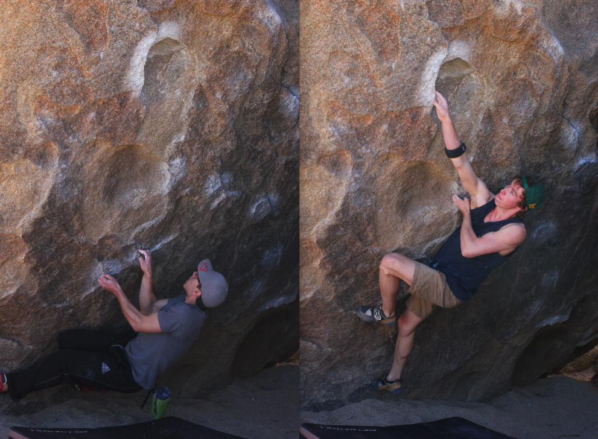
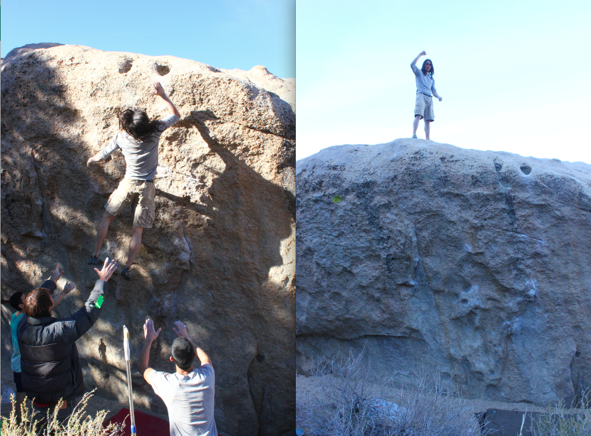
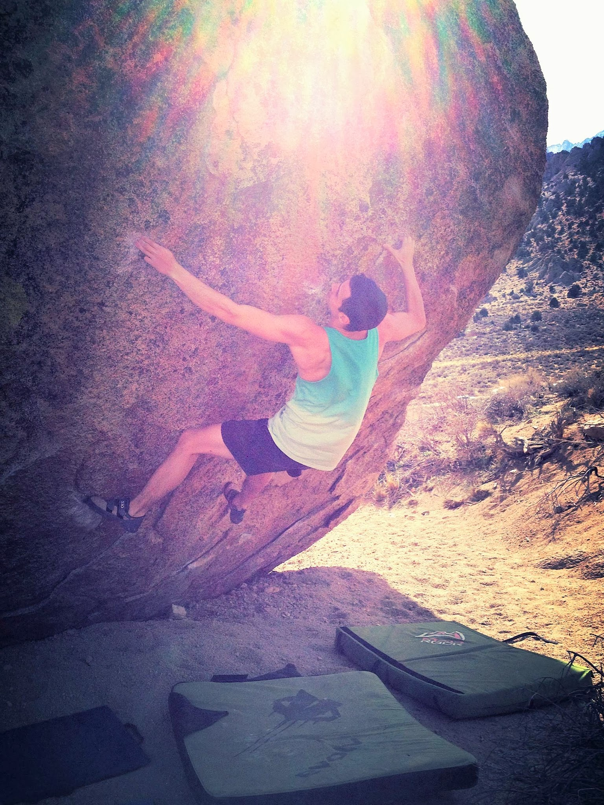
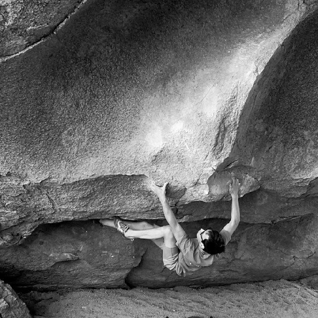
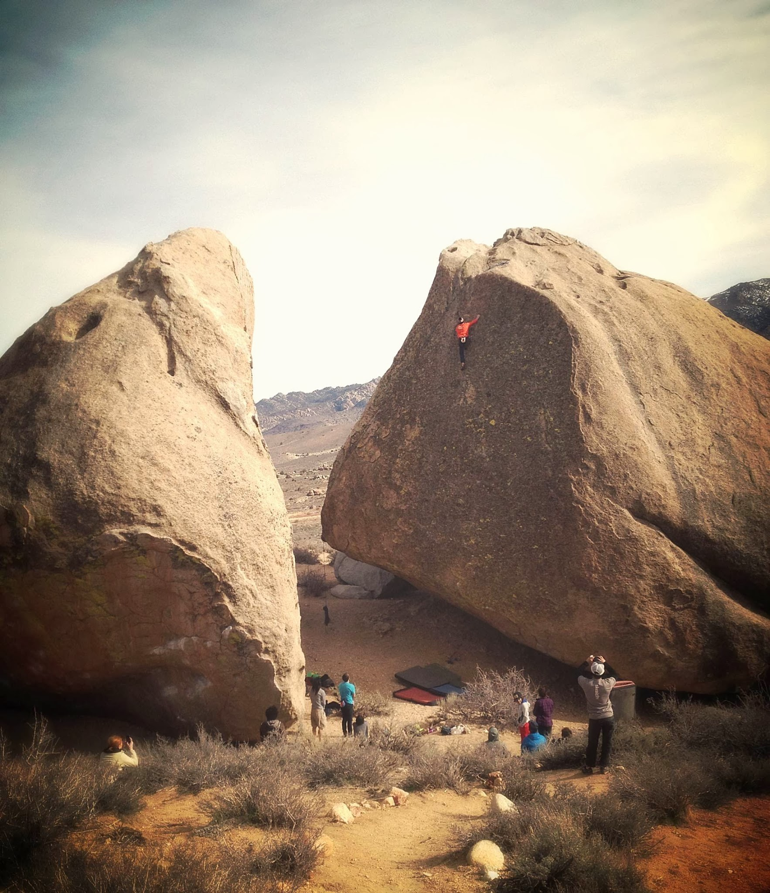
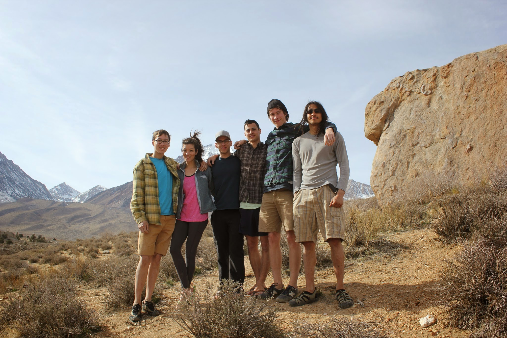

This past weekend, Chris, Avi and I headed down south for a much needed Bishop adventure. We met up with Marina, Jake, Mike and few others. We arrived early enough on Friday to squeeze out a half day of climbing, during which we all realized that our soft and precious skin wasn't going to survive the weekend. Nonetheless, we managed to have a very memorable trip with some notable sends!

*[Marina](http://instagram.com/marinasumie) warming up on quintessential Bishop patina**[Jake](uploads/yukanjahnsen) working on Bowling Pin Sit (V6)**Young Mike throwing hard on Zen Flute (V10) and then celebrating the send*Saturday's session was cut short by afternoon winds (up to 50mph). We rushed back to our campsite and found our tents scattered some 30 feet away. The winds were persisting, so we quickly dismantled the tents and decided to share a motel room for the night.

On Sunday I worked one of my long standing projects, Direction (V13).

Unfortunately, I couldn't send it because (circle all that apply):

I'm not in shape / I'm injured / the shoes weren't right / the temps were awful / the wind / that one dude was coughing while I was trying to send / I forgot to have coffee / my skin / I wasn't "feeling it" / a dog peed on my draw-string bag (<\-- true story)

But here's a photo of me on it anyway

*Photo by Chris Llewellyn ([@christfiz](http://instagram.com/christifiz))*Even though Monday was only a half day, it was arguably the most eventful day of our trip. Marina crushed Smooth Shrimp (V6), Avi snagged the classic Fly Boy Arete (V5), Chris sent Buttermilker stand (V12), and I salvaged the trip with a first-go send of Cocktail Sauce (V10). On our way out we even got to see an inspirational send of Footprints (V9) - good job Ethan (and Wes?)!

*Me on Cocktail Sauce (V10)*

*Chris on Buttermilker stand (V12)*

*Ethan Pringle cruising up Footprints (V9)*

*The Crew*

This trip helped me realize how excited I am to get back in to climbing after this extended hiatus. Look out for more trips in the near future. Love, peace and chicken grease.

\- Eden
