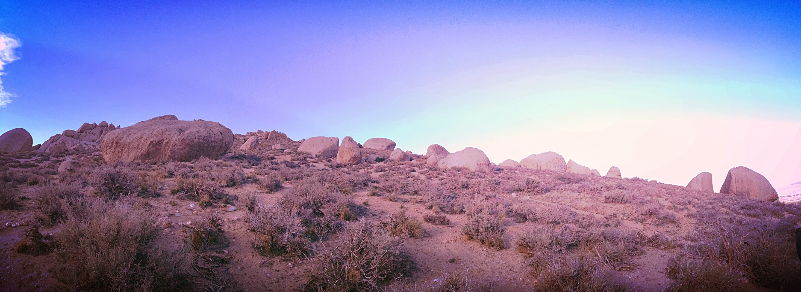

Cody, Itai and I headed up to Bishop (ok I lied, whatever) early on Sunday morning. We grabbed a quick breakfast in ~~Independence~~~~Lone Pine~~ Big Pine (?) and headed straight for the Buttermilks where we met up with Marina, Jake and Chris. Here are a few photos from day uno y dos.

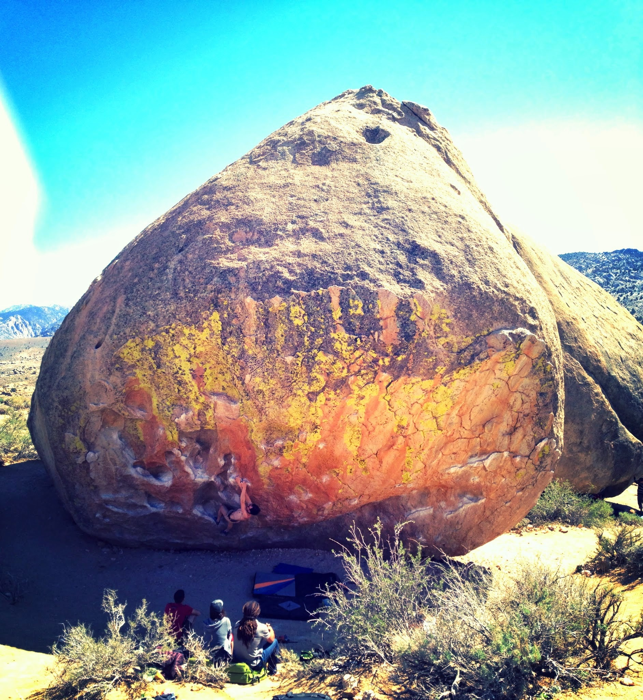*Chris sending Center Direct (V10)*

*Itai shaking off on a jug after a flash of Cocktail Sauce (V8/10)*

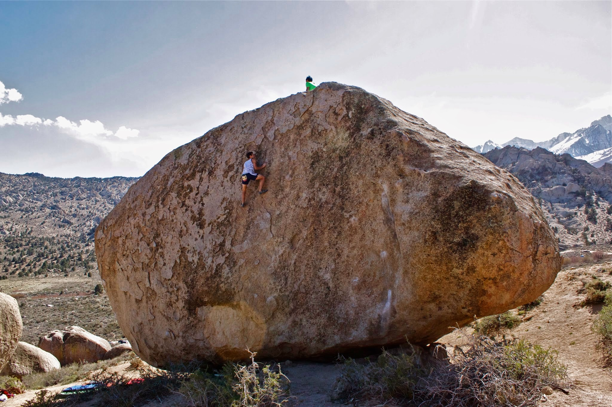*Itai running up a slab on the backside of the Saigon boulder*

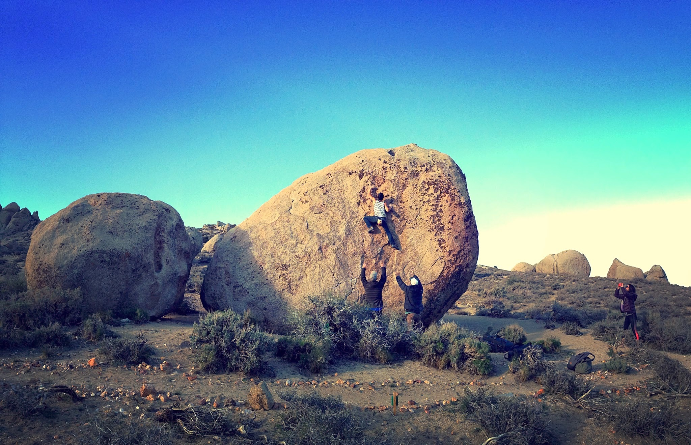*Itai working a lukewarm slab on the roadside boulders*

On day 2 we headed up to the classic High Plains Drifter (V7), where the gang (and 17 other dude-man-bros) all had a solid session. Here are a few photos:

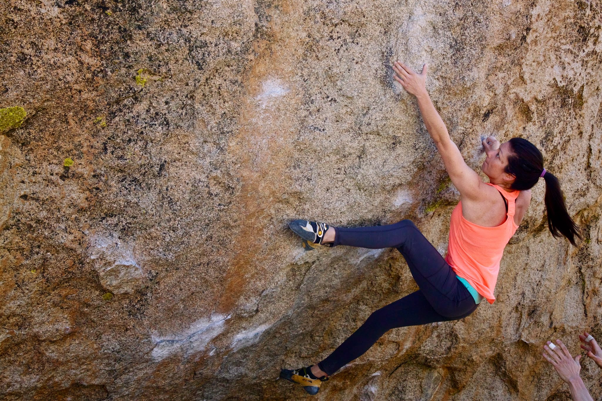*Marina reaching for the pinch*

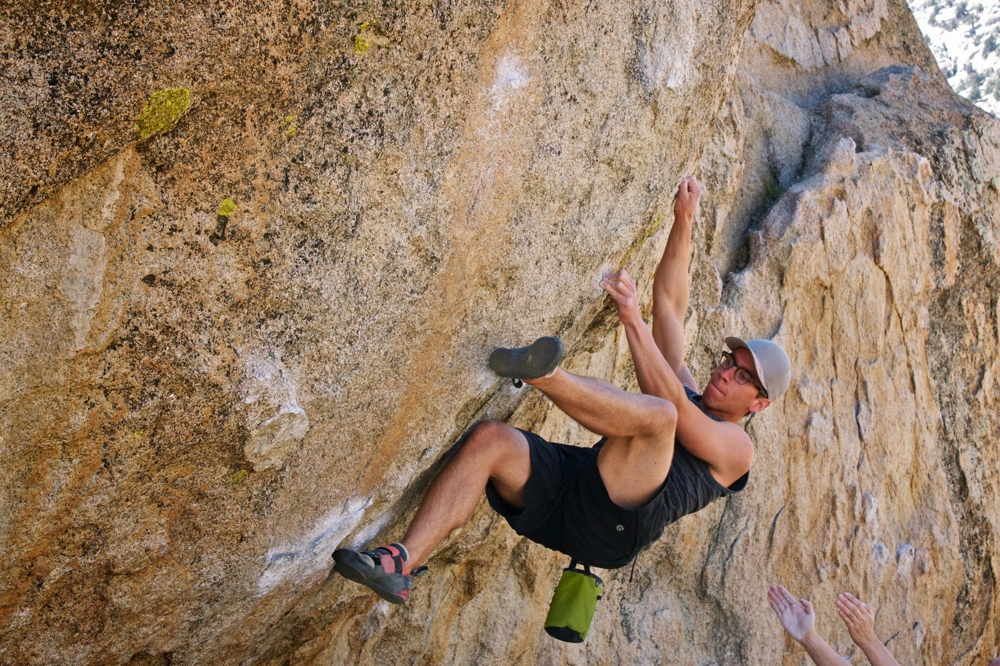*Jake placing the heel*

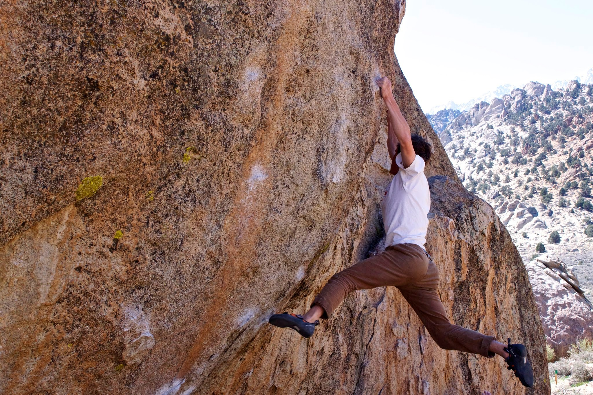*Cody throwing for the crimp*

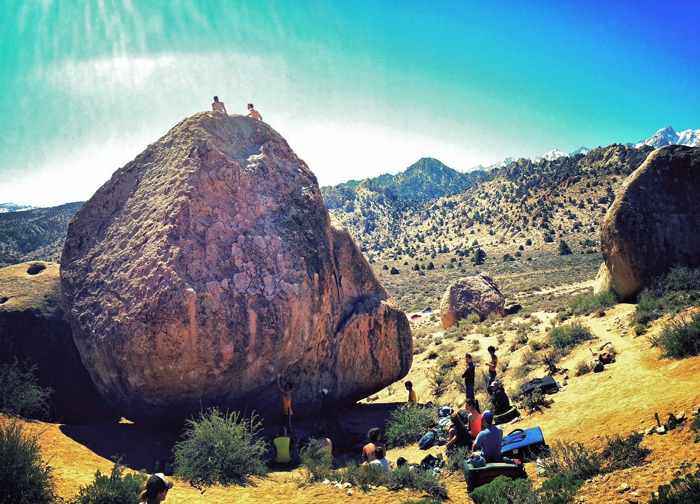*Itai and Cody taking in the view after back-to-back ascents - choo choo!*

Cody and Itai left early on day 3, and the rest of us decided to have a half day at the Happys before heading home. I'd be lying to you if I said it was complaint free, but hey, we had fun - right? Here are some pictures that make it seem like we had a chance of sending stuff that day...

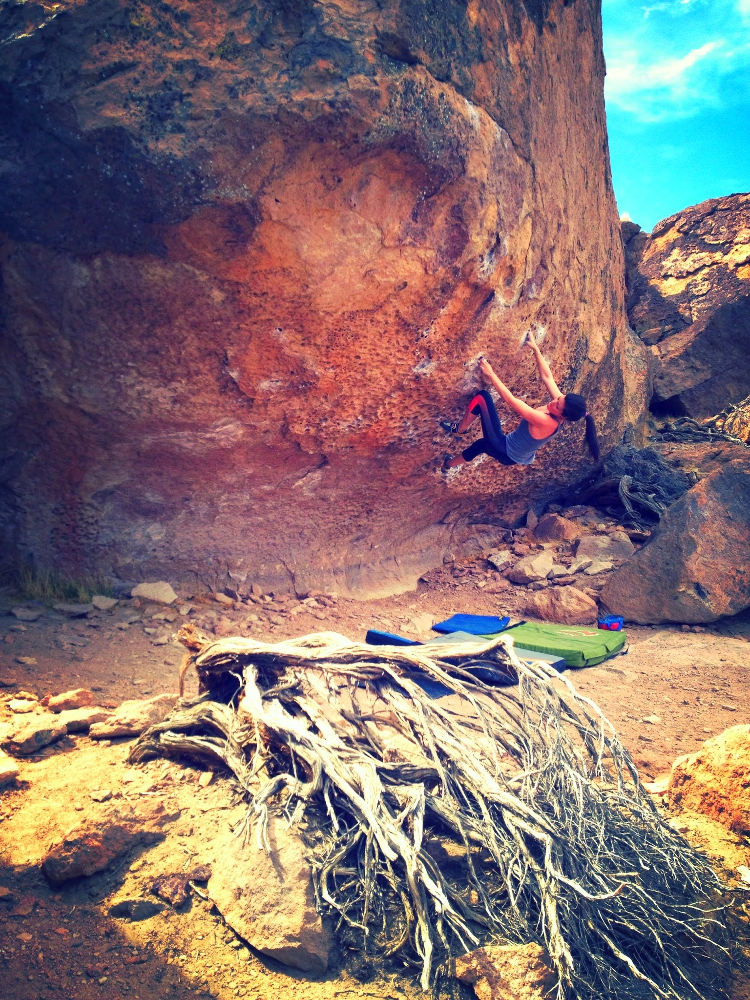*Marina getting familiar with the moves on Morning Dove White (V8)*

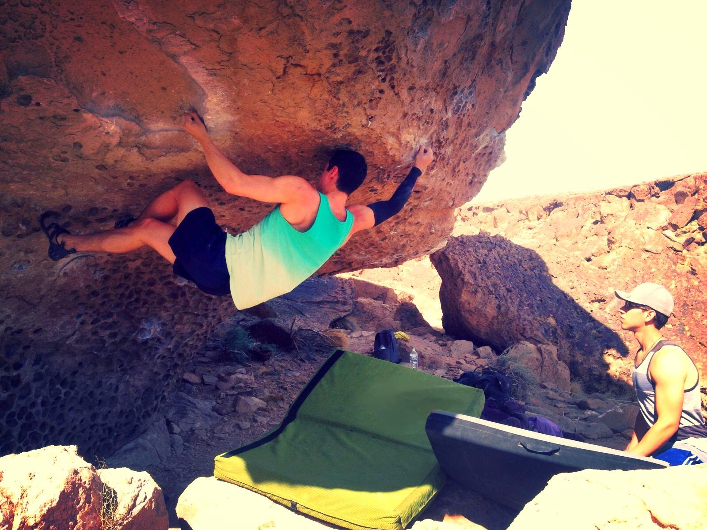*Working out the foot sequence on He Got Game (V11) - PC: Marina Campana*

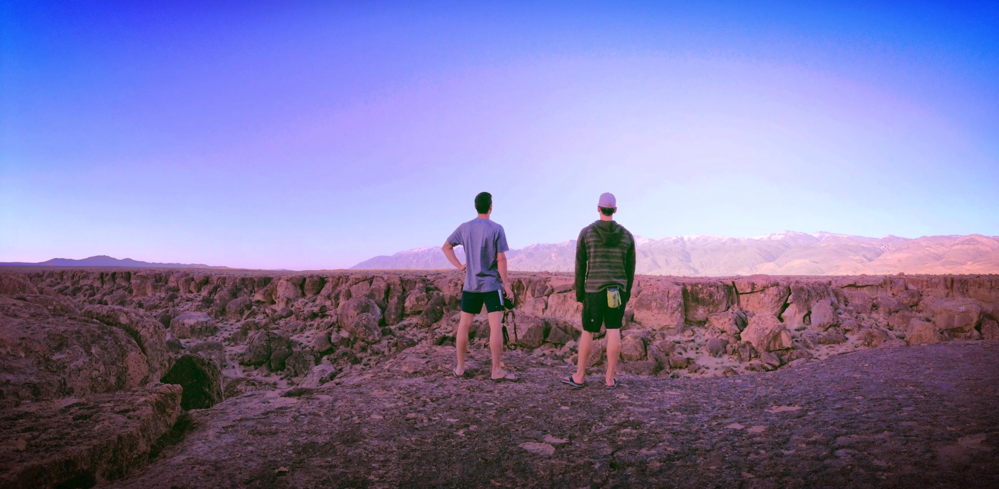

As always, it was wonderful to be outdoors. Can't be more excited for this upcoming spring season. See you guys out there!

P.S. Congrats to Chris for sending The Buttermilker! yaa boooyyyy

\- Eden
