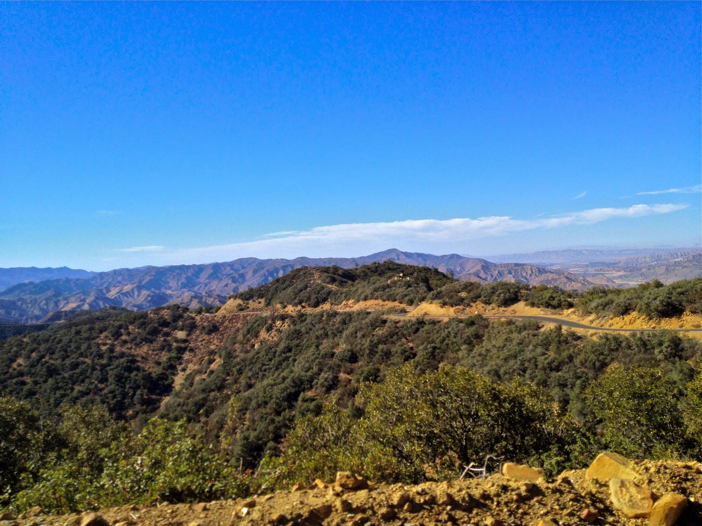
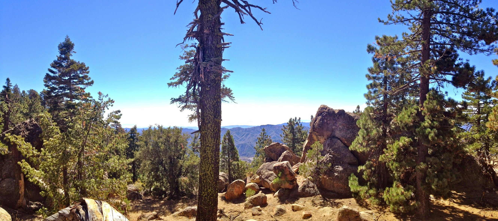
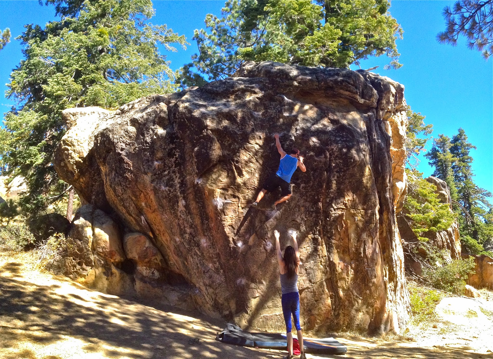
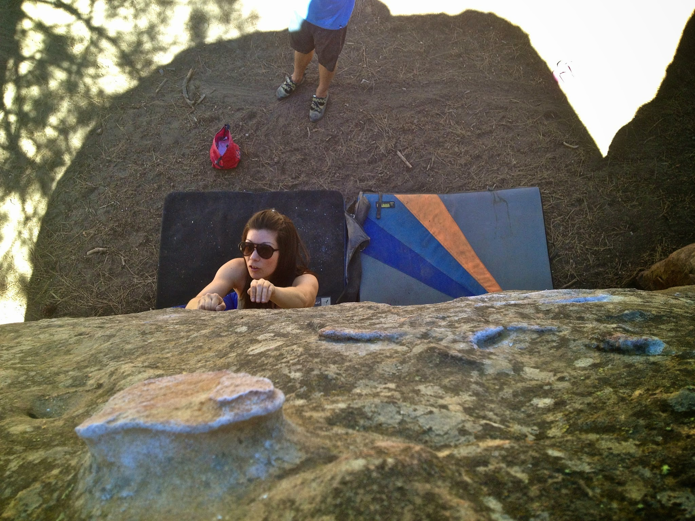
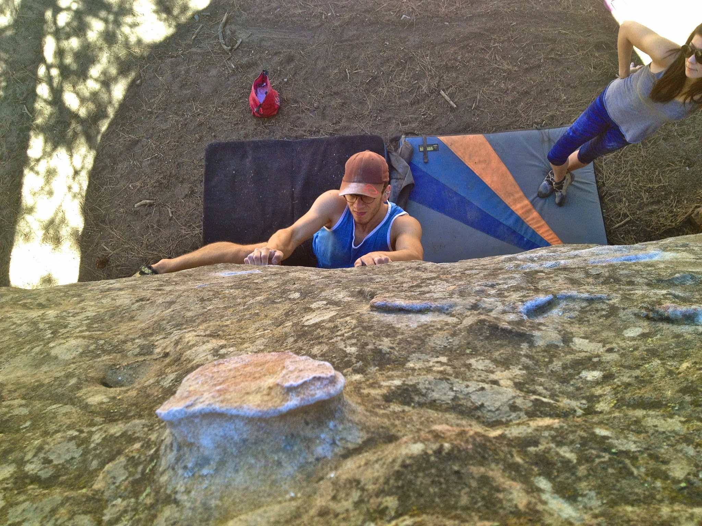
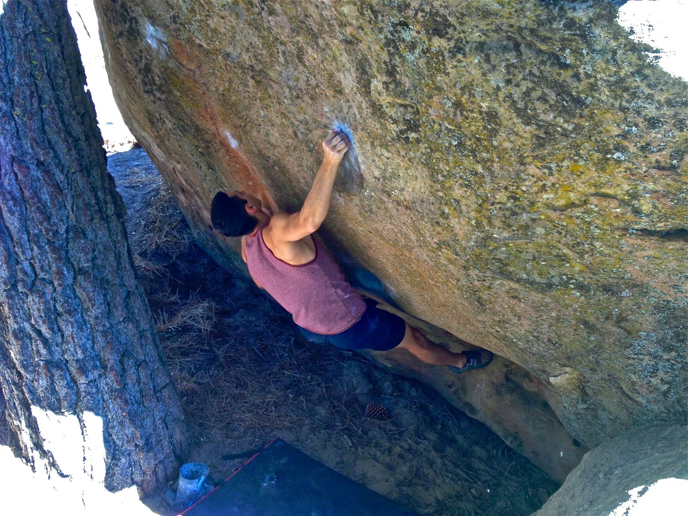
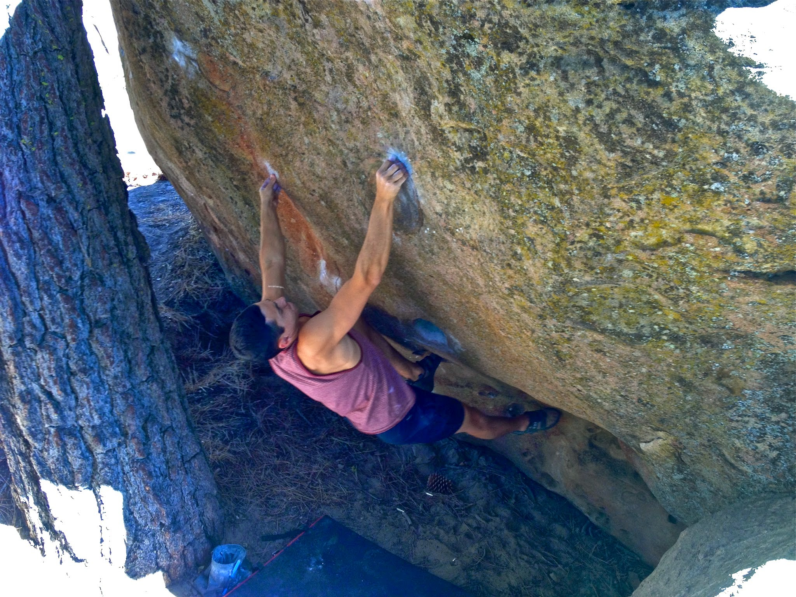

Yesterday Marina, Jake and I headed up to Pine Mountain for a much needed escape from the city. Pine Mountain is situated above Ojai, in Reyes Peak - with an elevation of roughly 7,000 feet. It was my first time going to this crag, and I was excited to explore yet another climbing area.

*The drive up*

*Reyes Peak Campgrounds*We jumped on a few classics and socialized with the other climbers that were out there. I managed to snag a send of 911 (V8), and unlock all the moves on Whiplash (V11). Hopefully I can return in more optimal temps in order to link the moves.

*Jake gettin high on a V4?*

*Marina, finding out that flies and slab don't mix*

*Flies and slab don't mix - seriously, don't swat and slab*

*Me, grunting on Whiplash (PC: Marina)*

All in all, it was not the most eventful day, and our trip was actually cut short due to the heat and the flies - but mostly the flies. I would spare you the details, but putting up a complaint-free blog is just not my style. So, if you aren't a fan of melodramatic tangents, feel free to skip the following ~~rant~~ paragraph.

There. Were. So. Many. Flies.

I mean, if I had a dollar for every fly out there, I'd breach the Forbes 100 list. And these flies were far from docile. In fact, they were closer to masochistic. What makes flies act this way? It was like they all came from broken homes and had "seen some shit". They meant business and they had strength in numbers. Didn't they have something better to do than chip away at our mental fortitude? They were determined, like a middle school bully, pushing his victim to the edge of a psychotic breakdown. As hours passed, each buzz became more and more potent. They had an uncanny ability to break you mentally. By the end, it felt like they were flying by my ear and whispering shit about my most personal insecurities. I would try and think about where to place my feet and instead I'd end up dwelling on the fact that I'll never be able to grow a beard, or that I couldn't send that one V3 in Squamish last summer. How the hell do these flies know that I'm sensitive about my inability to grow facial hair? Are flies psychic? Seriously, can someone please enlighten me as to what the purpose of a fly is!? Thanks for making us leave early, assholes. 

\- Eden 

