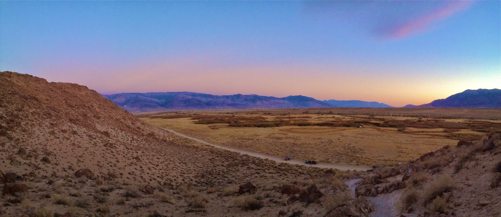
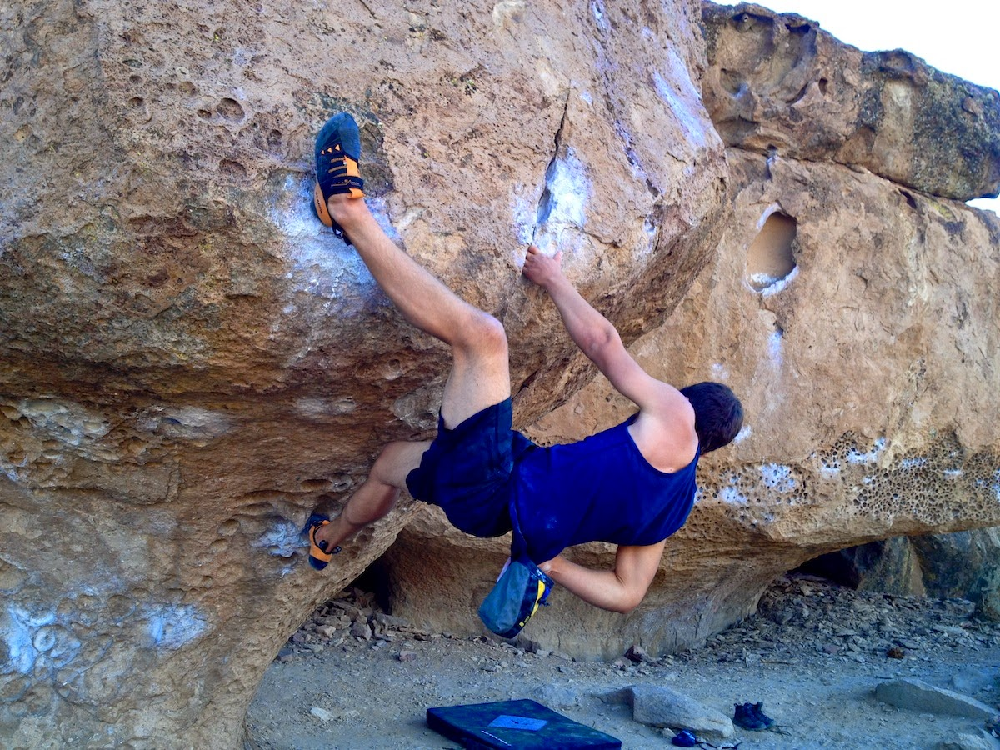
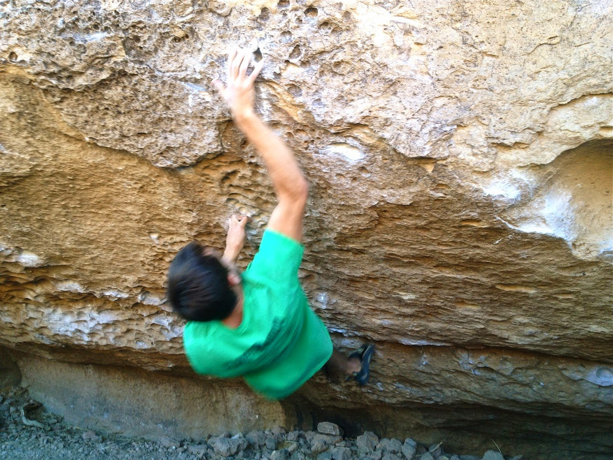
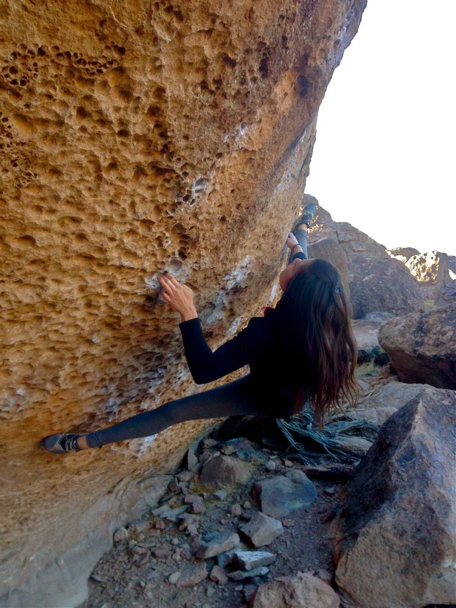
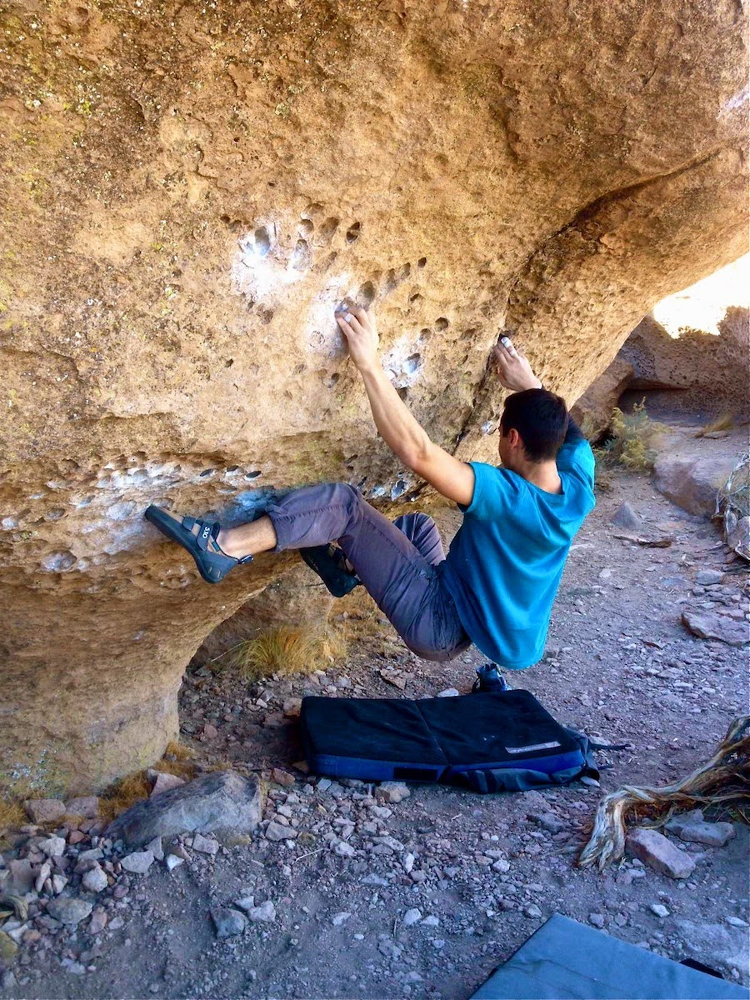

This past weekend I went to Bishop with Jake and Marina. It was pretty cold, and we ended up in the warmer Happy Boulders for the entirety of our trip. The Happys are like cargo pants - they have way too many pockets. But cargo pants are (usually) harmless, while the ironically named Happys completely demolished my fingers. Over the weekend I managed to put 6 holes in my hands, and twice that many in my ego. It happens.

Here's a photo of my hands at the end of the trip.

The trip didn't see any noticeable ticks, but we all had a good time figuring out beta and hanging out with friends. Here are some photos of the climbs we worked or sent over the weekend.

I'm looking forward to next weekend, when I plan to head back to Bishop.

See you all out there!

\- Eden
