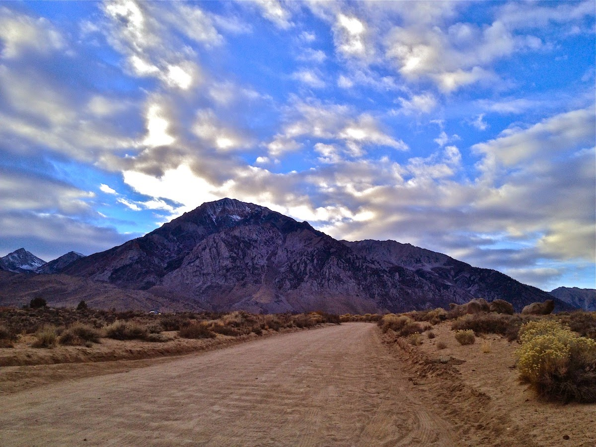
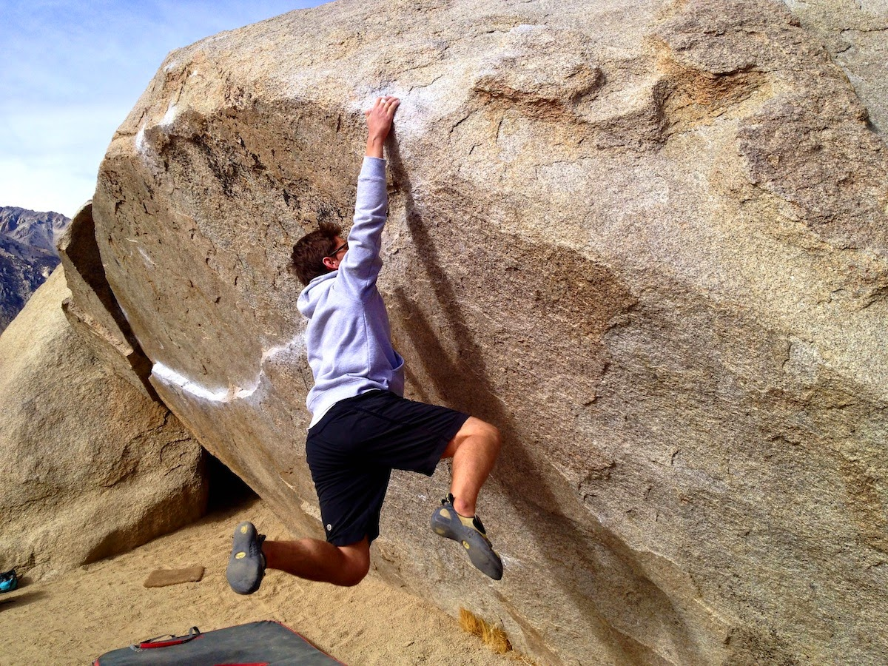
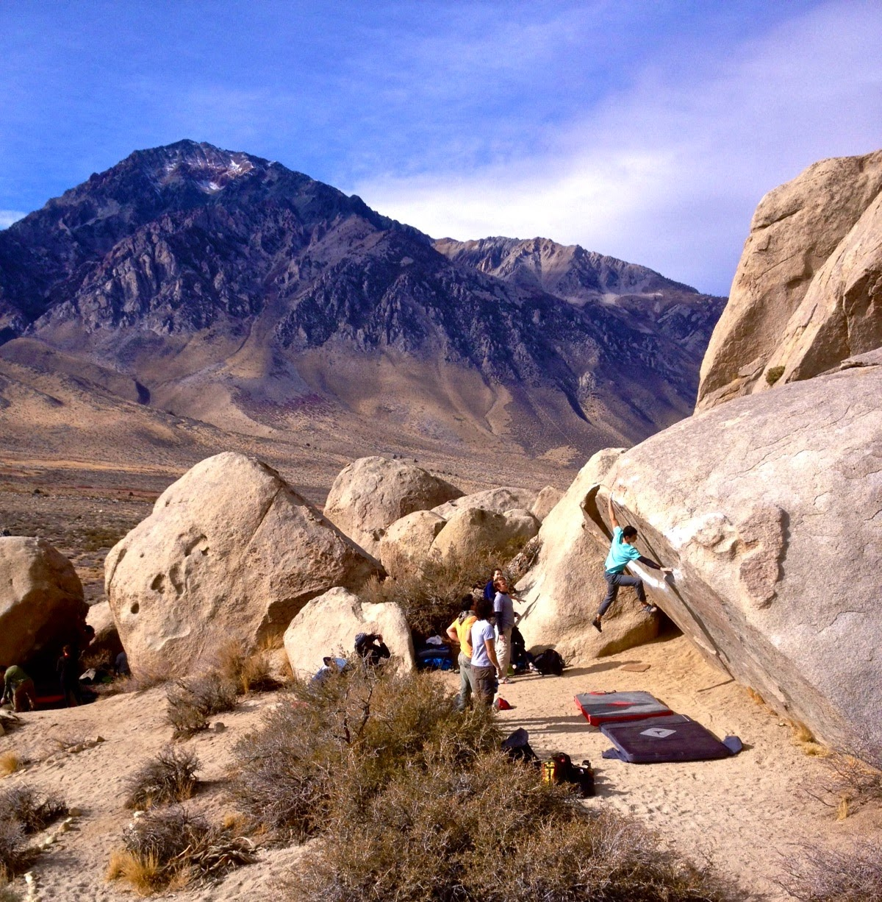
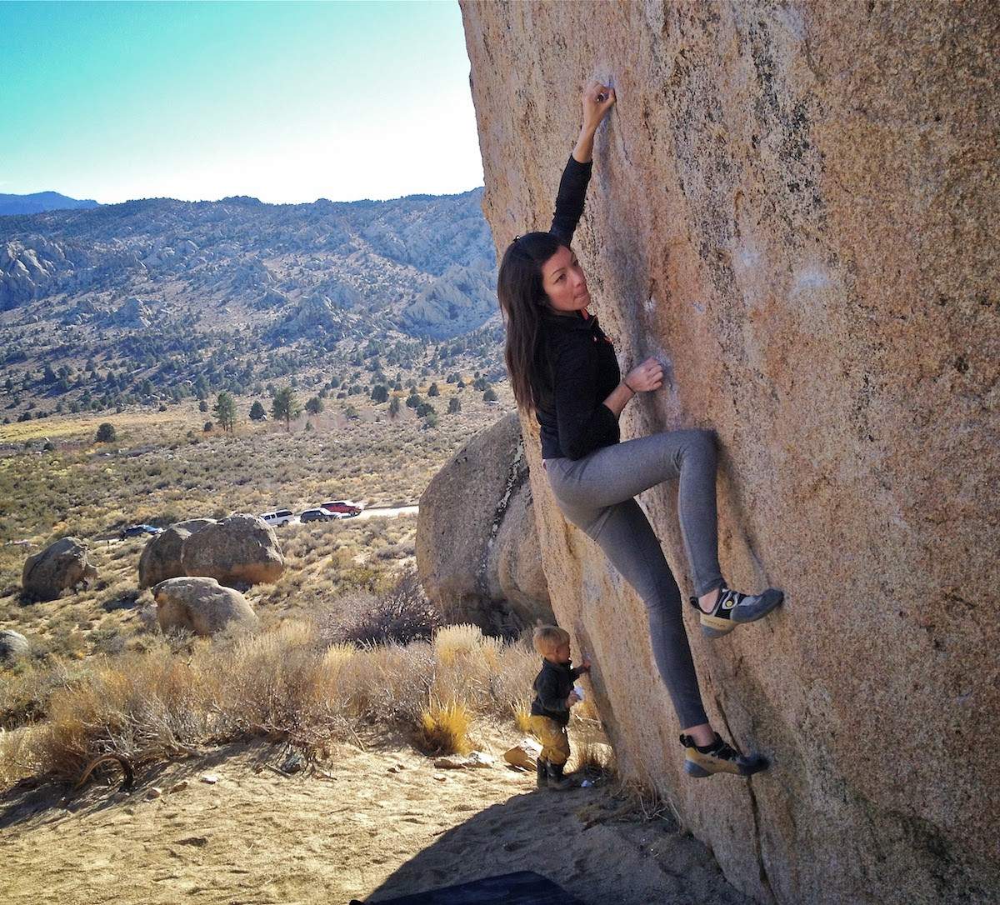
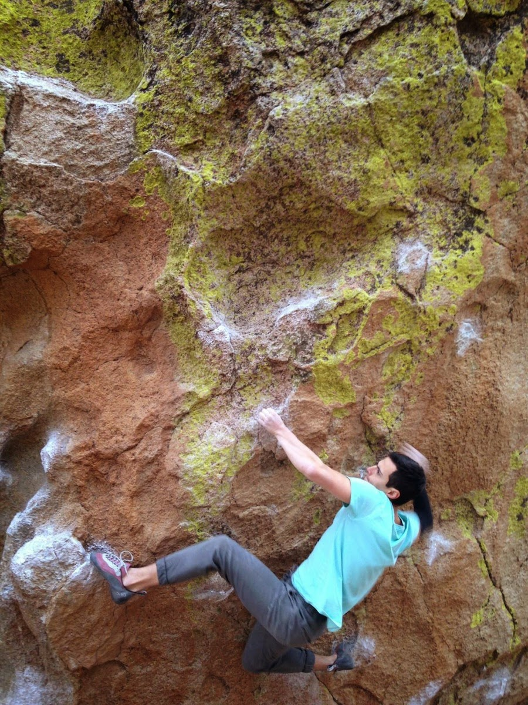
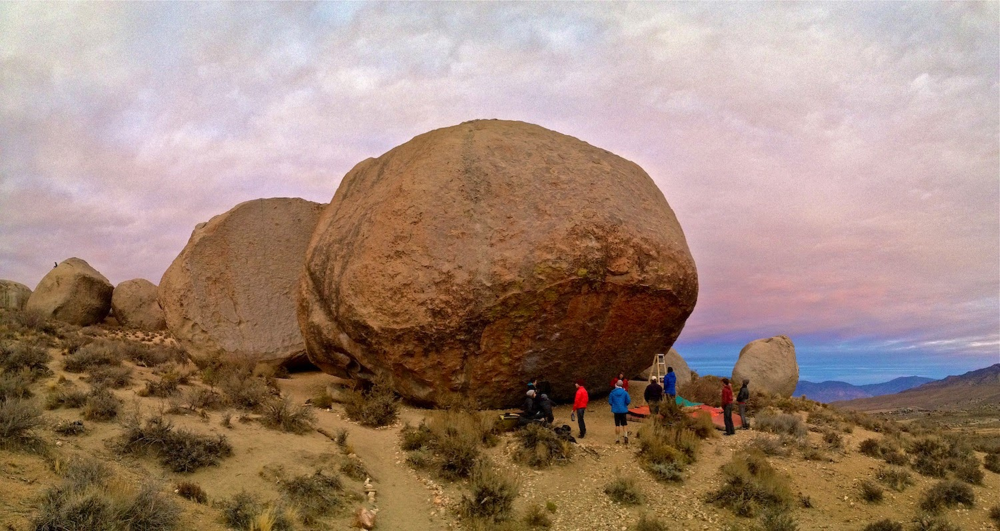

I drove up to Bishop this past weekend to meet up with Damien, Jovanna, Marina, Emily and Jake. I was excited for the back-to-back trips, and I was hoping that the weather would hold up.

On Saturday, a windy forecast kept me out of the Buttermilks. Instead I went to the Happys to try and deal with some unfinished business from last week. The rest did me good, and I managed to dispatch both Bubba Gets Committed (V10) and Toxic Avenger (V9) in the late morning session. I rested in the early afternoon, while watching Damien take out the classic Every Color You Are (V6), and work the moves of Morning Dove White (V7/8). However my phone/camera was free of charge in the worst way possible, so the first day went sans photo.

On Sunday I finally went back to the Milks for the first time since Spring. We started out near the Birthday boulders and worked our way back to the Peabodies. I grabbed a send of Iron Fly (V9) while the crew was working the ultra-classic Iron Man (V4), and also put down Junior's Achievement (V8) shortly after.

*Jake latching the last move on Iron Man*

*Iron Fly (PC: Jack Hanes)*

*Marina working Junior's Achievement while Aaron makes rock art*

Late in the last day of our trip I decided to jump on my project, Direction (V13). It took me a while to re-learn the beta, but after that I was able to repeatedly make high point on the climb. I fell off the last move around 4 times. So bitter-sweet. This is the best I've felt on the project, which is great - but I also fell on the last move, which was agonizingly frustrating.

*Me on the last move... (PC: Jovanna)*

*...and moments later*

As the sun went down we watched Dan Beall give burns on his mega project up the right side of the Grandpa Peabody. Here is a photo of the set up. Good luck Dan, hope it goes soon!

I'm sure I'll be back shortly because I already miss this place.

See you out there.

\- Eden
