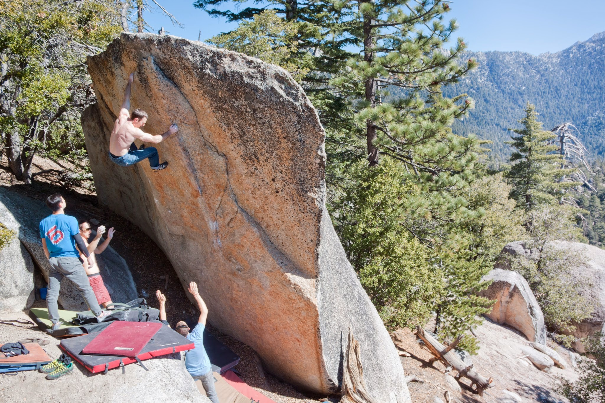
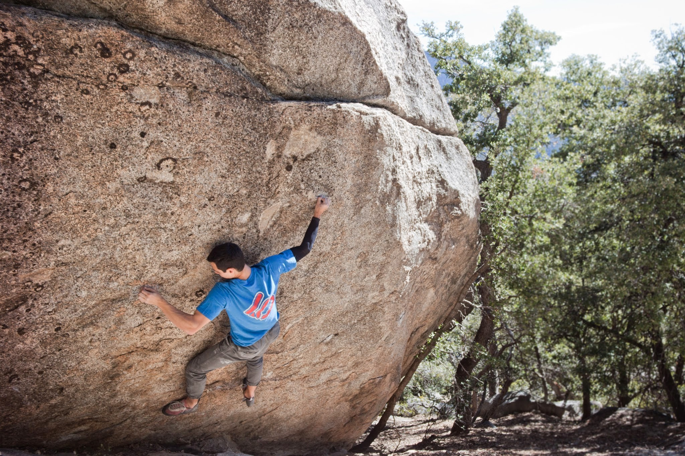
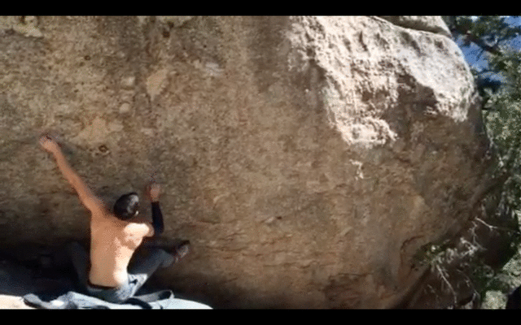
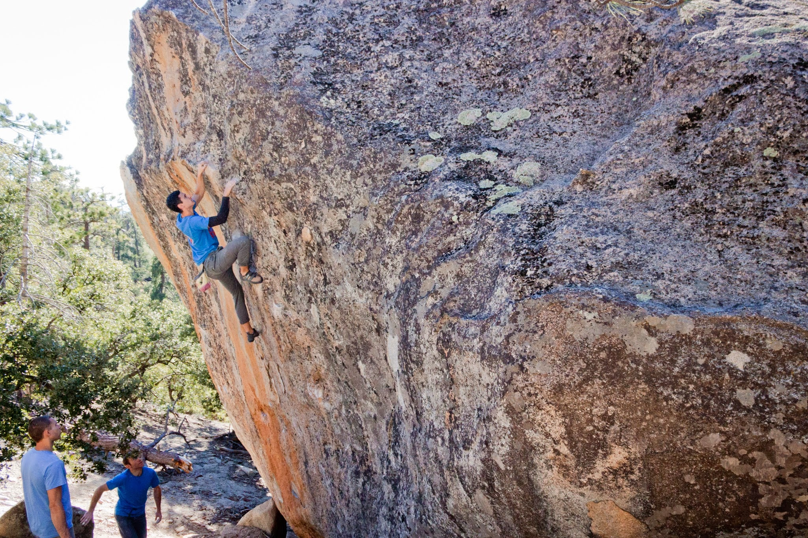
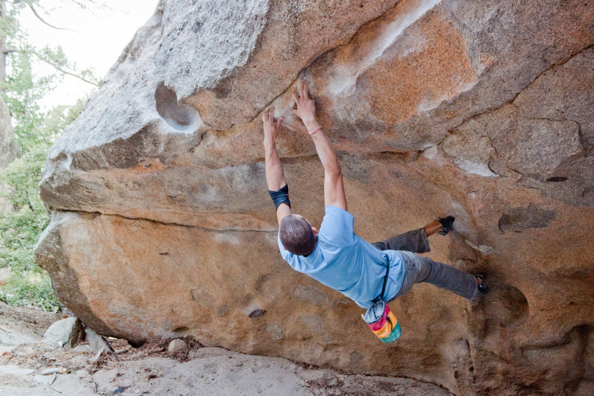
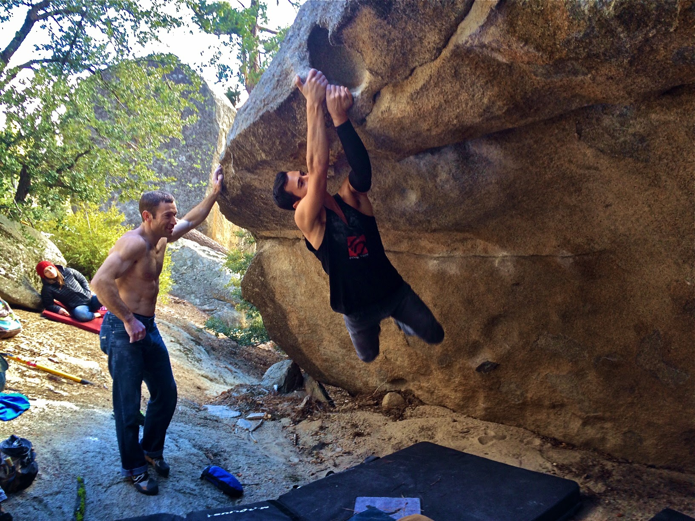

This past weekend Itai and I headed out to Black Mountain for the first time in a while. We met up with Isaac and a few of his friends, and had a fun day exploring the OK Corral. Isaac was a solid tour guide, and managed to get us all excited about the area even though temperatures were far from ideal.

*Mike Doyle on The Dan Osman Arete (V6)*Not long after we climbed the classic Dan Osman Arete I found a short crimp line that hadn't been done before. It added two hard moves to an existing stand start. The first move is the crux, and it involves a dead-point to a small edge. From the edge you throw to a jug rail, hold the swing, and top out. After a relatively quick, but hard fought session I managed to piece it together for a first ascent! I speculate that it's in the V10/11 range, but a ~~sandbagging
downgrade~~ second opinion would be very welcomed. I decided to name the climb Transitory State, because this winter season has been so absurdly fleeting.

*Working the moves on Transitory State (V10/11?)*

| *A GIF of the first two moves of Transitory State (V10/11?)*

After the session on the project, we headed down to the lower OK Corral area to scope out more blocs. Isaac's tour only got better when he showed us the Hueco Wall (V3) and Loh Roof (V8), which were both crowd favorites. Here are some photos from the afternoon session.

*Me heading up the immaculate Hueco Wall (V3)**Isaac eyeing the jug hold on Loh Bo?? (V9)*

| *Itai holding the swing on Loh Roof (V8)*

It's been a while since I've been back to Black, but I'm sure I'll be up there again very soon.

See you guys out there!

\- Eden

