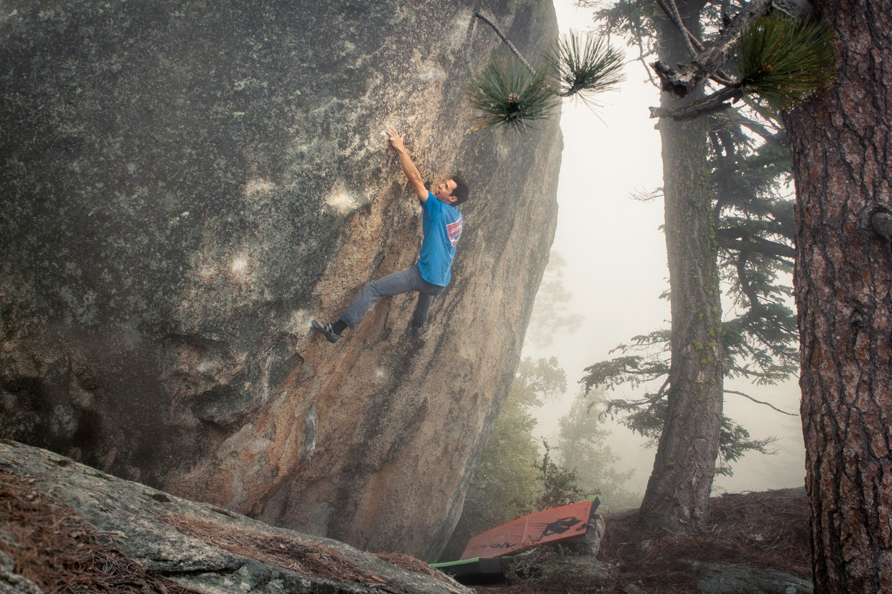
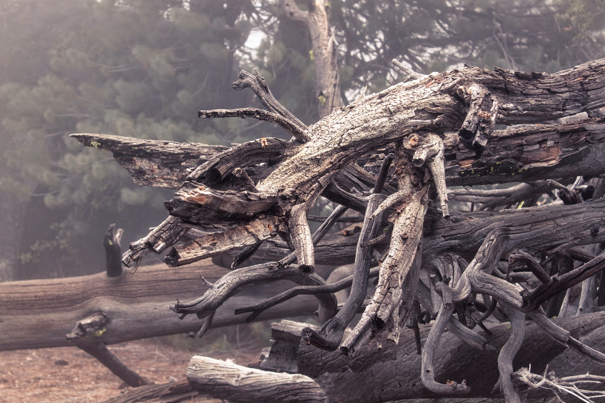
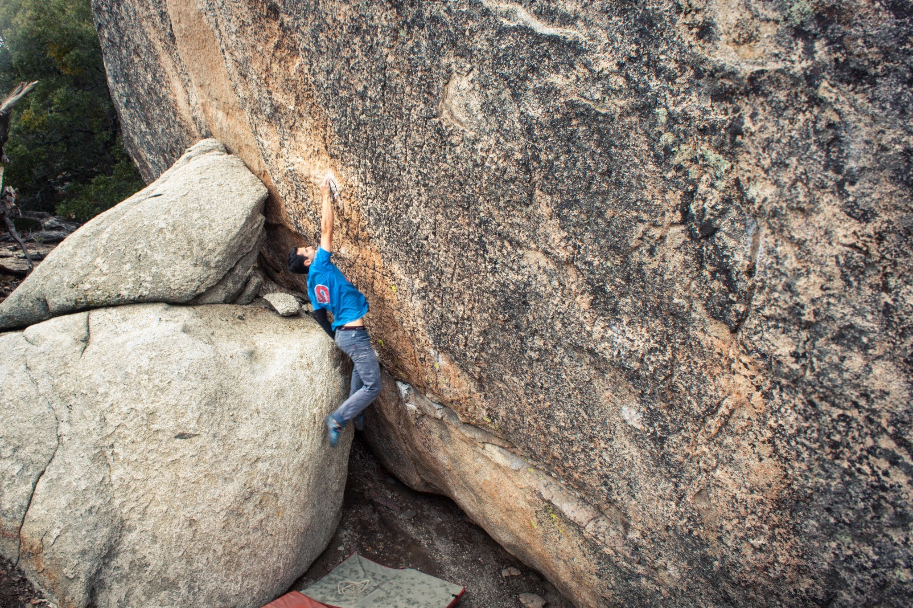
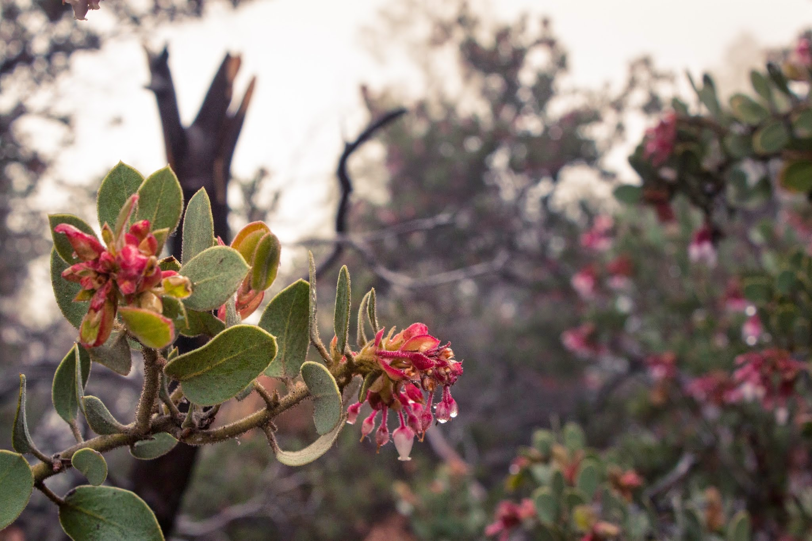

Isaac and I headed up to Black Mt. Saturday morning, optimistic and ready to climb. Unfortunately, we were greeted by 100% humidity and about 10 feet of visibility which dampened our mood. I still managed to climb a great line that Isaac put up called The Last Survivors of the Pleistocene Epoch.

*Trying not to slip off of the wet holds on The Last Survivors...(V7).*

Uncut footage of the send

*Dead trees in the mist. (Is that the title of a Stephen King novel?)**Trying a dyno on a hard project.**Condensation*It's hard to get upset about getting rained out considering California is in a severe drought, but we managed. A redemption trip is a must!

\- Itai

