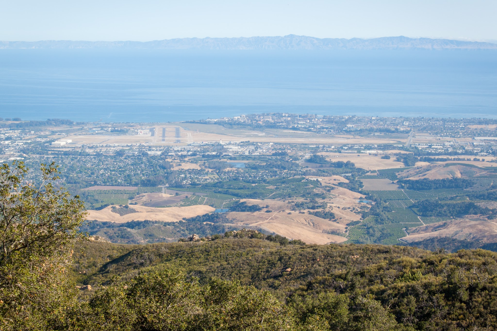
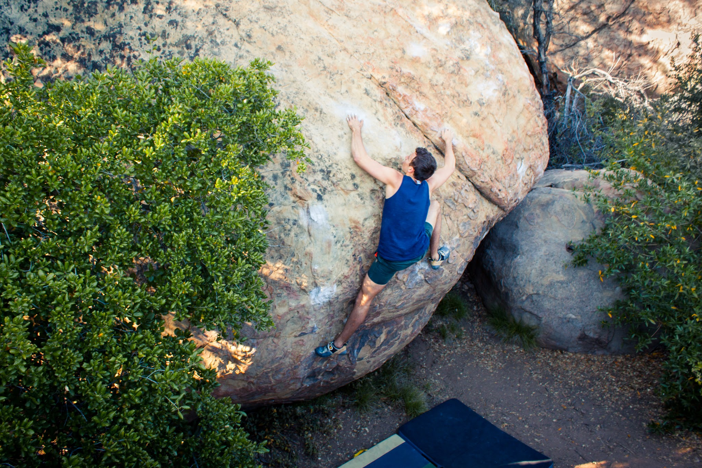
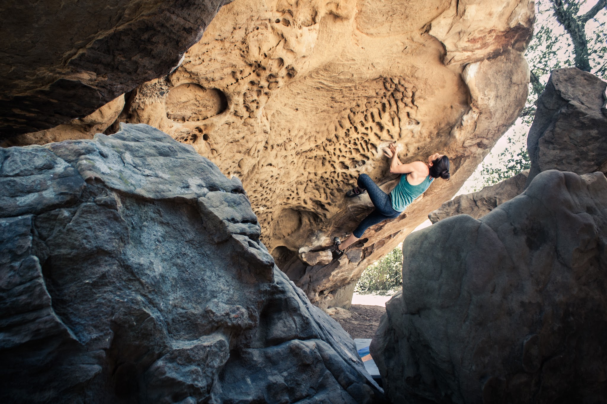
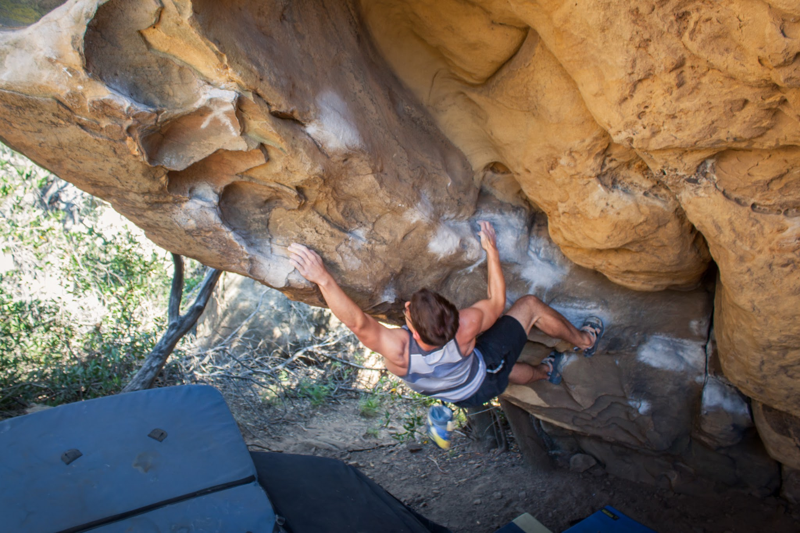
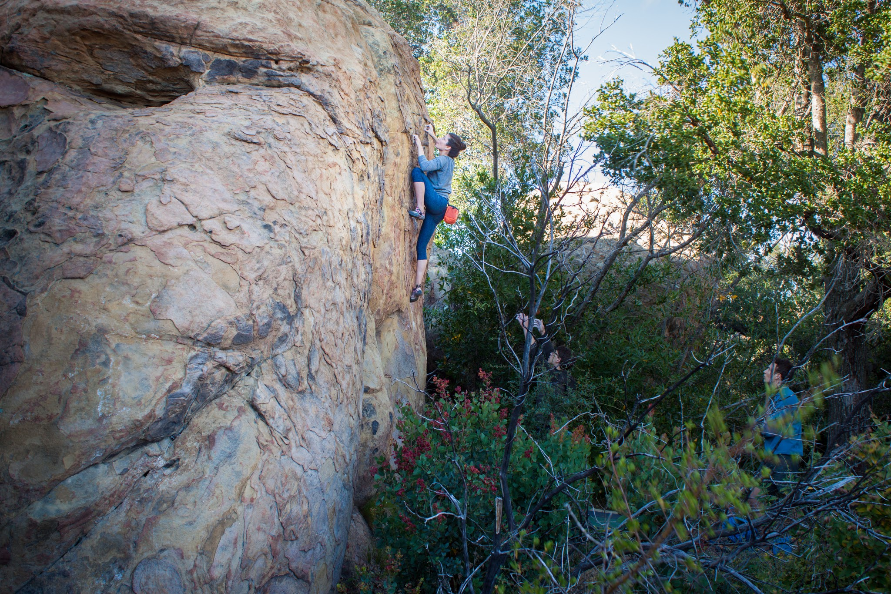

Marina, Jake, Ike and I drove up the coast yesterday for a relaxed half-day at The Brickyard. It has been a while since I have climbed on sandstone, and the large and mostly open-handed features proved more manageable for my sore finger. We jumped on many of the area classics and left feeling tired and more than ready for some Mexican food in town. 

*The beautiful view overlooking Santa Barbara.**Ike, on Charlotte's Web (V3).**Marina, on Soot Patrol, (V3).**Jake, on his spite-send of Watch The Doge, (V5).**Marina, on a tall and thin face climb.*

