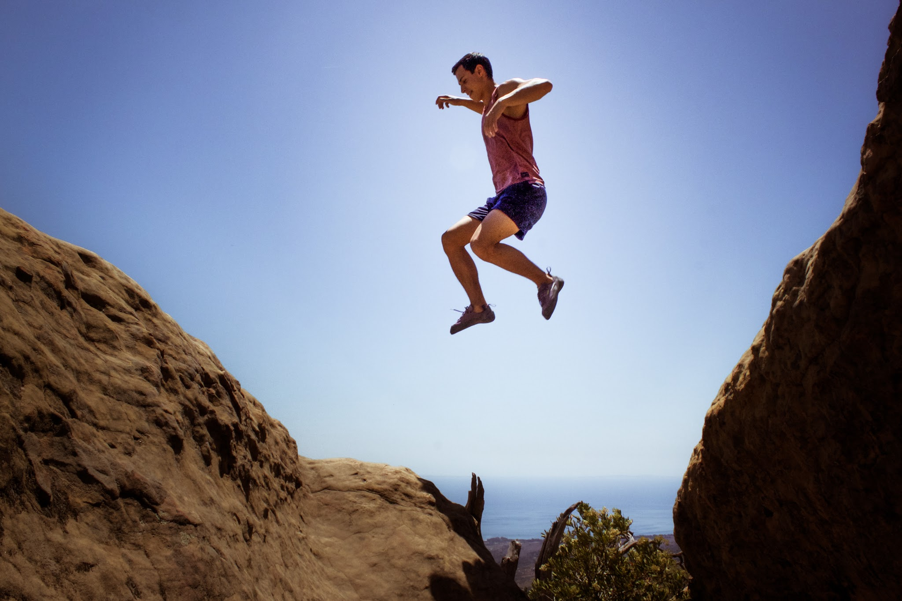
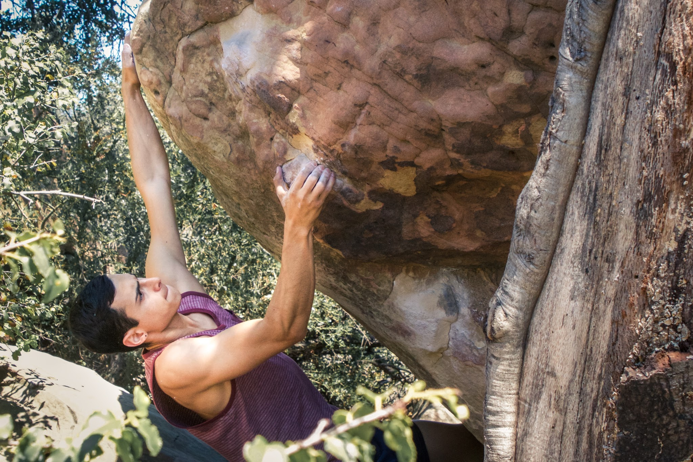
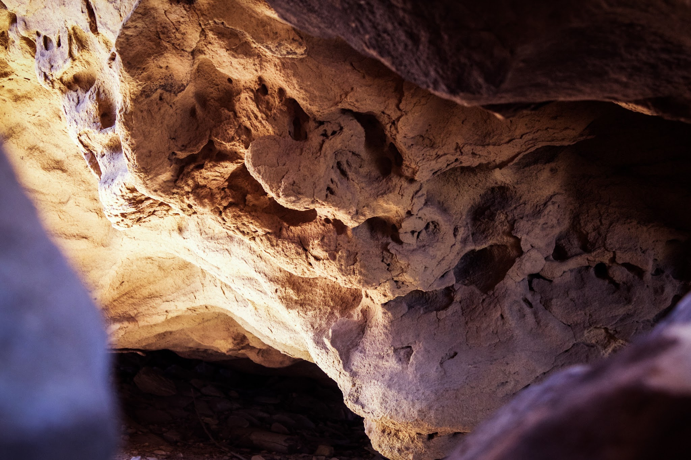
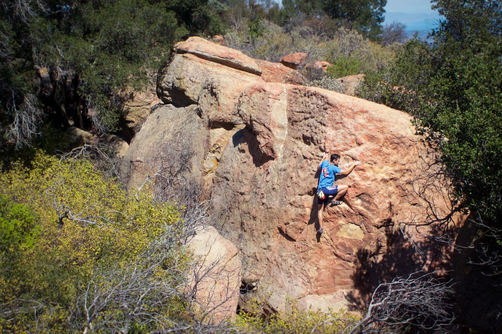
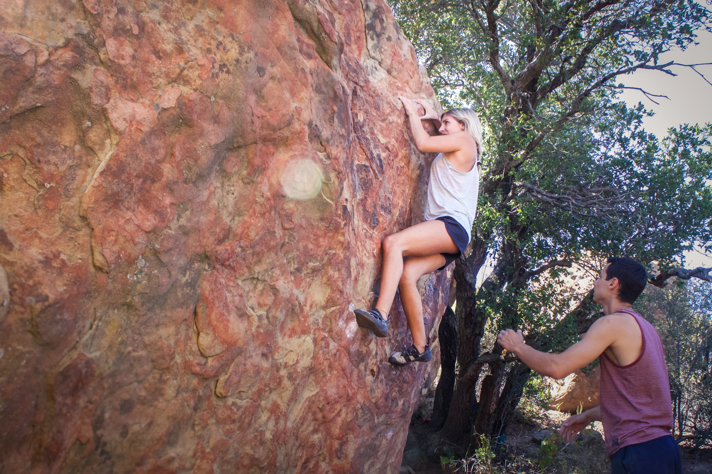

It was too nice a weekend to stay indoors, so I met up with Eden and Jovanna for a quick day trip to Santa Barbara. We ran through a circuit of the area classics like Watch The Dog and Charlotte's Web before switching over to more casual slab climbing.

*Jump!**Eden, on the super fun Smooth Criminal (V6)**Some dank sandstone formations.**Itai, questing up some sunny slab.**Jovanna, sending her project of the day.*The heat and the flies are a good reminder that fall is still far away. Nevertheless, The Brickyard is always a good time. Till next time!

\- Itai
