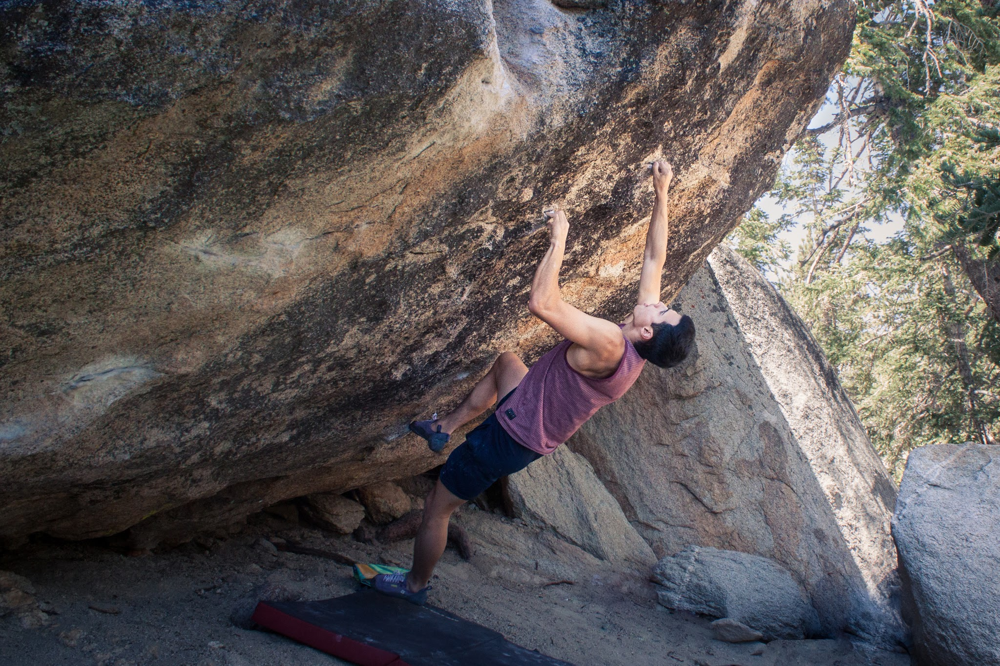
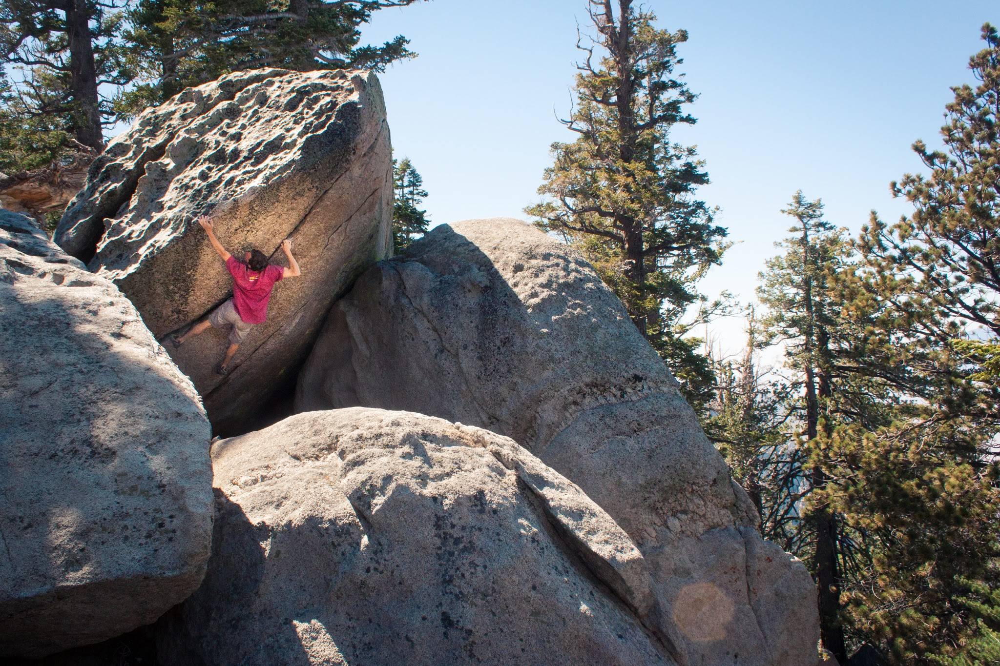
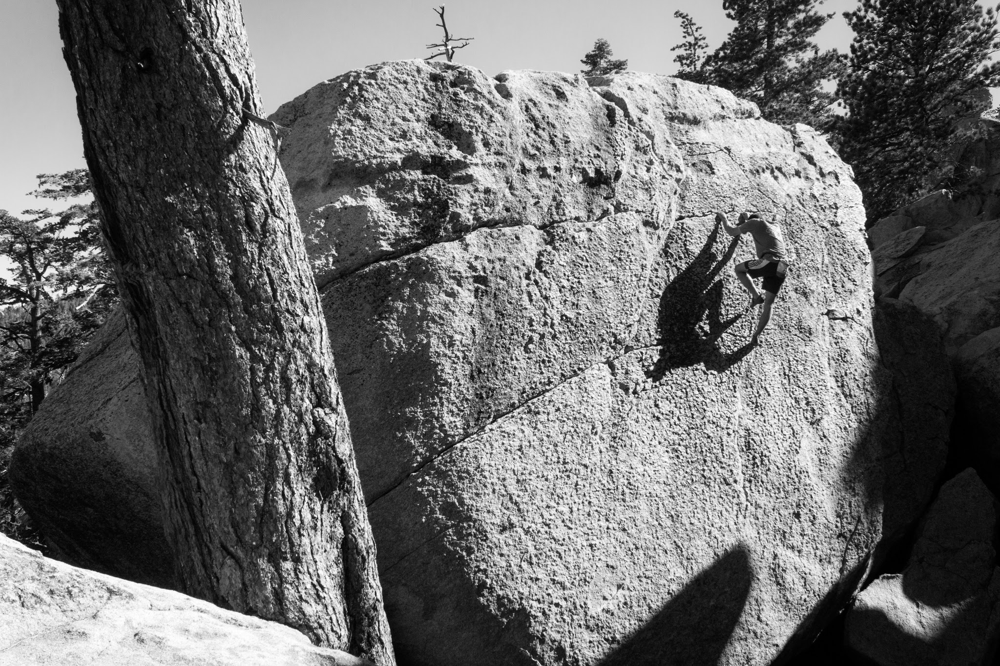
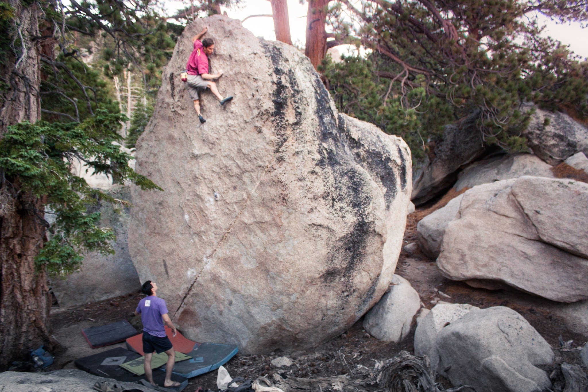

On Saturday Cody, Itai and I drove out to The Tramway and met up with Isaac, Alexandra and Alex. We were hoping that the recent "drop" in weather would lend for a nice day of climbing outdoors. It had been roughly a month since I got to climb outdoors, and much longer since I had touched granite - so I was very excited for the trip.

Before the trip I was itching to jump on Black Mamba (V12) and see if it was a viable summer project. During the day Itai and I managed two separate sessions on it, by the end of which we had completely unlocked the beta and executed every move. Unfortunately we both received flappers/splits in the process and were unable to continue once temps became more favorable. Below is a shot of me staring down the low percentage deadpoint on the Mamba.

*The deadpoint move on Black Mamba (V12)*

After the morning session near the Swing Dance and Blue Flame boulders we headed up the mountain to a cluster of boulders that none of us had been to before. It got recommended to Alex because of a "classic" lowball V5 called How I Wasted Your Time \- or something along those lines. Since it was a new place, the crew got to test out some of the other climbs in the area, like the one pictured below.

*Cody cruising up a V4 with a nice view*

We finished up in the new area and decided to search for Emerald City. I had never been to this Tramway classic, and I was amazed at the quality of the line. Emerald City climbs up a 25-30 foot slab face, and offers a beautiful panoramic view as a topping out present. Highly recommended.
We finished up our day with a goodbye lap on White Flight, another immaculate highball.

*Itai working his way up a V5 just to the right of Emerald City*

*Cody on the last move of White Flight (V3)*

I had a solid day trip out at Tramway and can't wait to get back on some granite in the near future. Seriously, granite is like the best. I can't even.

\- Eden
