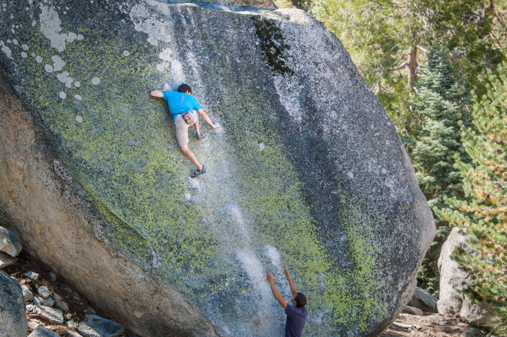
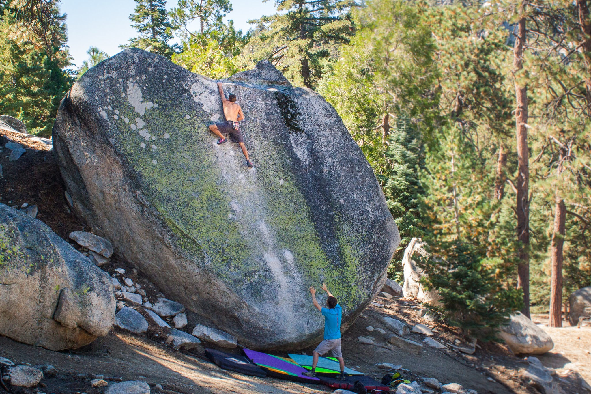
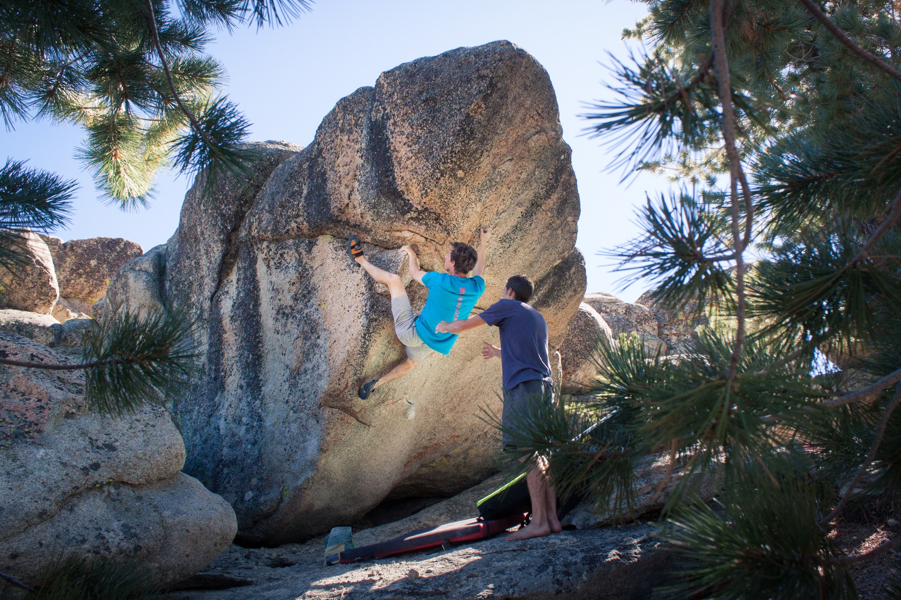
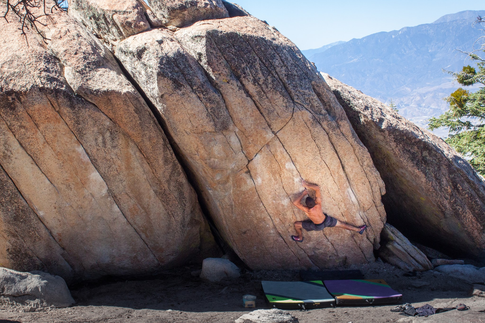
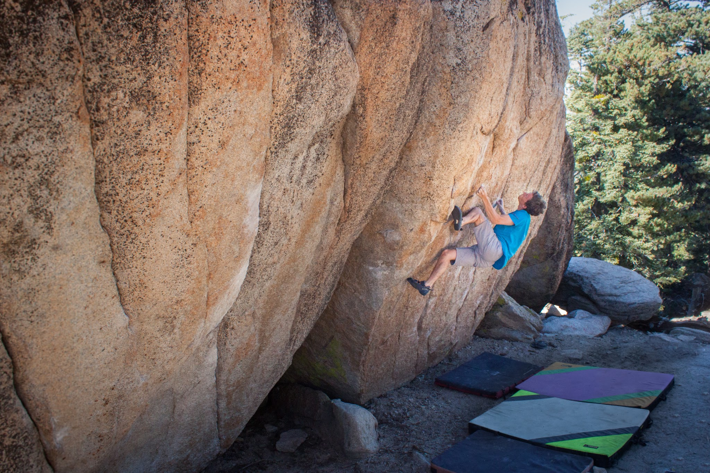
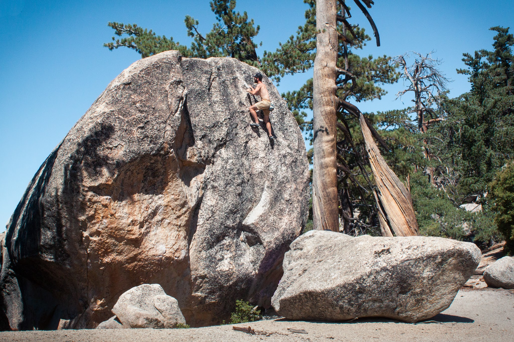
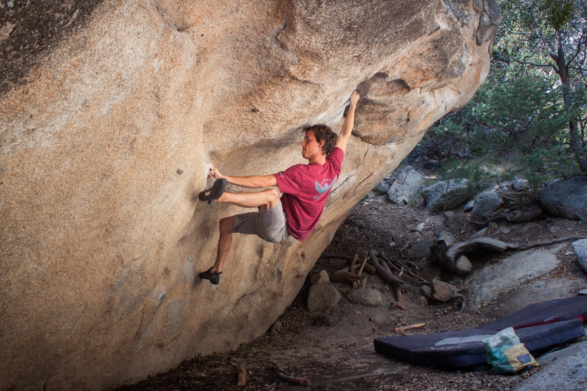
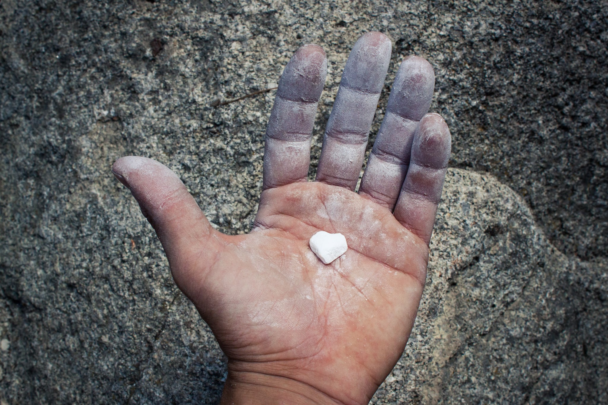

Cody and I set out Friday night to meet up with Joe, Sara and Jason at Black Mountain. We battled heavy traffic the whole way but eventually made it, ready for a night of sleep. Unfortunately, due to recent rain, the dirt road up to the basin campgrounds was too much for our low clearance vehicles. After a short nap we tried our luck at a different campsite and called it a night.

We awoke after very little sleep, so I decided to get the gang on the infamous Big Greeny in hopes of waking everyone up some more. I think it worked.

*Cody, a move away from peeling off the wall.**Joe, staying composed on the committing last move.*

After running through the warm-up circuit, I showed everyone some harder moderates including the classics Tour de France and Hopscotch. 

*Cody, on a problem I put up several years ago called Captain America.*

*Joe, on the elevator door move of Tour de France Sit.*

*Cody on Tour de France.*

Sunday was hot and we were tired but of course we still found the energy to climb. I took the crew out towards the Lion's Main boulder which I had never been to before. Making committing moves up high in the noon sun was rather draining, and most of the group decided to head home. Cody and I stayed for a few more hours, working some projects and hiking around.

*Jason slabbing it up.**Cody, figuring out his beta on Loh Roof.**Chalk Heart*

It was nice to get back out to Black Mountain and play tour guide for a weekend with some good friends. I'm hoping they'll be back soon (with better temps).

\- Itai
