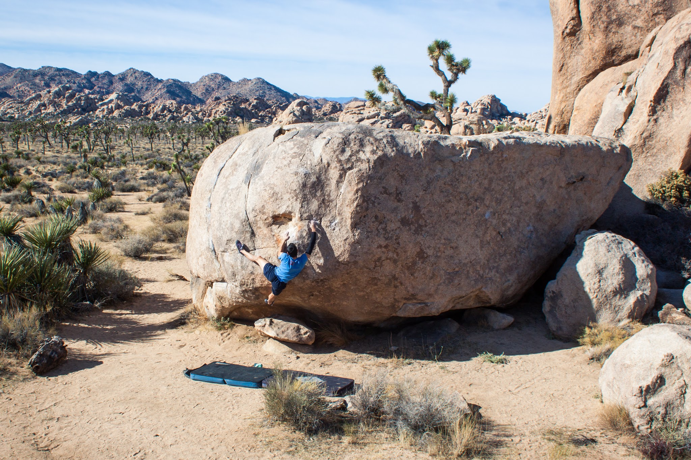
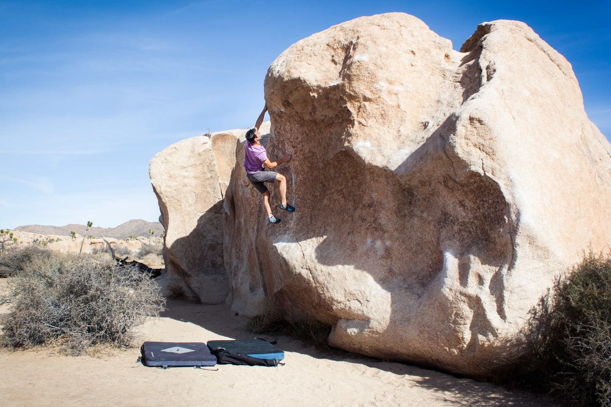
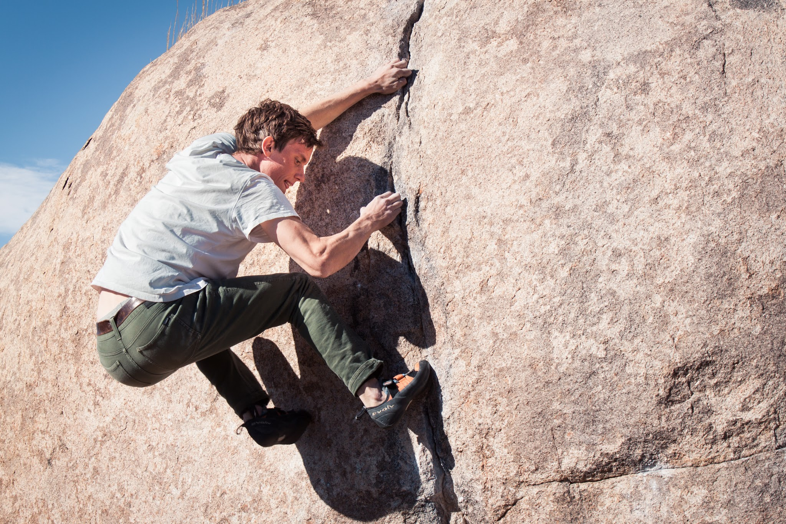
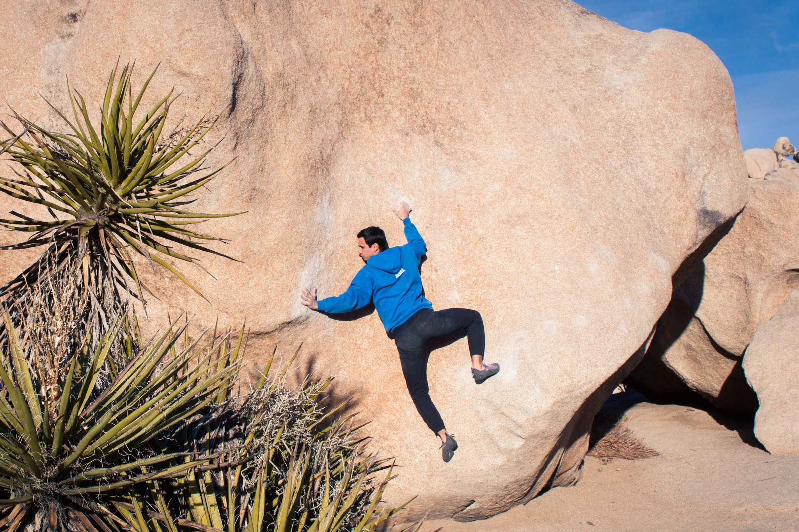
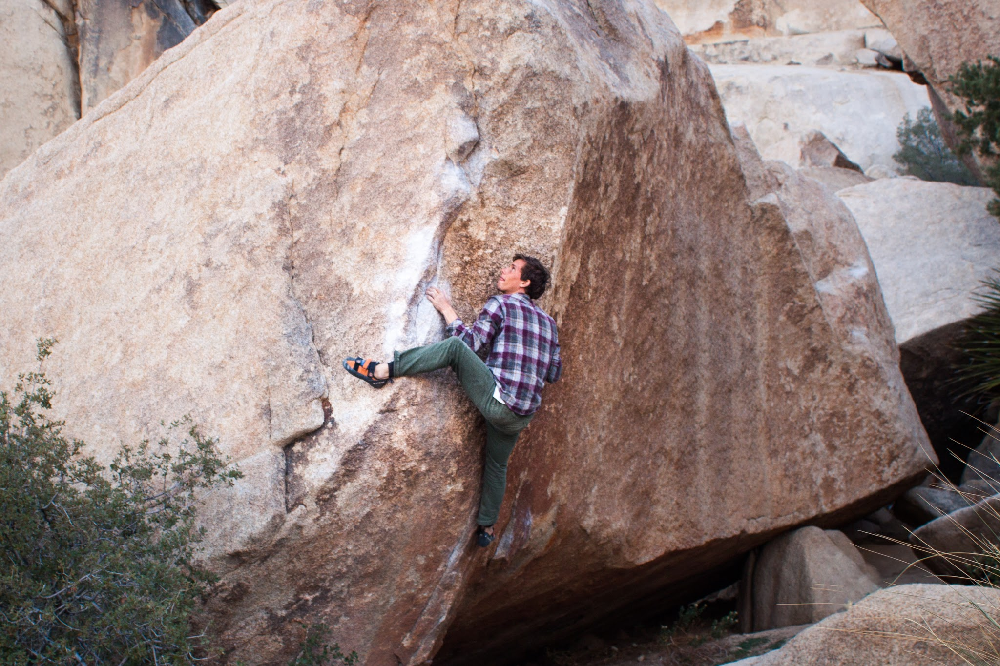
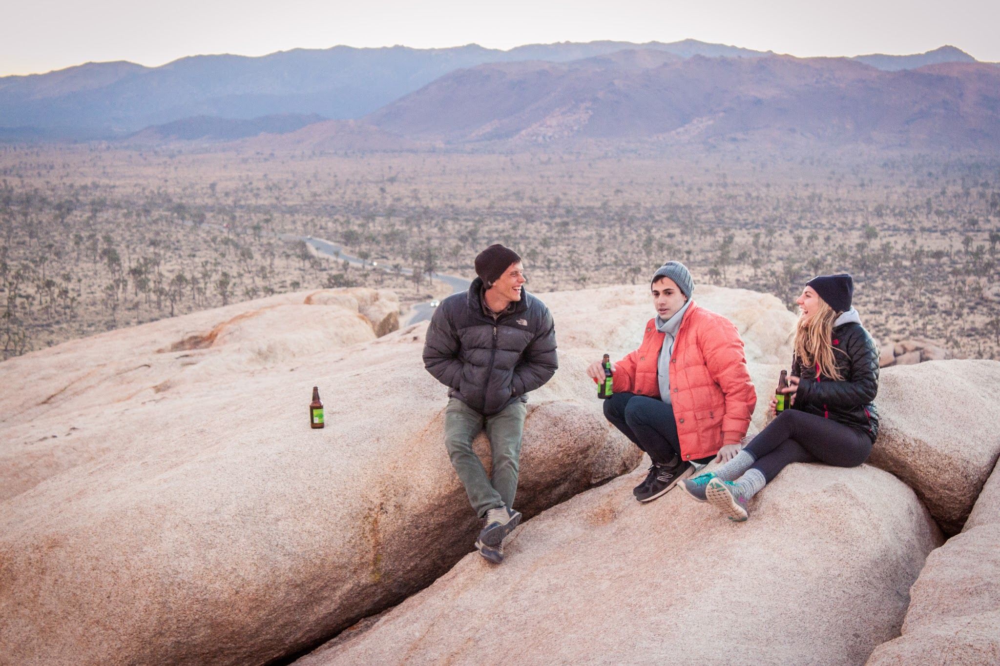
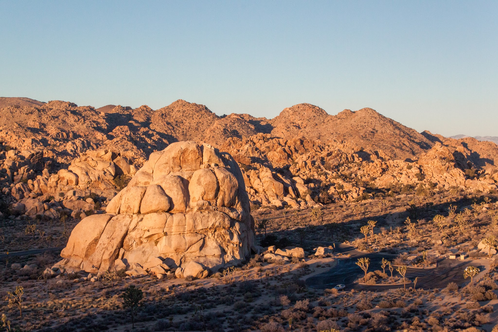

Over the past few weeks, Eden and I have made some trips out towards the beautiful desert east of Los Angeles. Joshua Tree hosts some impressive granite peaks and boulders with equally impressive views. It's been great to get out there with friends and explore some of the classics. Here are some pictures from the last few trips:

*Eden, on the small crimps of Vicarious, V10*

*The classic Undertow, V3*

*Cody, laying back the crack.*

*Eden, stemming the gem.*

*Cody, eyeing the next hold on the tricky Scatterbrain (V6).*

*The gang, relaxing and enjoying the view after a day of climbing.*

*The morning light on Intersection Rock.*

It's always hard to leave this place, no matter how tired and dirty you are at the end of the trip. We all left plenty of climbs undone, so a return trip is a must.

\- Itai
