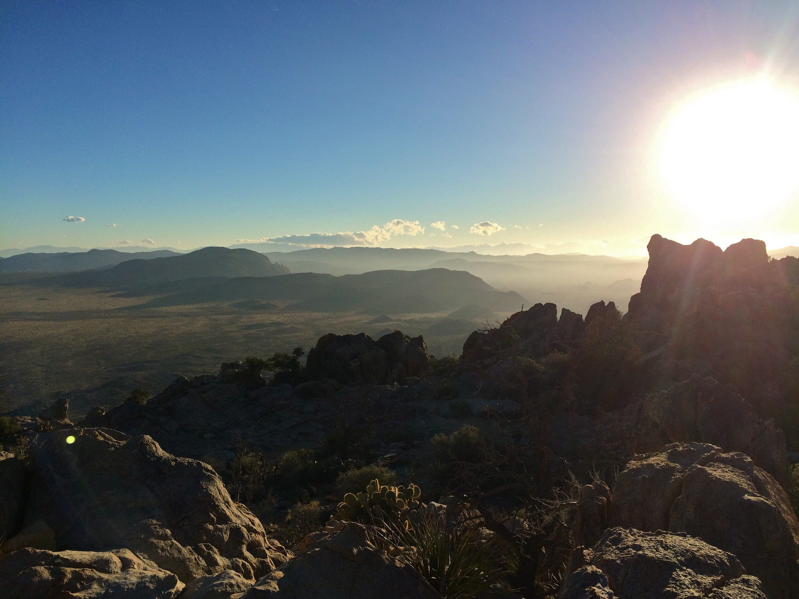
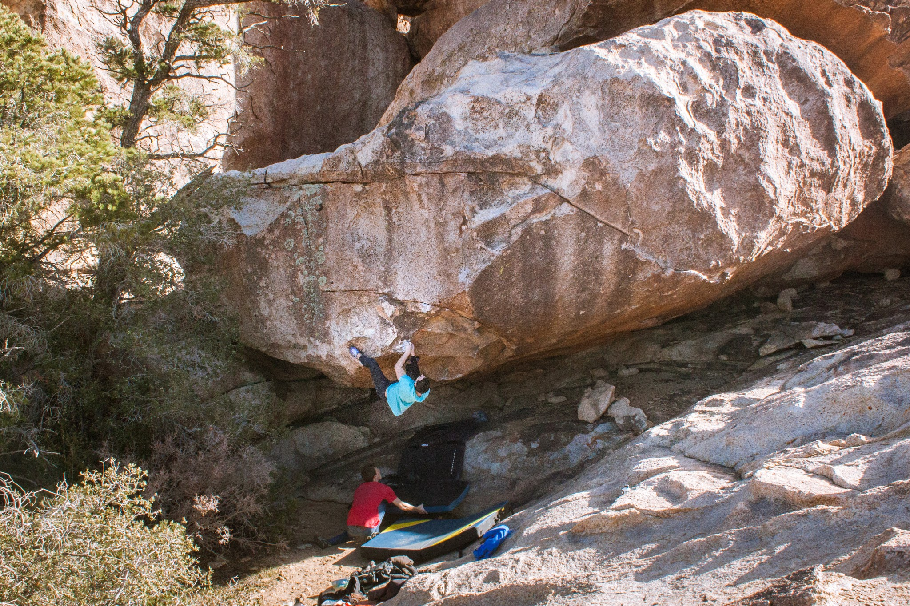
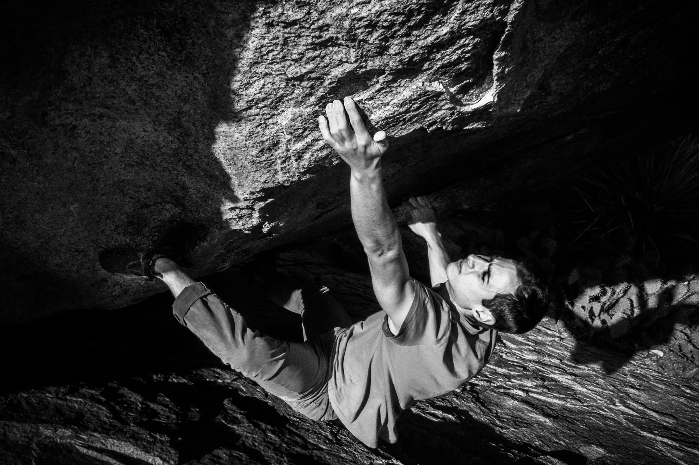
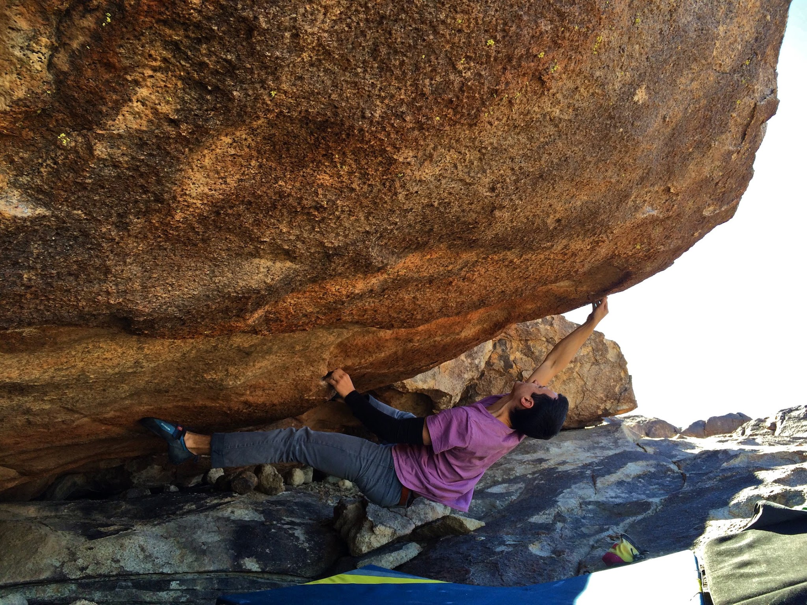
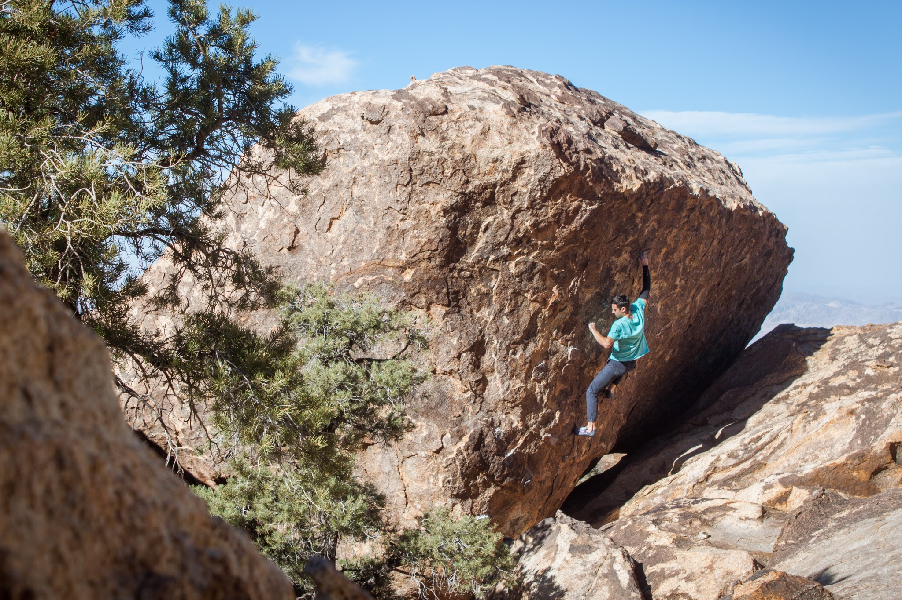
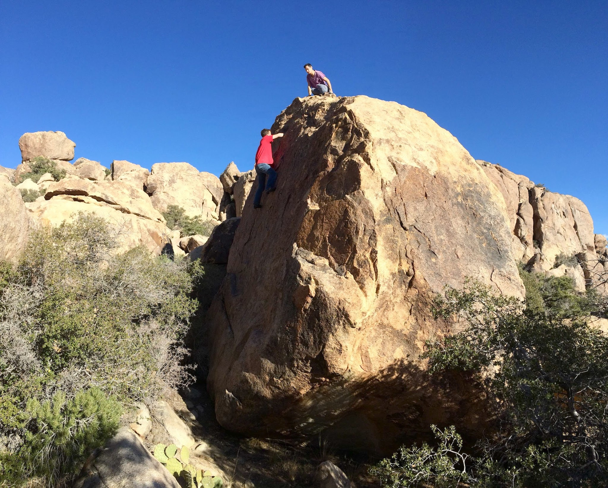
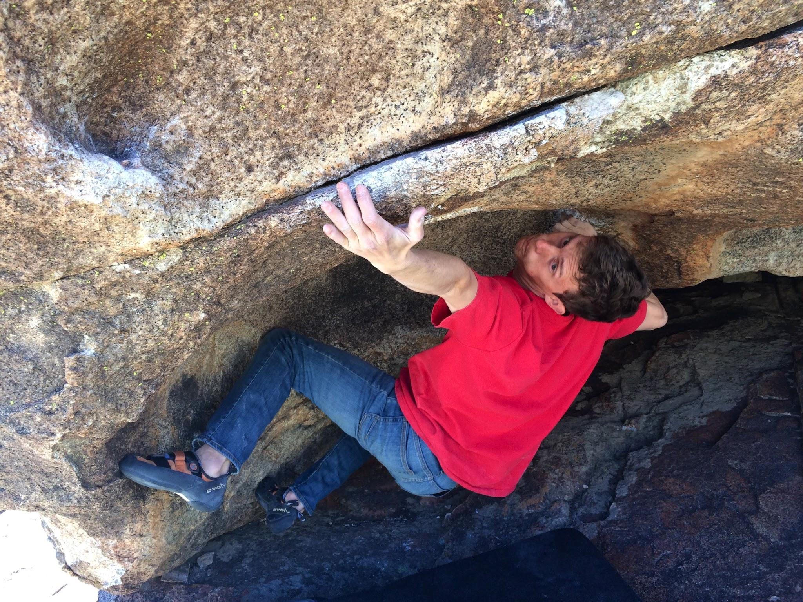
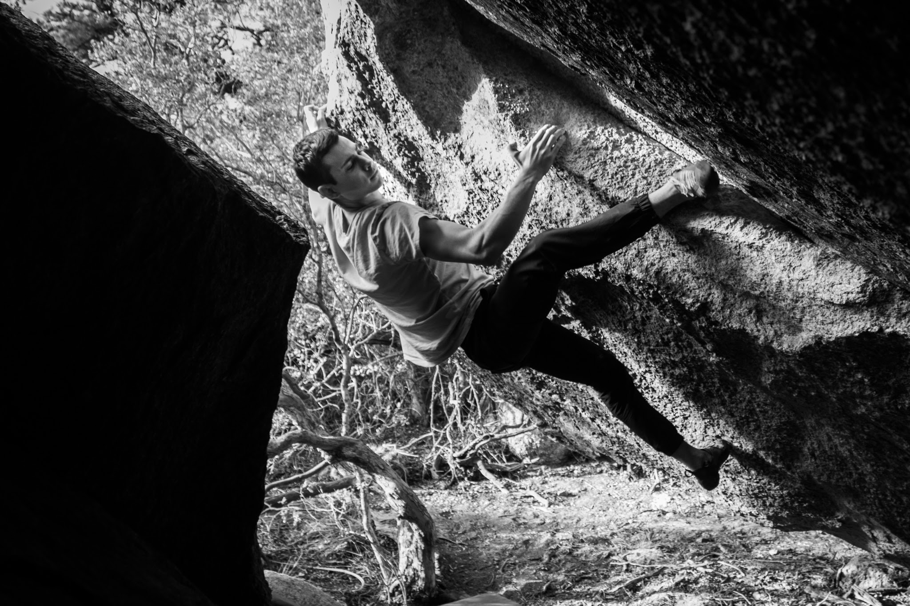
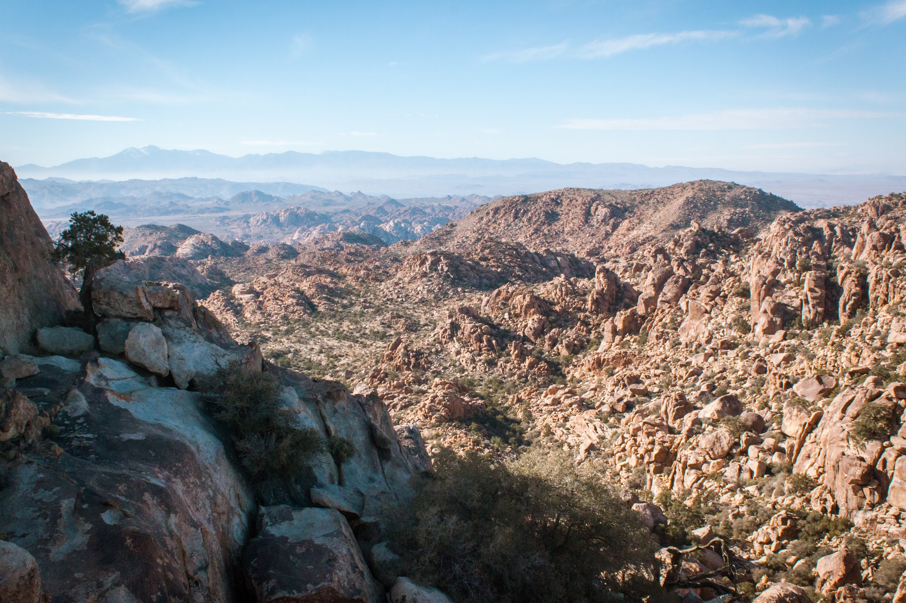

We awoke after a short sleep in what must have been the last camping spot in the whole park and headed down the dirt road to Queen Mountain pullout. Cody, Eden and I had discussed hiking out to the underground for several months, and today was finally the day. The infamous approach deters most, but we felt up for the challenge and the opportunity to escape the crowds.

You can spot the giant ravine from about a mile away, an imposing thousand feet of elevation gain and plenty of chances to get lost lay ahead. We followed the cairns as best we could and made it to the secluded plateau of The Underground in just under two hours. We had plenty of great climbs to get on, Dark Matter being the best of the lot.

Though we may not be eager to do that hike again, I know we will be back. The climbing there is just too good to pass up.

\- Itai
