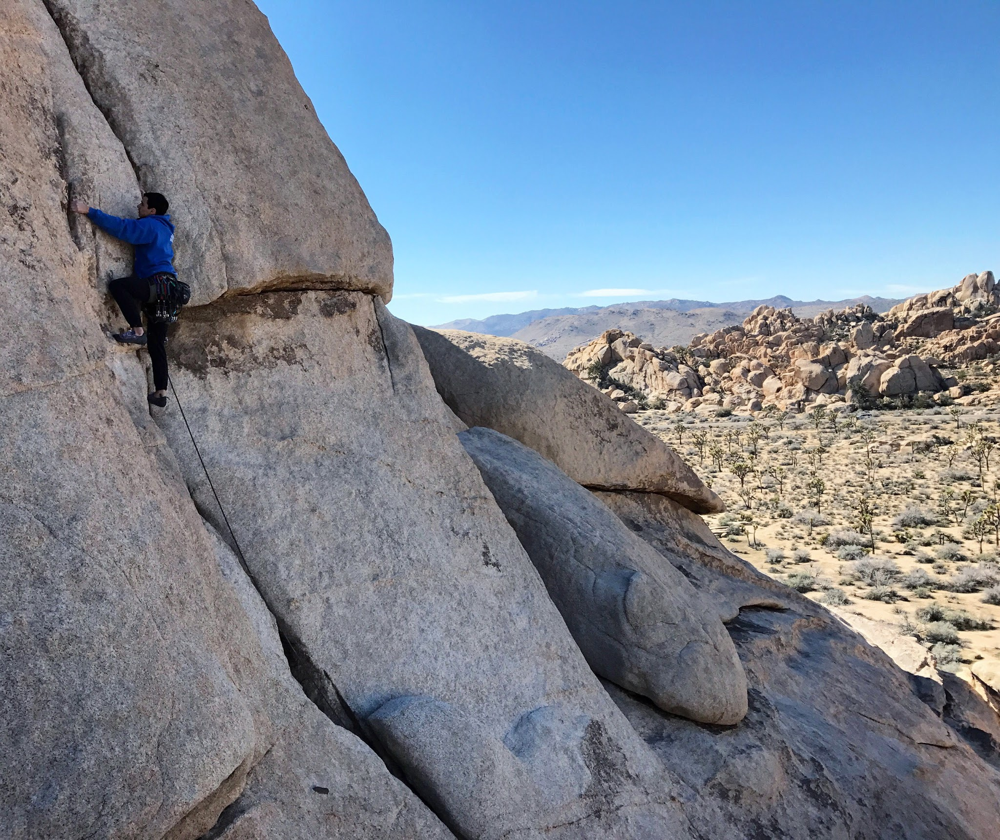
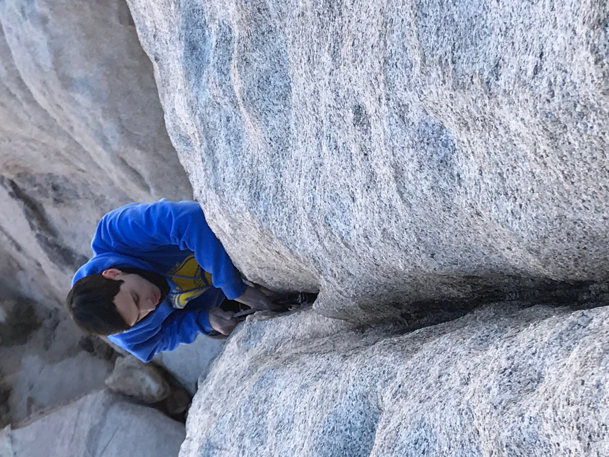
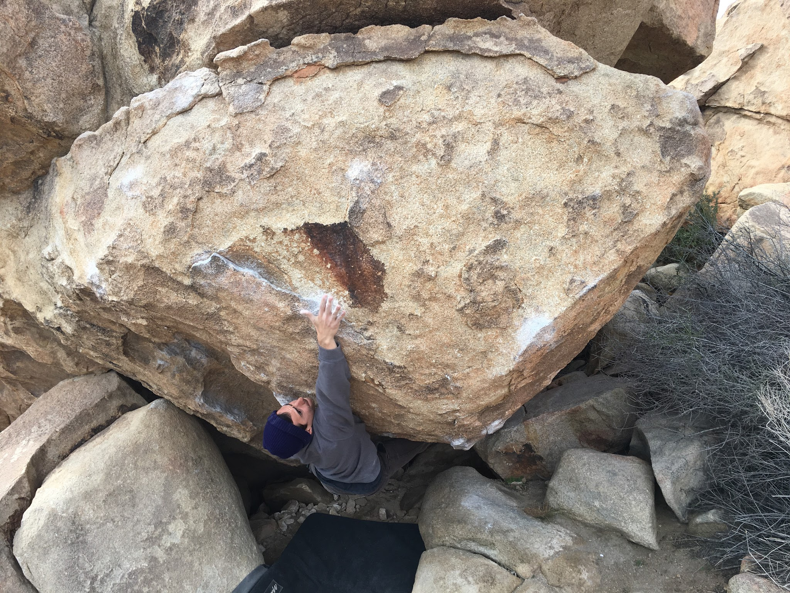
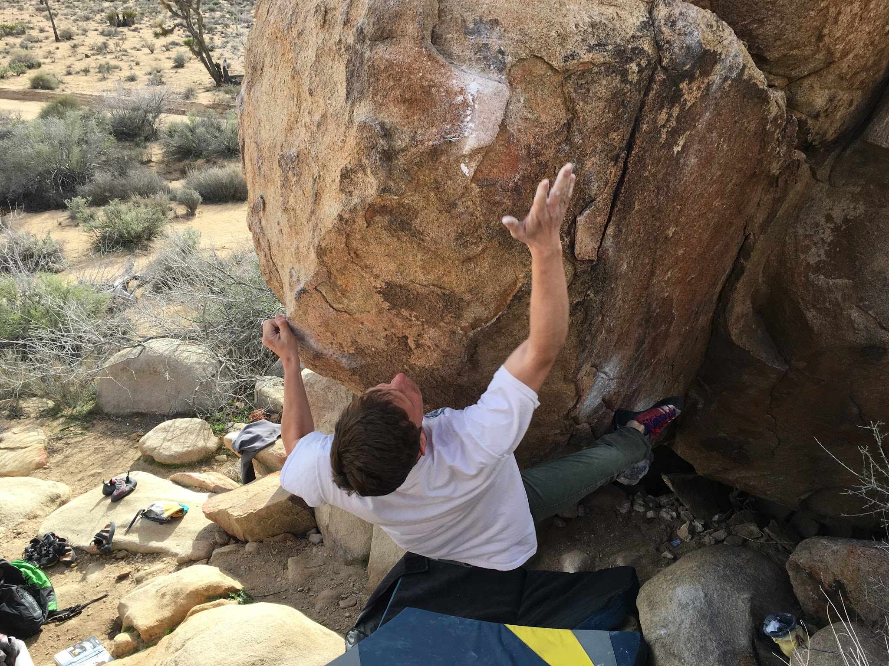

We had to take advantage of some dry weather this last weekend, so Itai, Cody and I drove out to Joshua Tree on Friday night for a quick day trip.

We woke up fairly early on Saturday morning after a cold desert night, and the guys made me warm up by leading my first trad climb. Can't believe it took nearly 12 years of climbing! 

We transitioned from rope to bouldering, and spent some time working on Tidal Wave and Scatterbrain (Sit). In true Joshua Tree fashion, I ended up putting a hole in my finger and had to call it a day. We later went on to explore the Echo Rock area and jumped on some new climbs!

*Itai sticking the crux on Igneous Ambiance (V7)**Itai snagging the last move on Mulligan Variation (V8)*

*And Cody, getting agonizingly close...*

Next time!
