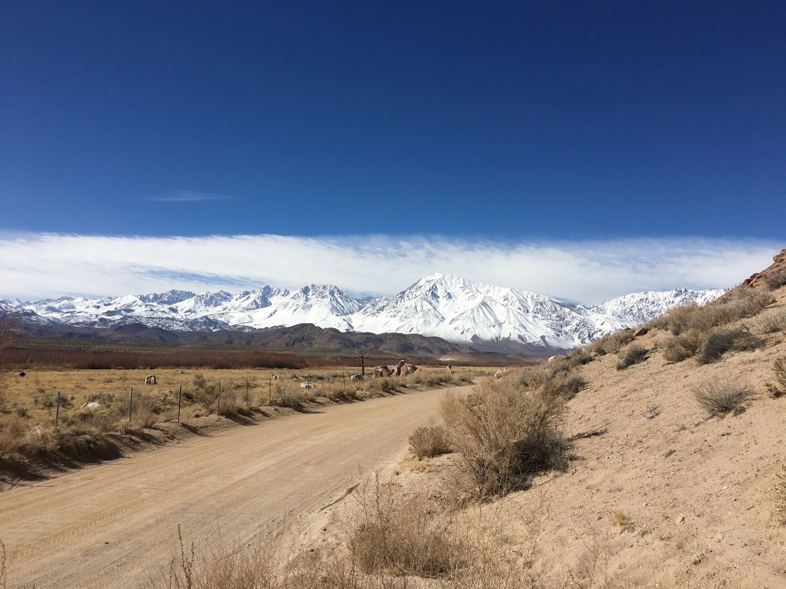
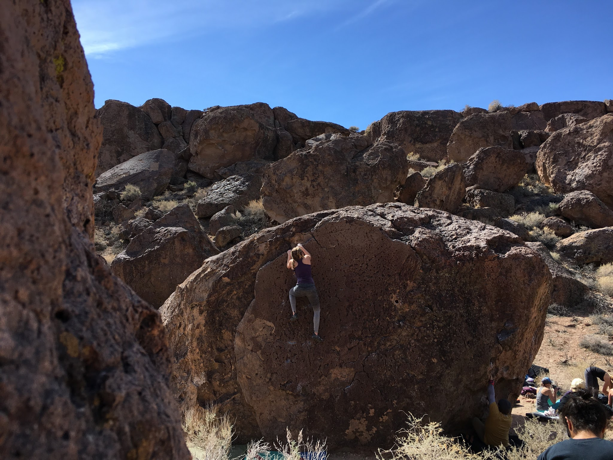
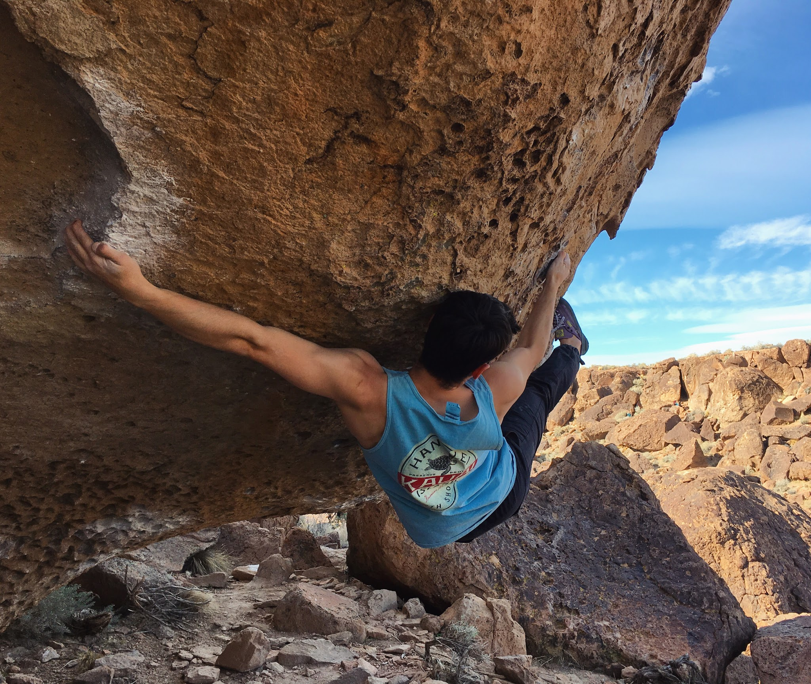
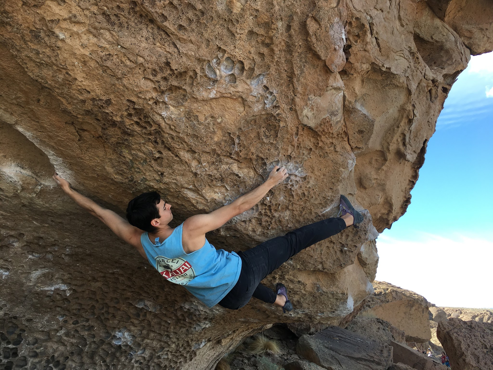

Jovanna and I drove up to Bishop early Saturday morning for a full day at the Happy Boulders. It had been a year since I'd last been to Bishop, and even longer since I climbed at the tablelands. I was excited to be back! 

*Mount Tom, draped in snow*

We spent the morning meandering through the canyon floor and jumping on fun classics.

*Jovanna running up Mmm.. Nice*

It started heating up and getting more crowded so we headed up the canyon side so I could jump on He Got Game (V11). After figuring out the beta for the crux sequences exiting the roof, I managed to send!

*The crux sequence on He Got Game (V11)*

*Another angle of the same move*

We continued climbing throughout the afternoon until our skin had us stop.

*Jovanna, climbing Paranormal in the West Country (V1) on our way out*

It was great getting out to the Sierras and I can't wait to get back!

\- Eden

