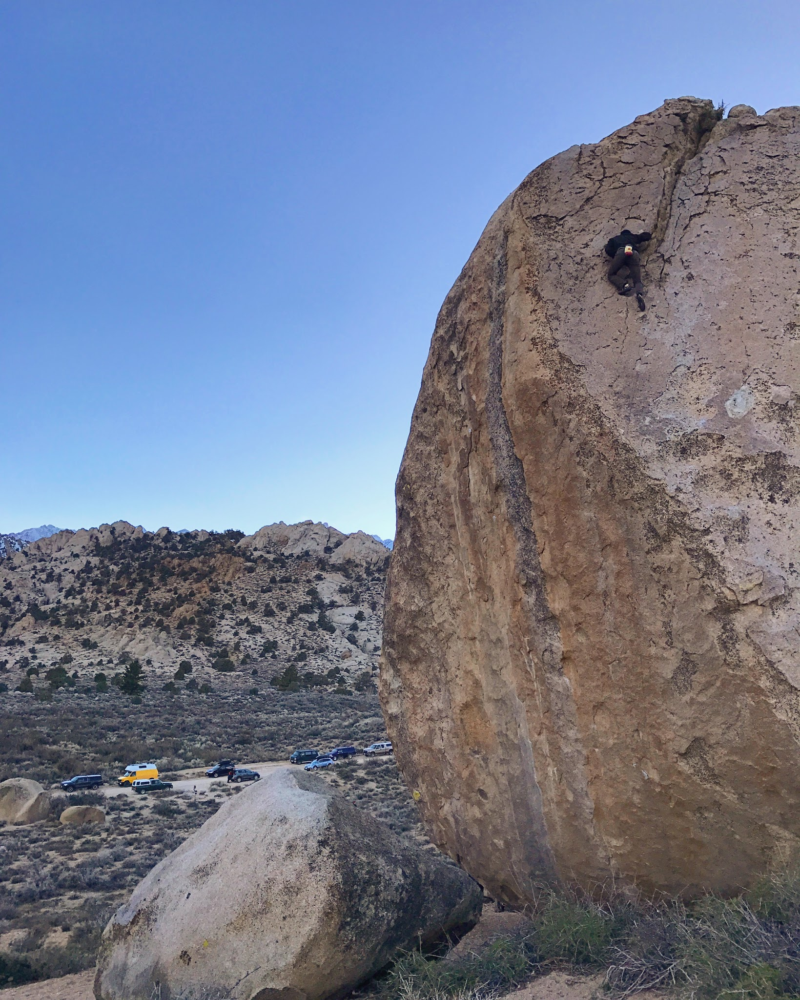

It shames me to even mention that it had been over a year since I last set my eyes on the beautiful Buttermilk country. Over a year since my fingers got tested by the large crystals of those perfect granite crimps. Cody and I set forth for Bishop early last Friday despite some questionable weather forecasts, and I'm very glad we did.
Aside from being a little scared topping out Saigon and Roadside Highball in slight rain when we first arrived, it quickly blew past us and never returned.

.jpg)*Cody, slapping the last big move on Brian's Project (V8)*

.jpg)*Sticking the first move on Scenic Crank Low (V11)*

The first day ended with the highlight of sending the rarely done Scenic Crank Low (pictured above) in only three or so attempts. Cody got painfully close to sending Brian's Project but will have to return to it next time with better temps hopefully. Our finger tips were raw from a full day of climbing so we went in to town for a much deserved burger and beer and to watch some March Madness.

The next day Joe and Sara joined us for yet another full day of great climbing which included a flash of Pope's Hat and a few sunset laps on the giant Peabody's aretes.

.jpg)*Joe topping out Verdad (V5)**Itai, pulling out of the roof and onto the tall finish on the flash of Pope's Hat (V10)*

.jpg)*Joe, starting his long quest up Grandpa Peabody's East Arete (5.10a)*

*Itai, nearing the top of East Arete (5.10) as the sun sets on the Milks.*My fingers are still recovering from the non-stop bouldering weekend but as always, I can't wait to go back.

\- Itai
