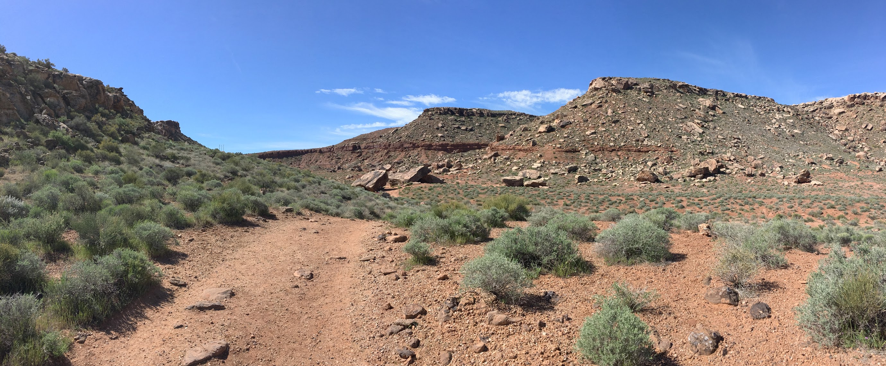
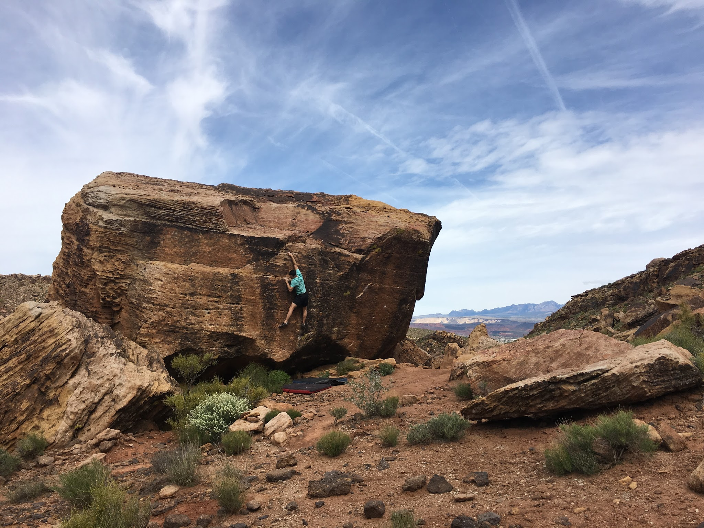
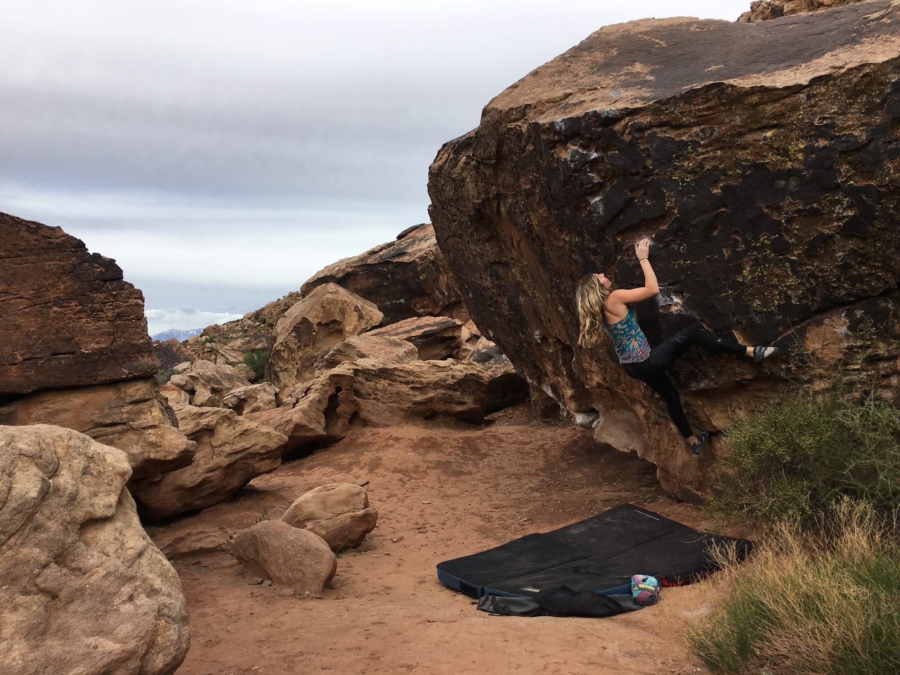
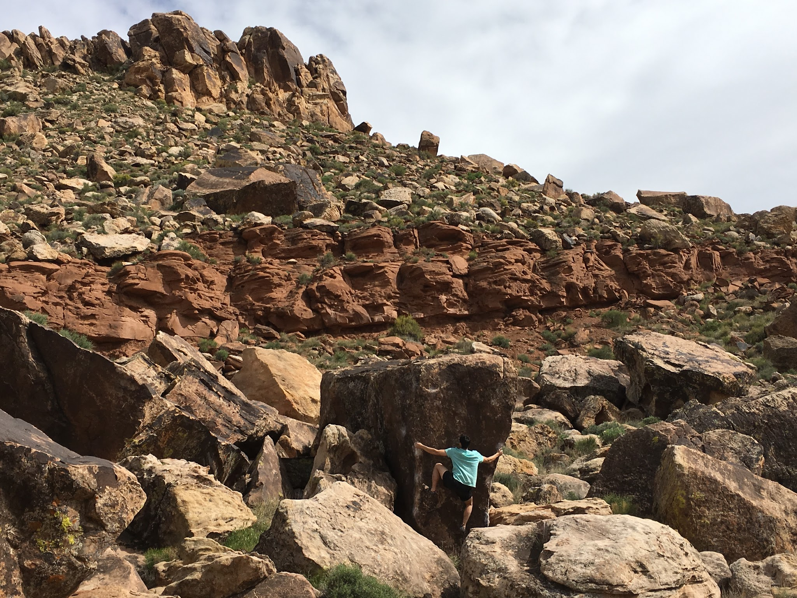
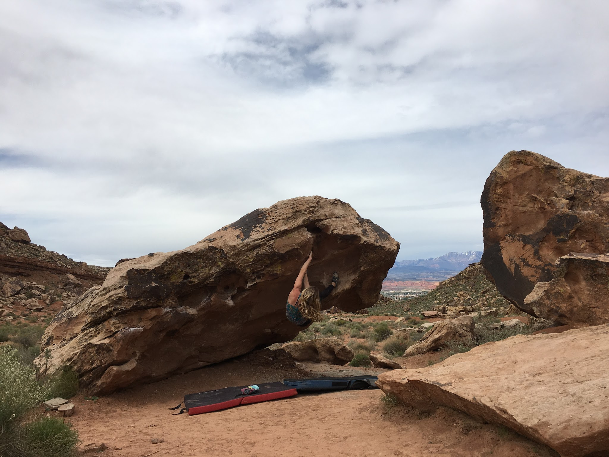
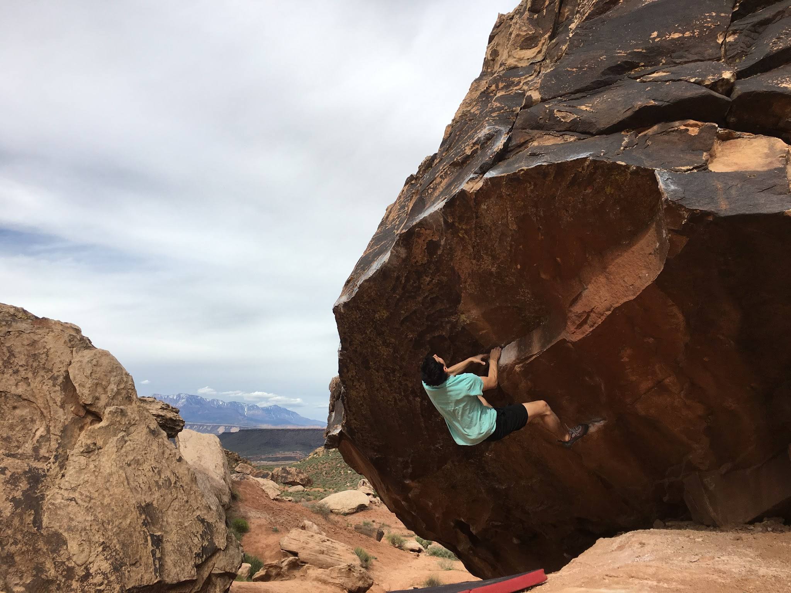
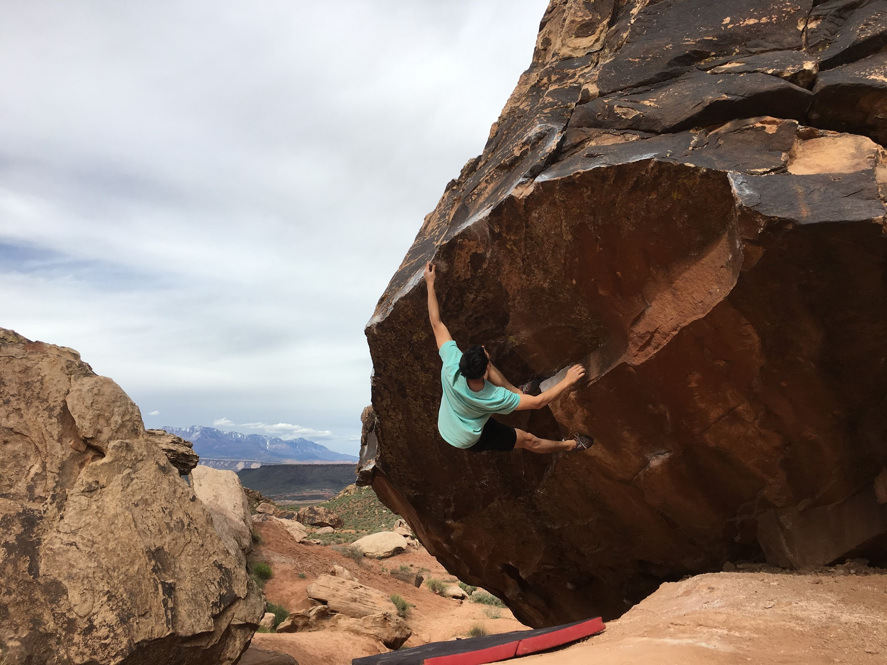
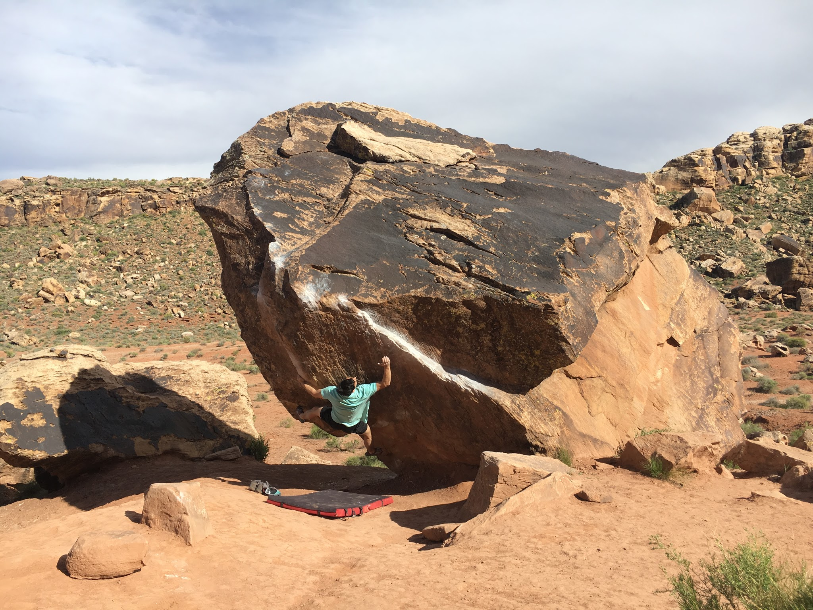

Jovanna and I headed up to Zion for a short, but much deserved (on her part) vacation. We decided to make a quick pit-stop in Moe's Valley during our Utah adventure. At first it was tough to navigate due to the fact that we did not have a guidebook, but we managed to find the valley of boulders and enjoyed a full day of climbing. We were not disappointed! 

*View of the valley*

*A V6 on the Settlers of Catan Boulder*

After warming up and getting a feel for the area I decided to jump on Show of Hands (V11) - which I had my eye on since before the trip. This beautiful line climbs out of a roof on perfect incut crimps and finishes on a tall slab. I was happy to take this one down!

*Show of Hands (V11)*

We spent the rest of the day trying out boulder problems and exploring the new area.

*Jovanna working the moves on Whelmed (V4)*

*The Fridge (V4)*

*Jovanna sending Steamfunk (V2)*

*Spectro (V6)*

*Israil Direct (V8)*

One day was not enough. I can't wait to be back!

\- Eden

