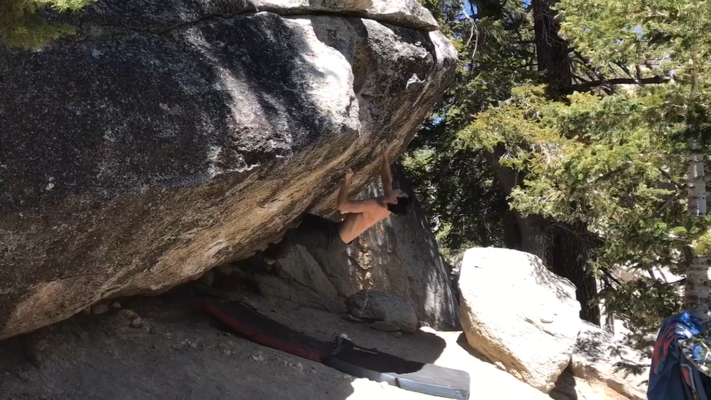
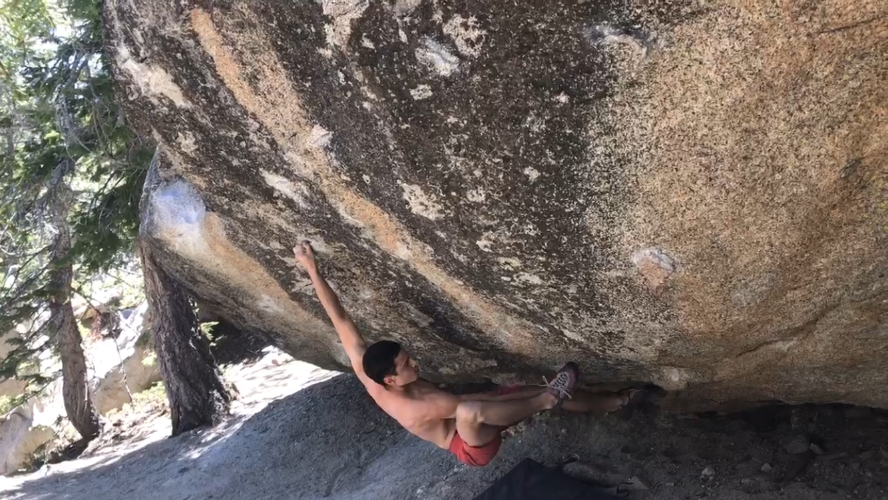
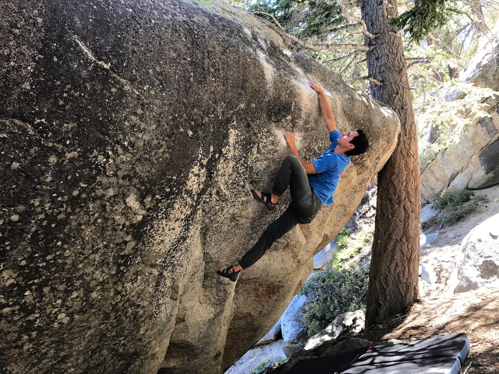
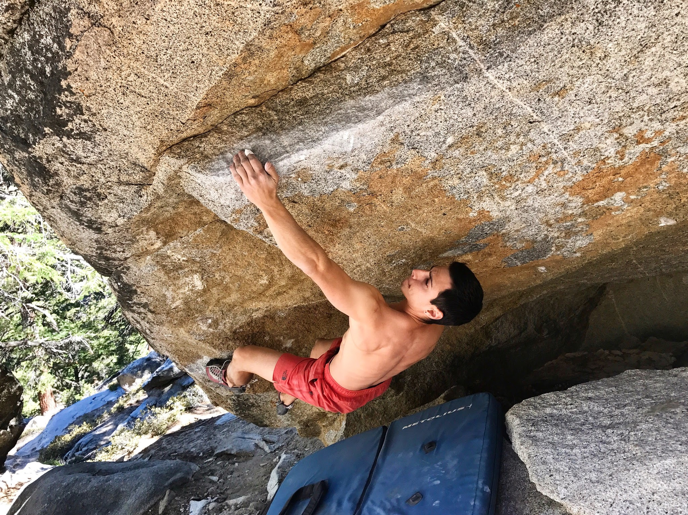
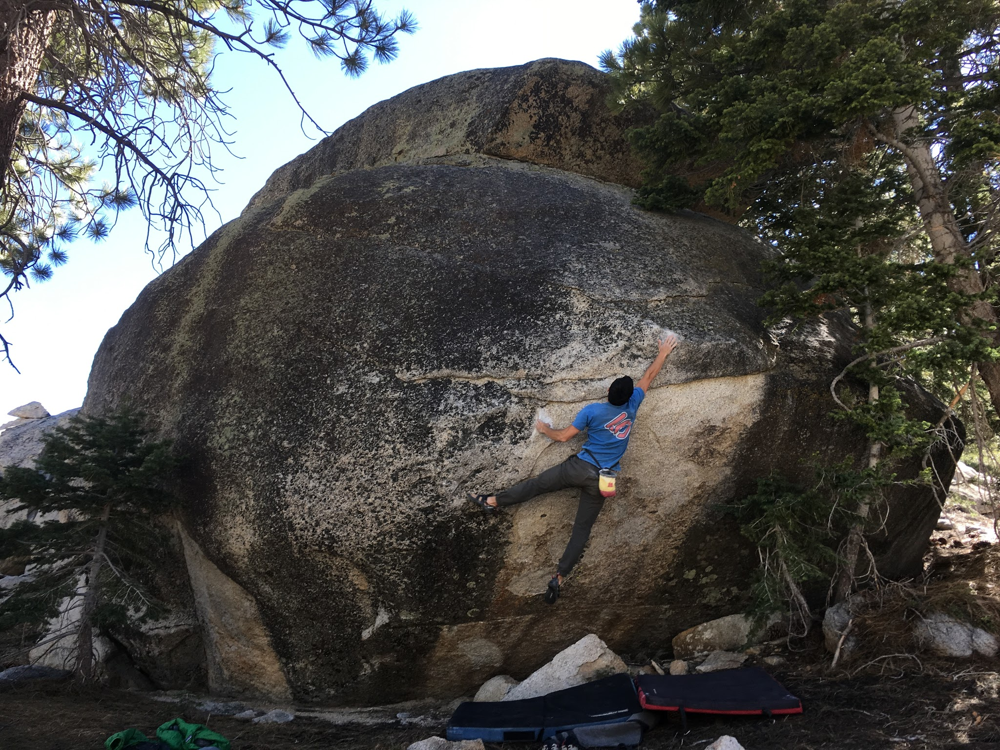
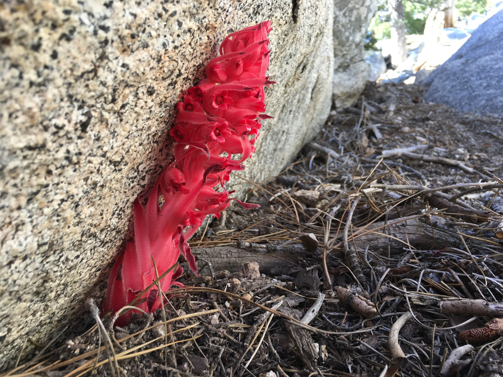

Itai and I headed up to Tramway on Saturday for the first time in a year. We decided to start the day by jumping on our project - Black Mamba (V12). This line adds a sit start to Stretch Armstrong, a low percentage one-move-wonder V10. We both got agonizingly close, falling on the last move many times. Definitely feels like it'll go down this summer!

*Screengrab of Itai on Black Mamba (V12)*

*Me on the same*

After working Black Mamba for a while, we headed up the hill to the Icebergs to jump on Greenpeace Sit (V10) and Science Friction (V10). We made quick work of both!

*Itai sending Greenpeace Sit (V10)*

*Me on Science Friction (V10)*

On the way out we stopped by Osama (V10), which Itai gave a few goes on. But by this time we were pretty wiped, so this one will have to wait for next time!

*Itai sticking the opening move on Osama*

See you out there!

Eden
