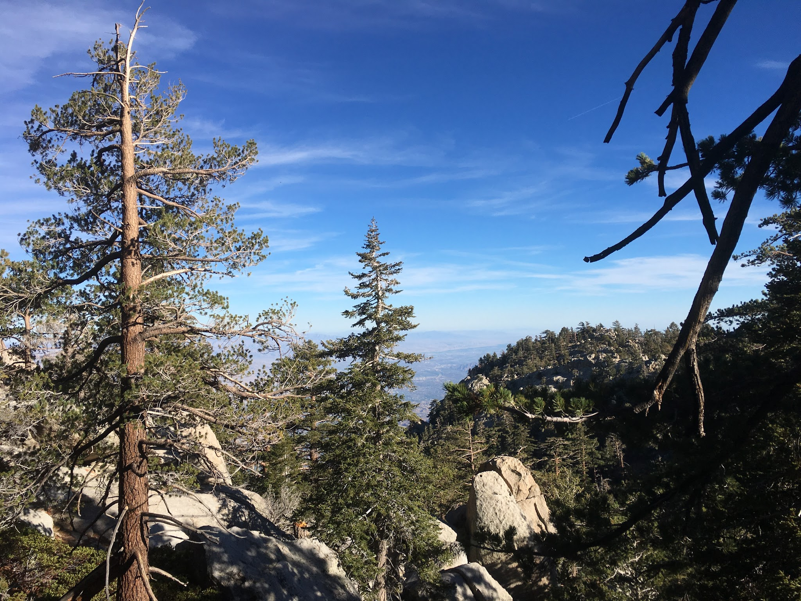
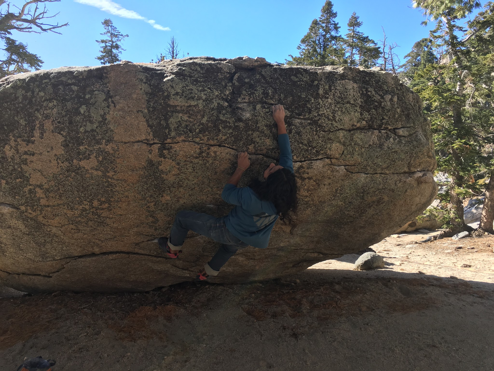
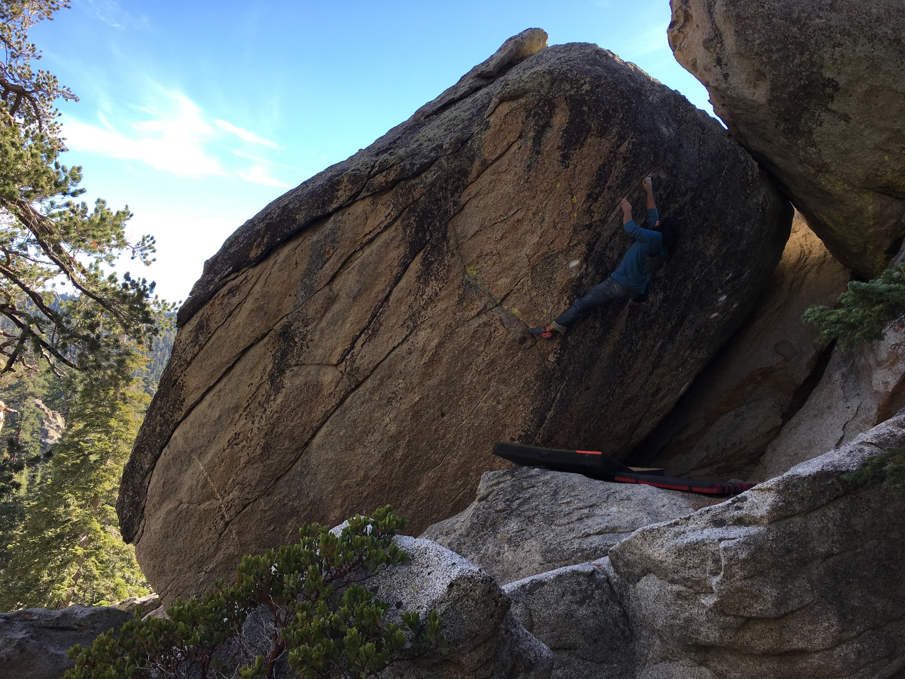
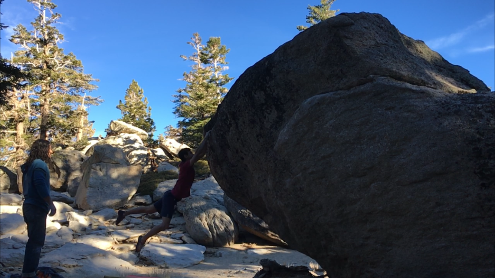
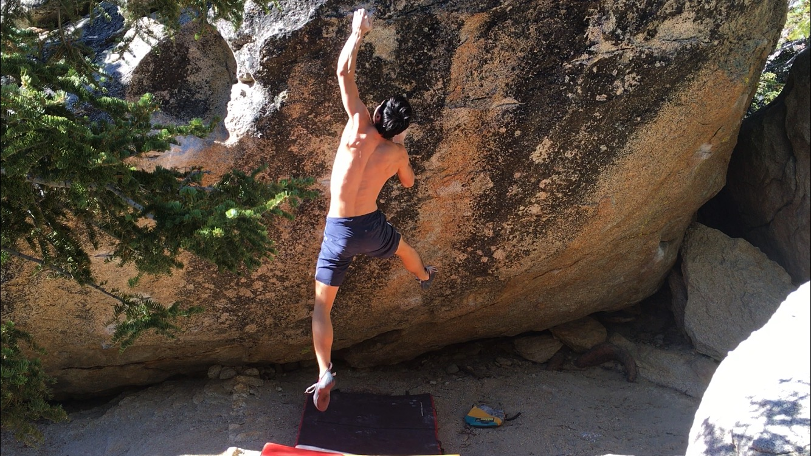

Yesterday Norm and I headed up to Tramway to get outdoors and escape the record-breaking heat.

We began our day by warming up and then heading to my project Black Mamba (V12). It started off well, but I tweaked my shoulder on one of the goes and decided to take a break and come back later. After that, we went looking for Barefoot Sharma Arete (V8), which took an embarrassingly long time considering we had the guide. But once we found our bearings we jumped on a few new and enjoyable climbs!

*Norm taking a lap on a crimpy V5/6*

*Norm getting agonizingly close on Barefoot Sharma Arete (V8)*

*Me sending Chad's Dyno (V10)*

It was getting later and we decided to start heading out and back to the tram. But before that, we made a pit stop at the project and I sent it!! So happy to finally put this one down.

*Sending Black Mamba (V12)*

\- Eden

