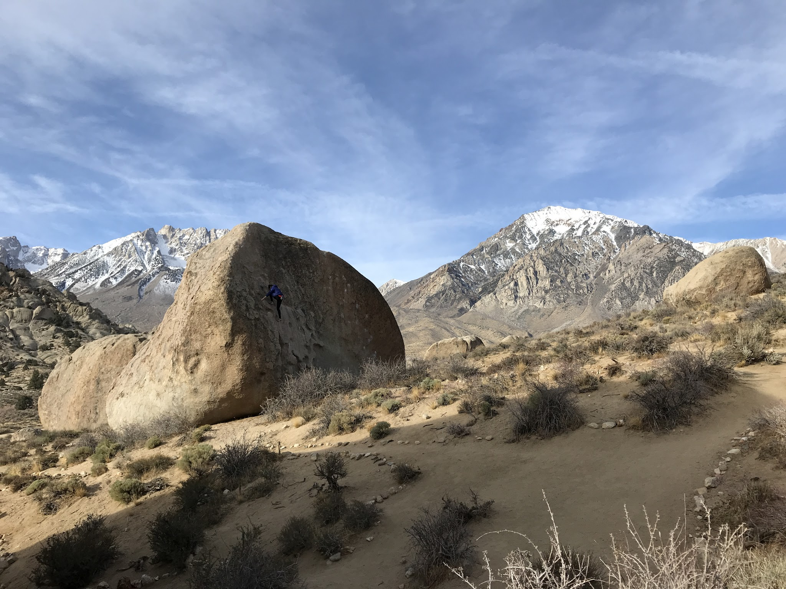
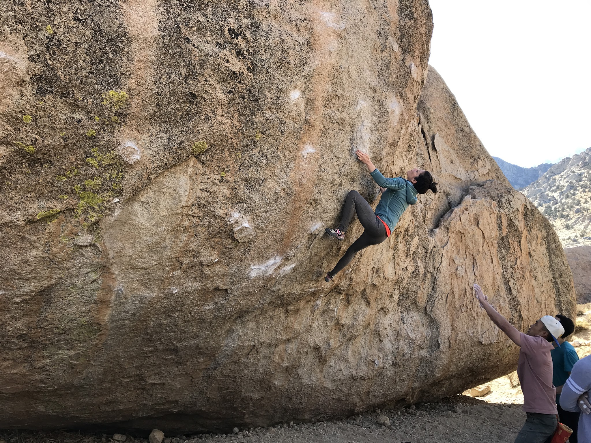
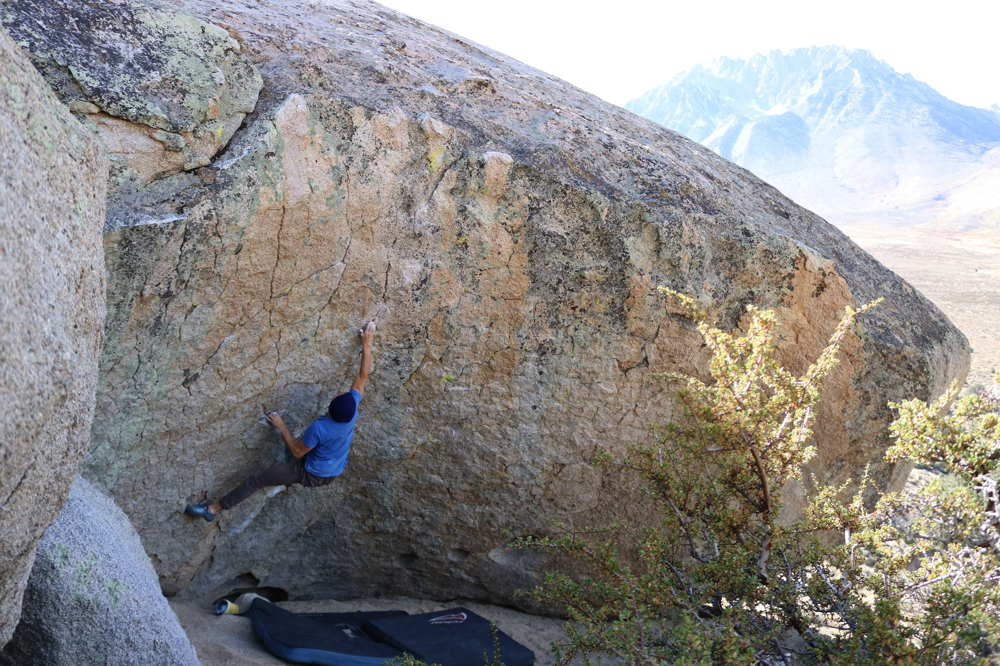
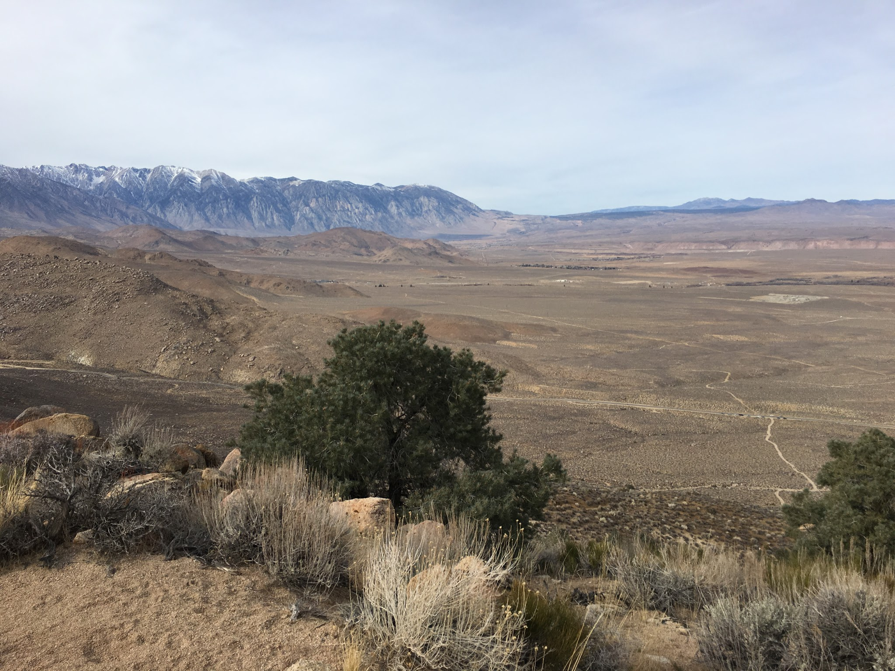
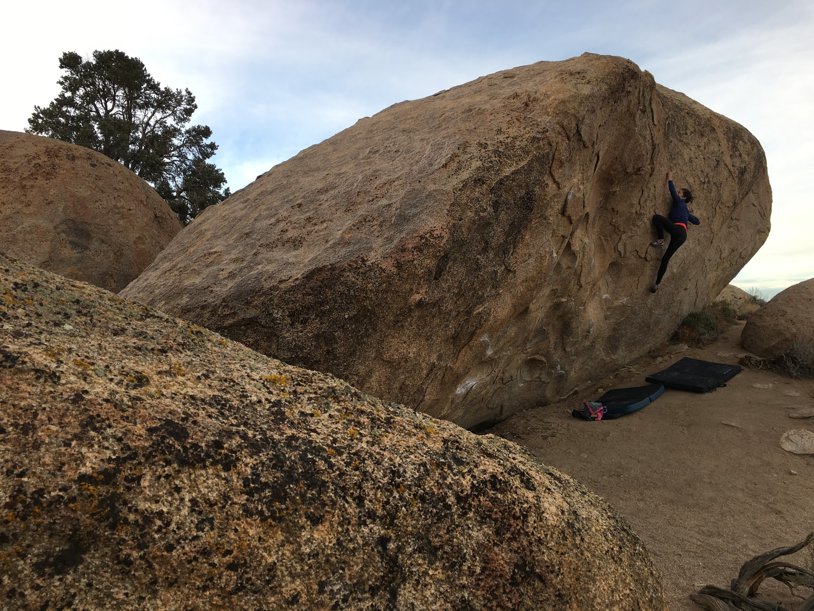
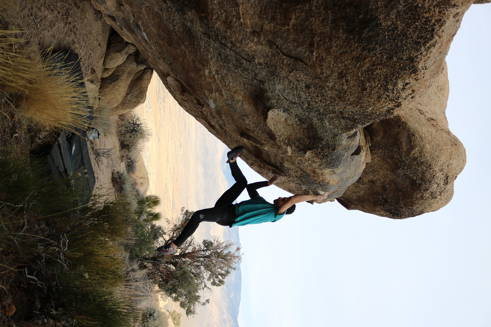
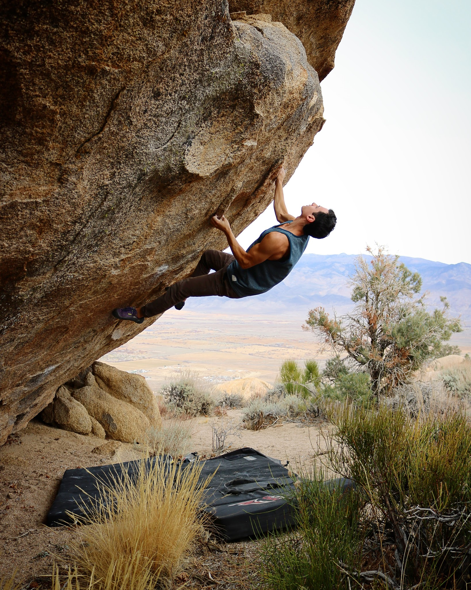
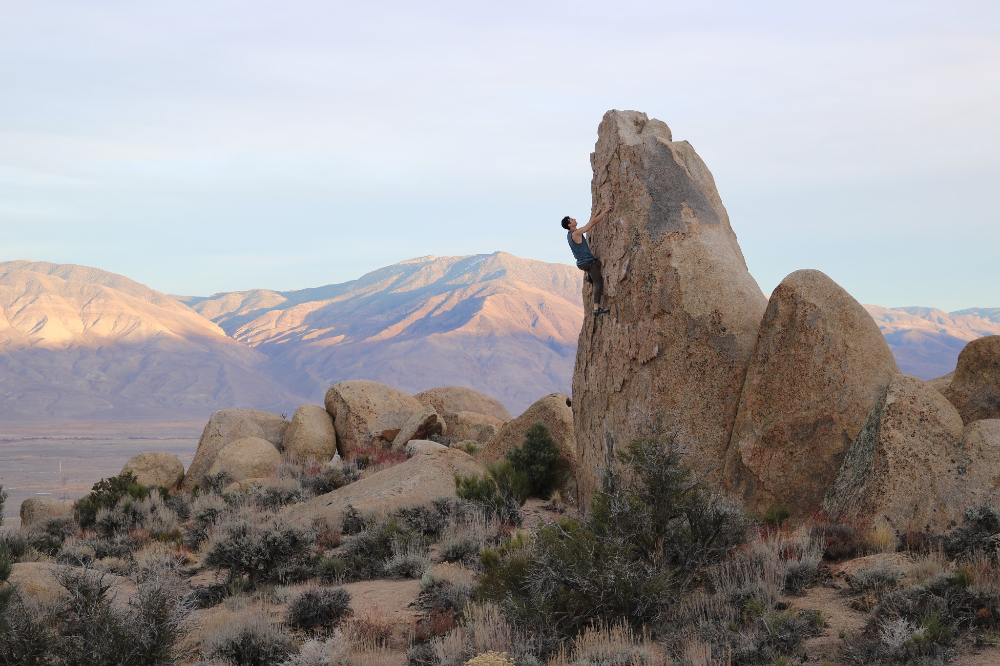

Marina, Itai, and I took advantage of a three day weekend and drove out to Bishop early Saturday morning. We set up camp and got to climbing!

We started off at Marina's project, High Plains Drifter (V7) where she quickly got her high point.

*Marina working High Plains Drifter (V7)*After the midday session we headed out to the Bardini Boulders so Itai could revisit A Maze of Death (V12). After getting reacquainted with the movement he was able to grab the send!

*Itai sending A Maze of Death (V12)*

On Sunday morning we headed back to High Plains Drifter where Marina continued to work out the moves. After the morning session we trekked up to the Druid Stones / Waganoobe area where we all got to try some new movement! Itai and I were able to make quick work of Gasperini (V12), and Marina sent Suspenders (V5) and nearly got Sky Dance (V6).

*The Druid hike...*

*Marina sending Suspenders (V5)*

*Me sending Gasperini (V12)*

*Itai Sending Gasperini (V12)*

Monday morning we all felt wrecked and decided to head back home on the early side. It was a wonderful way to start 2018 and I can't wait for the next trip out!

See you out there,

Eden
