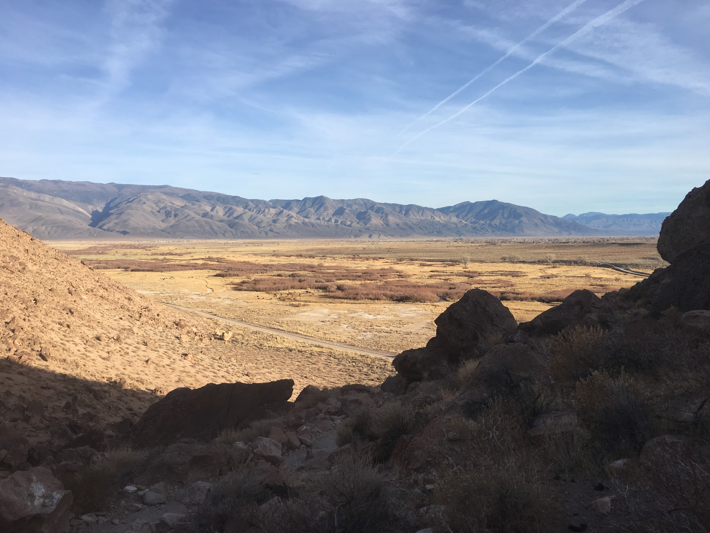
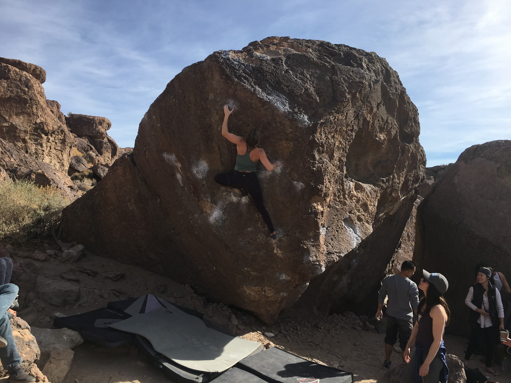
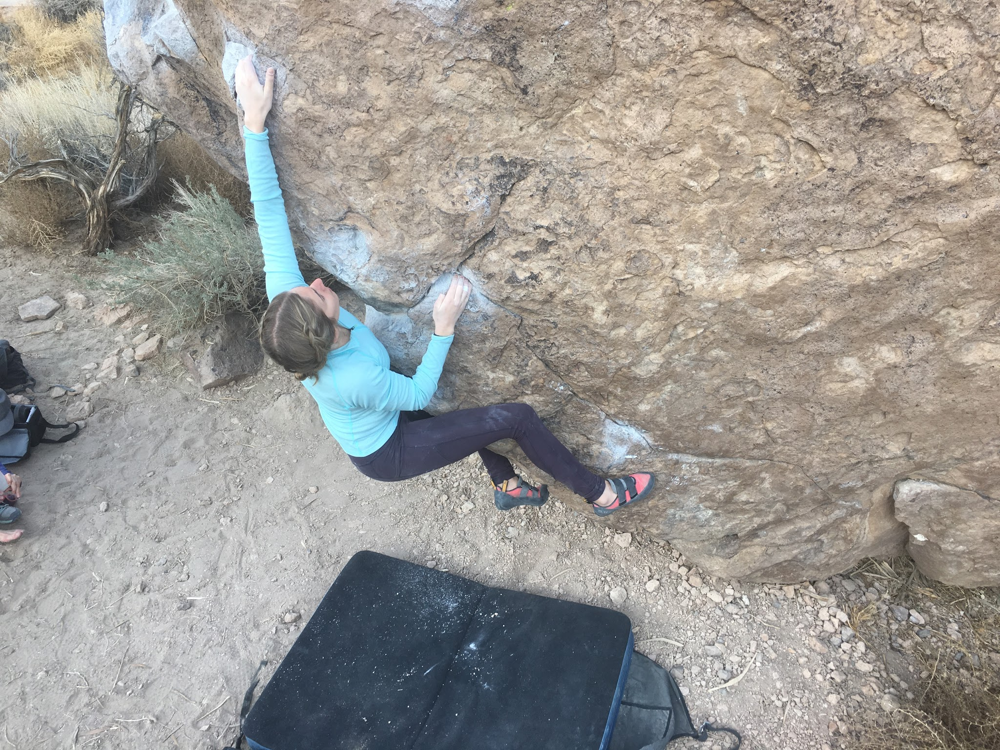
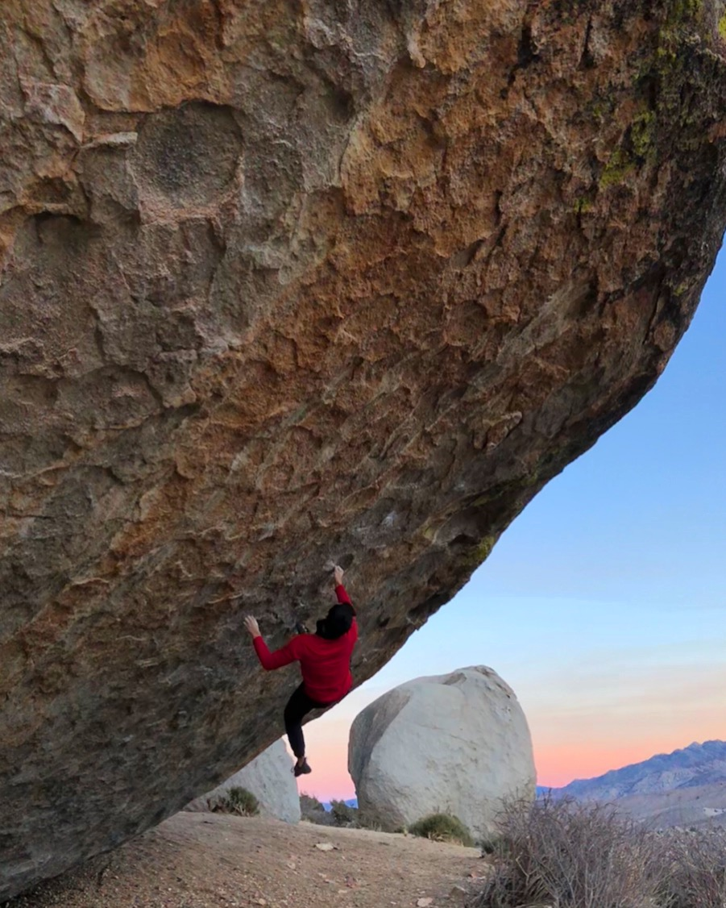
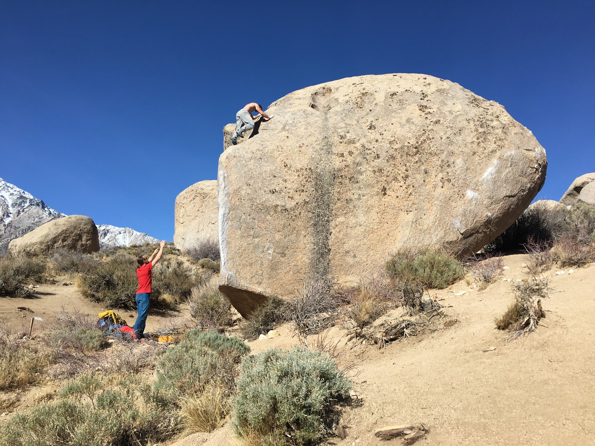
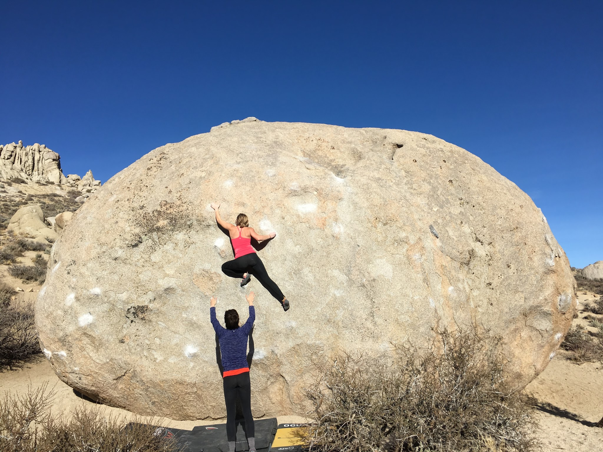
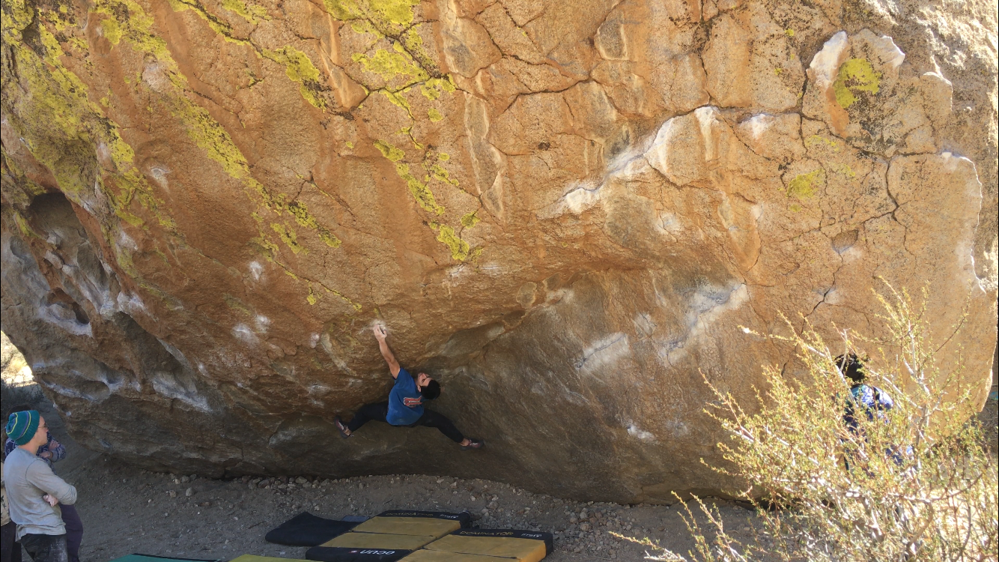
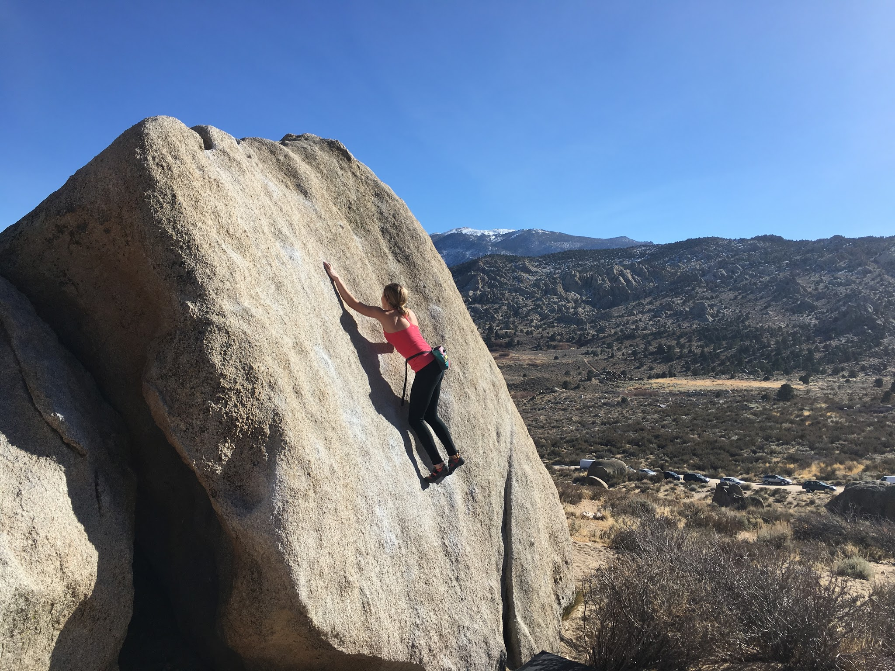

Jovanna, Marina and I rallied out to Bishop early Saturday morning to squeeze out another trip before school and work pick up. We started our trip in the tablelands where Jovanna conquered three V3s and opened up a few new projects!

*Jovanna sending Carrot Top (V3)*

*Jovanna sending Pirate Booty (V3)*

We finished up in the tablelands by late afternoon and decided to make a quick run out to the Buttermilks so I could try out Social Distortion (V12/13)... thanks crew :)

The climb consists of around 4 moves and is a stand-start drop-off, which sounds far from appealing. But it resides on the Grandpa Peabody which is hard to beat! The straight forward crimp line turned out to be very much my style and I was able to send it in 5 attempts! Again, thank you to Marina for capturing photos, and Jovanna for getting the vid (see Videos tab).

*Me sending Social Distortion (V12/13)*

We spent Sunday exclusively in the Buttermilks before surrendering to the heat and heading home. We started our day at
High Plains Drifter (V7), where Marina got to put in some solid work on her project. We then headed down to Grandma Peabody where I tried my hand at the Mystery (V12). I worked out all the moves but couldn't link it together this time. After that, Jovanna got to jump on some milks classics.

*Polish climber friend topping out Pope's Prow in the heat*

*Jovanna getting really close on King Tut (V3)*

*Flailing on Mystery (V12)*

*Jovanna with a balancing act on Robinson's Rubber Tester*

I wonder if actual winter temps and conditions will ever come this year? I hope so!

See you out there,

Eden

