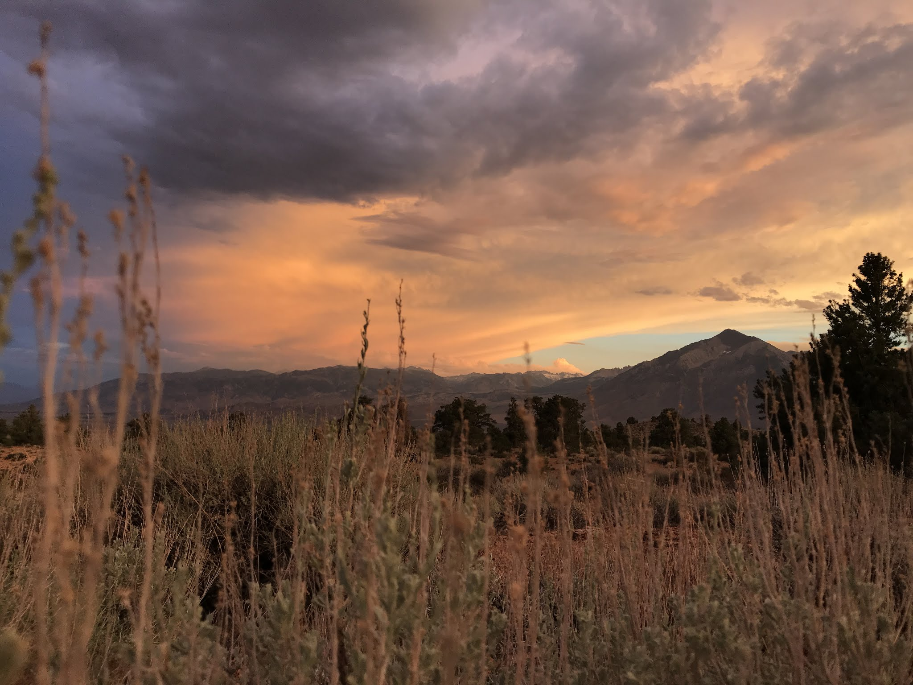
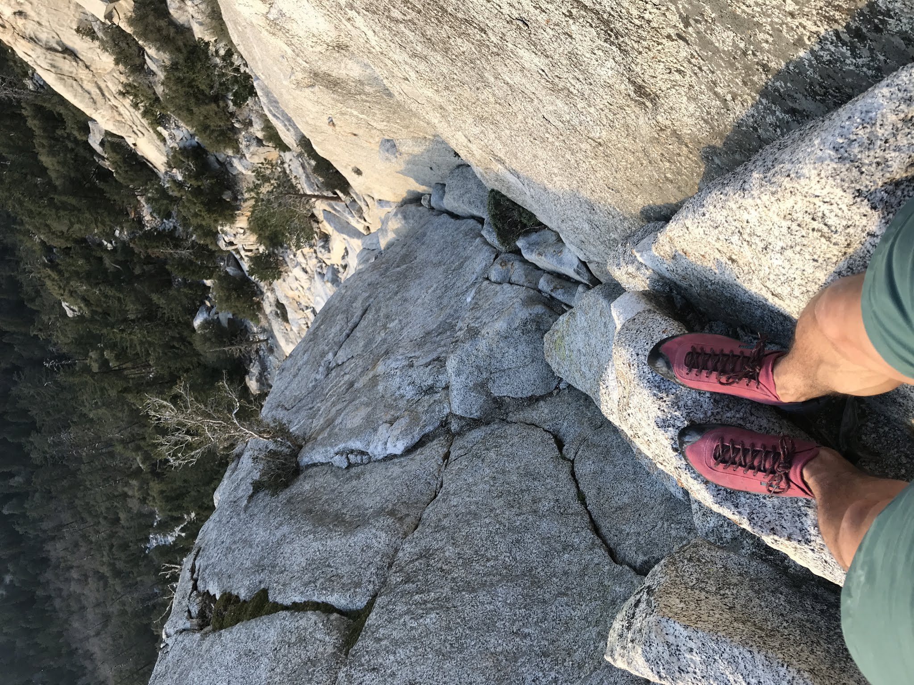
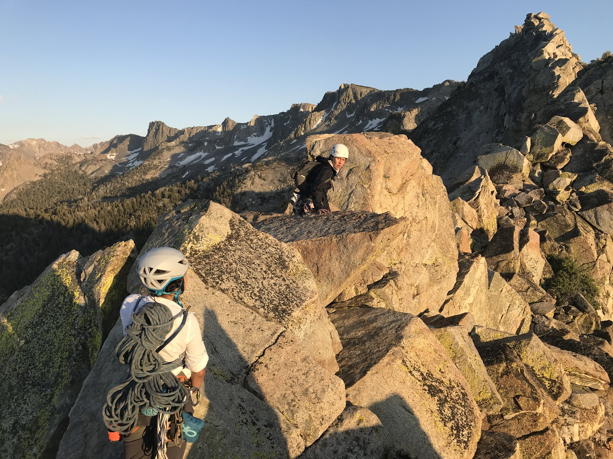
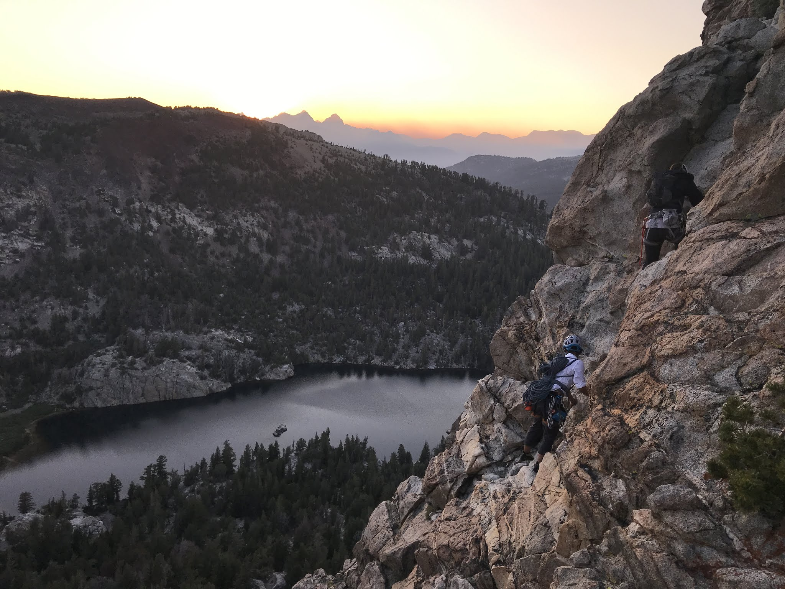
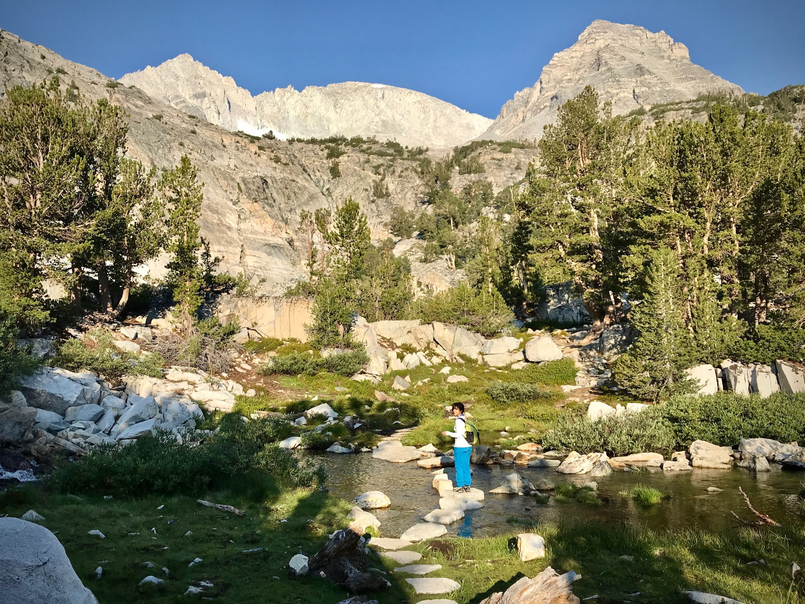
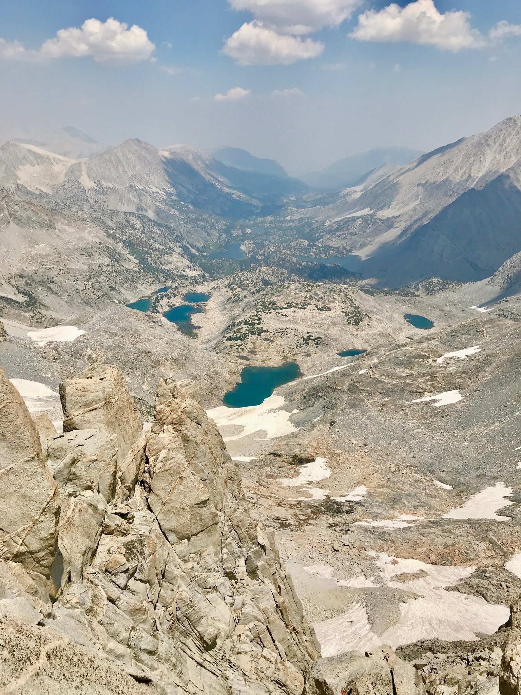
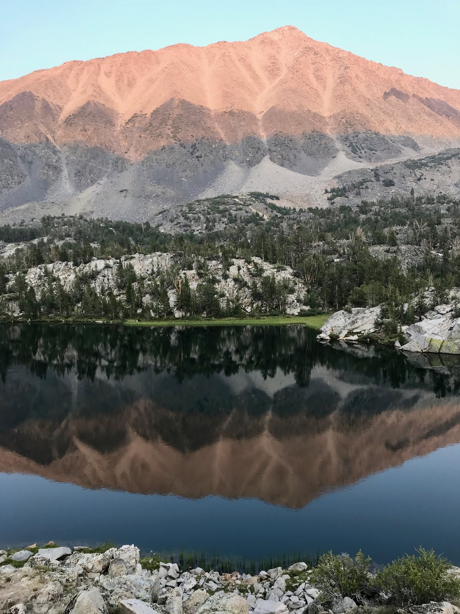
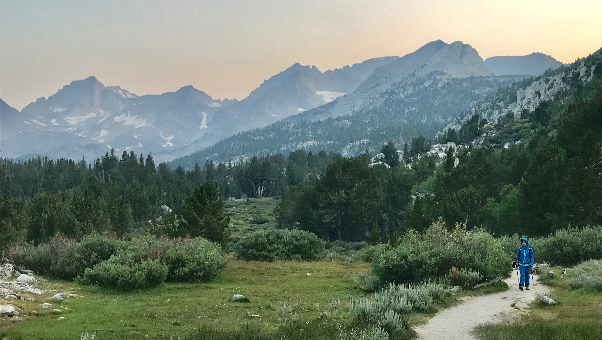

When it's too hot to boulder, we boulder anyway, but sometimes we retreat into the high Sierra instead.

Here are some uncharacteristic pictures of scenery, hiking, traditional climbing, and even some alpine adventures from the summer.

*A Sierra Nevada sunset*

*Taking in the view on pitch two of The Trough on Tahquitz Rock.*

*Alpine start for Lone Pine Peak (upper left)*

*Summit of Crystal Crag via Crystal Corridor*

*The downclimb to Crystal Crag*

*Gem Lake on the approach trail to Bear Creek Spire*

*The final push towards the Bear Creek Spire summit via The Northeast Ridge*

*Views down the valley from the Spire*

*The beautiful but mosquito infested (not pictured) hike out*

*The massif (with Bear Creek Spire farthest back and left)*

