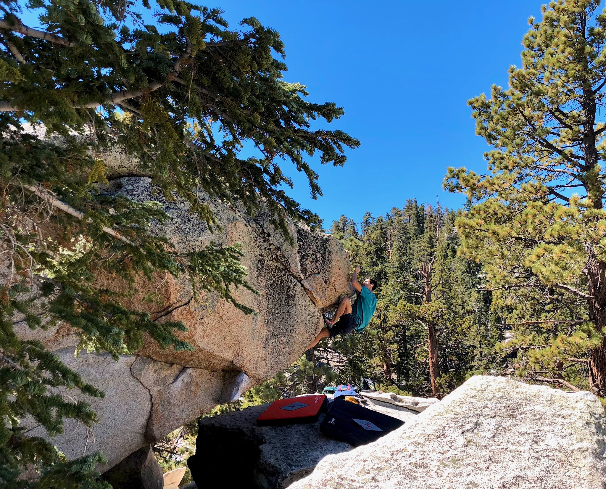
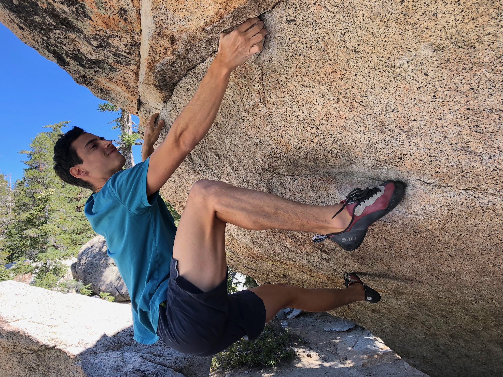
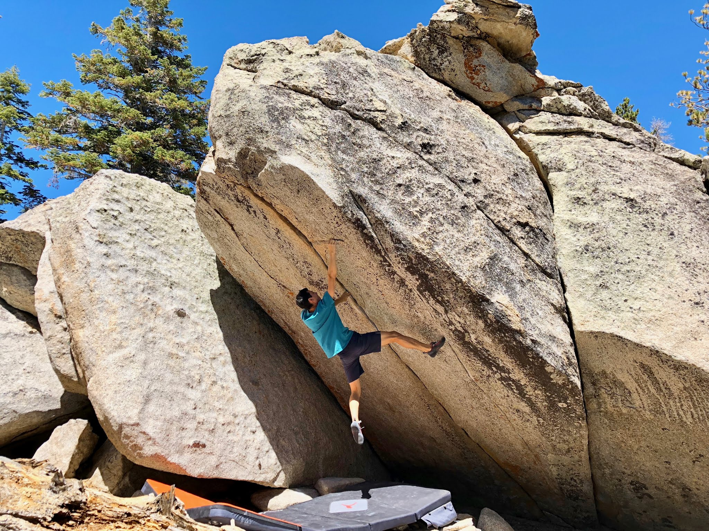
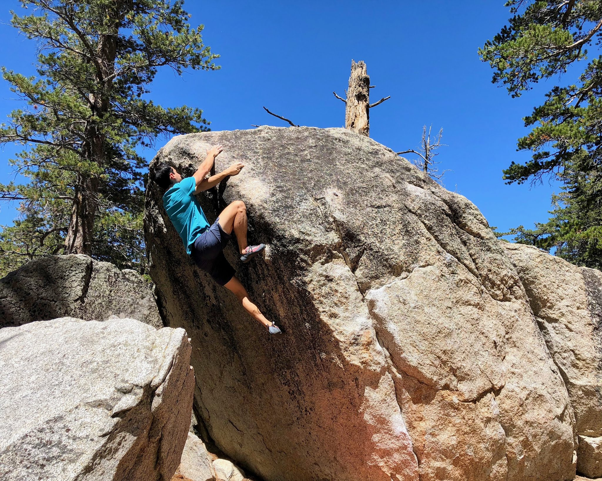
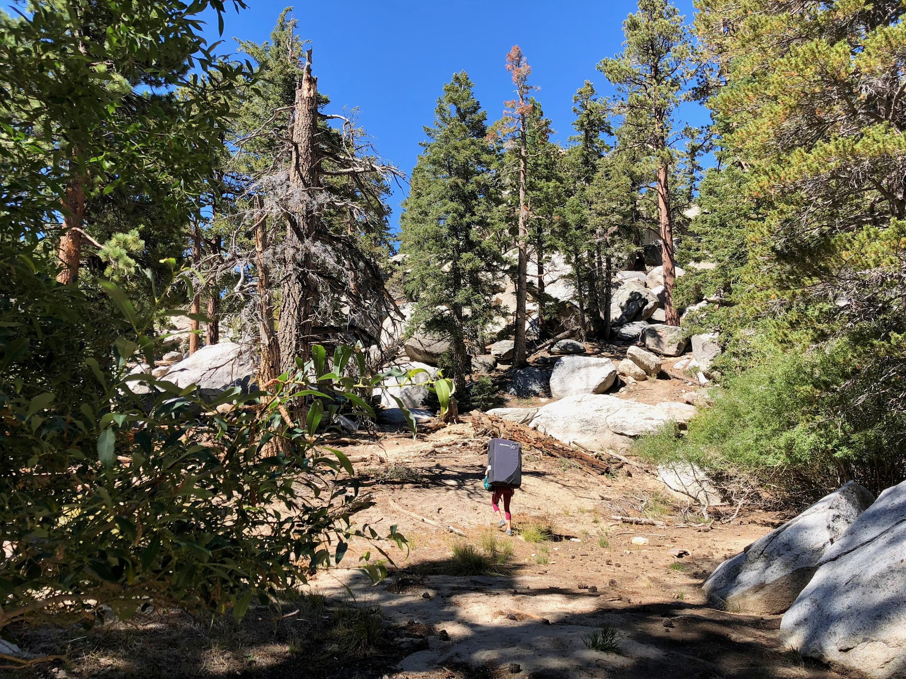

Jovanna and I woke up early this morning in order to squeeze in a short day at Tramway. It was a beautiful, but very hot day. We started out by warming up at the Trailside Boulders, and then spent some time looking for an area called the "Undiscovered Country" - which we very appropriately could not discover. We made a quick pit stop at Paper Dragon (V10) before continuing our search.

*Topping out Paper Dragon (V10)*

*Early moves of Paper Dragon (V10)*

After that we were able to find the cluster of boulders we searched for earlier. It was fun to revisit this area since I haven't been to it in a while. We spent a little bit of time climbing before surrendering to the mid-day heat and heading home. Here's a few photos...

*Me working Somewhere In Time (V12)*

*Me on Black Cauldron (V4), an area classic*

*Jovanna leading the way out :)*

It was nice to get back out in the mountains and explore. See you out there!

\- Eden
