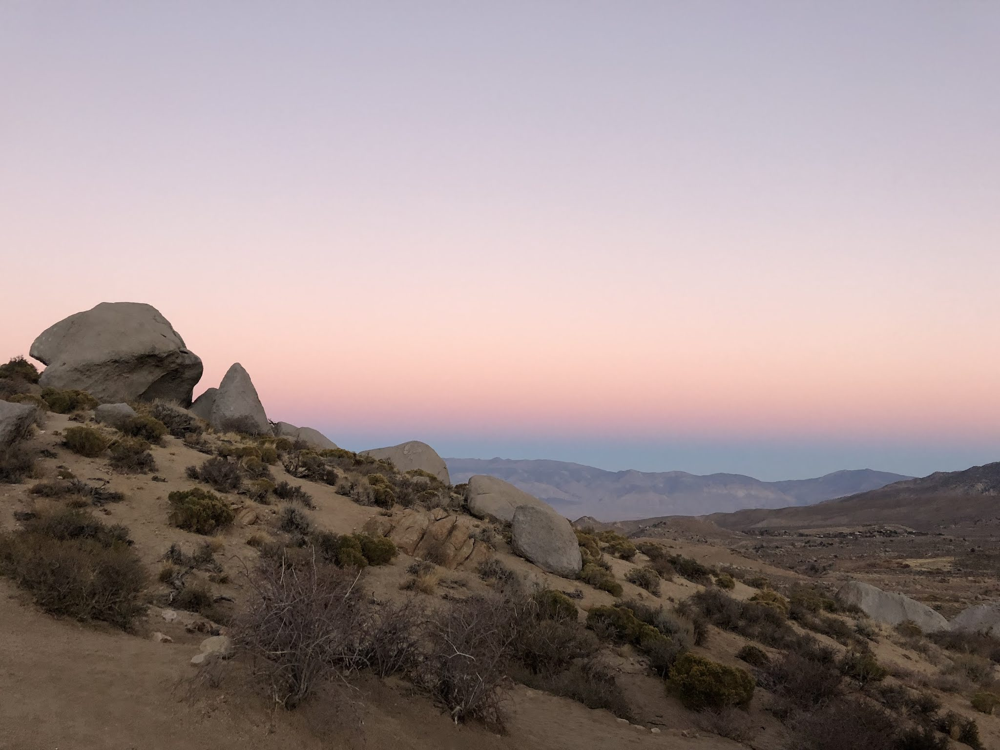
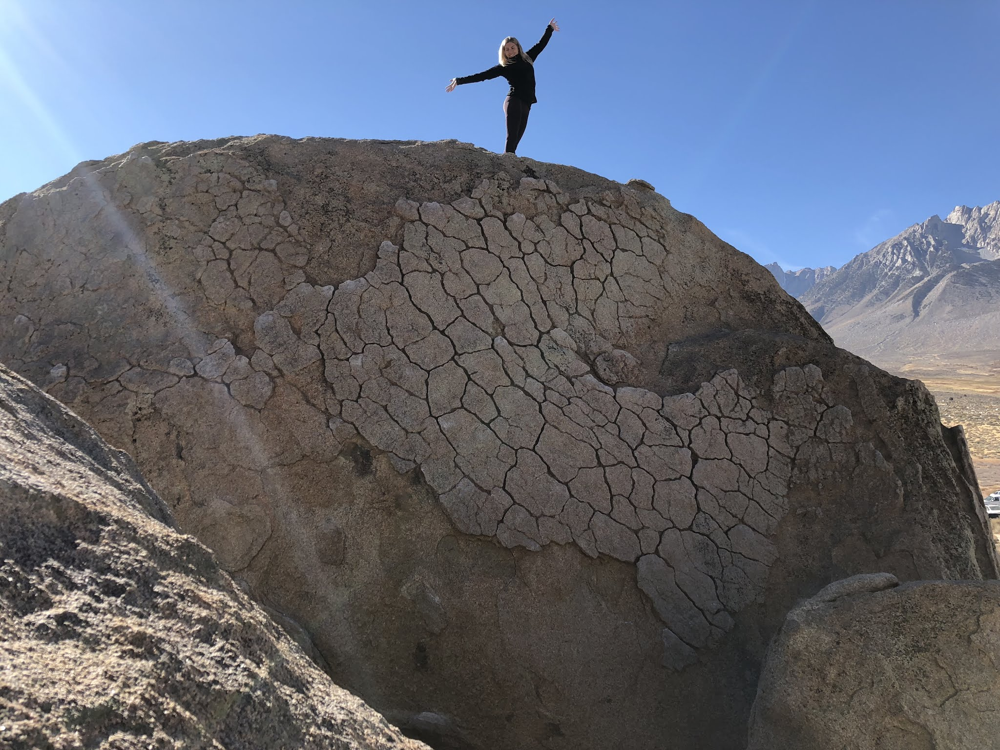
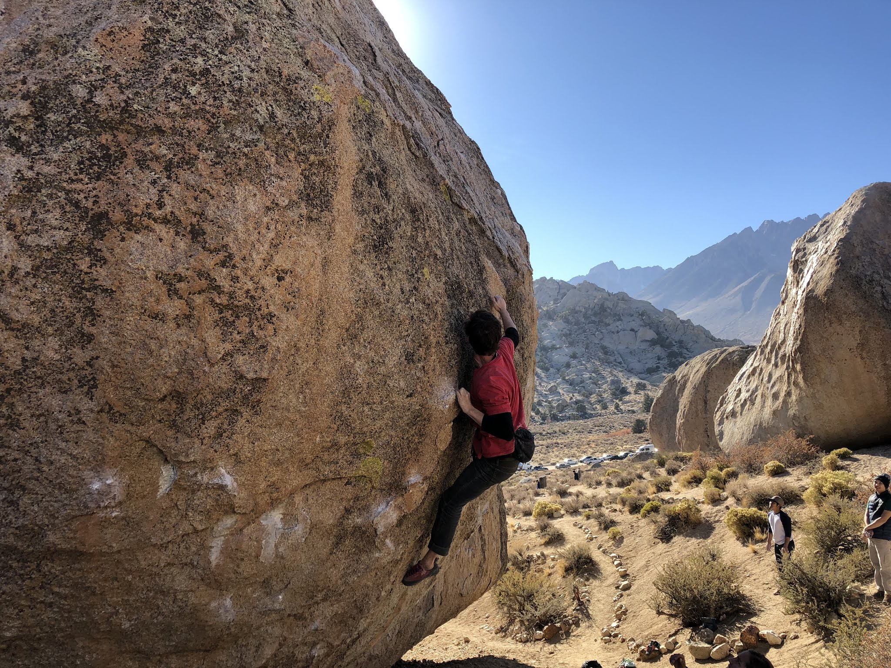
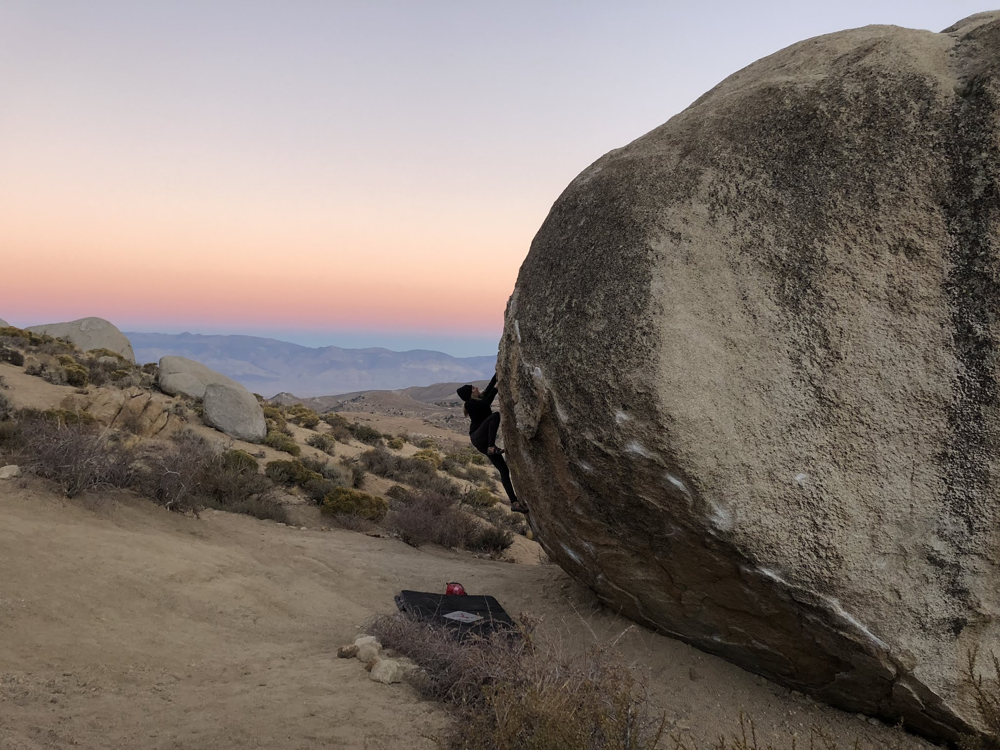
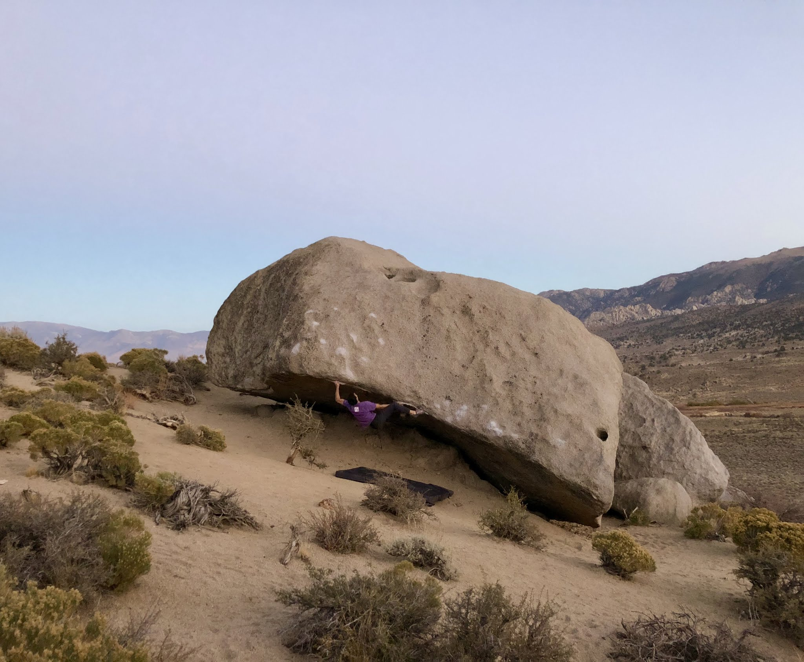
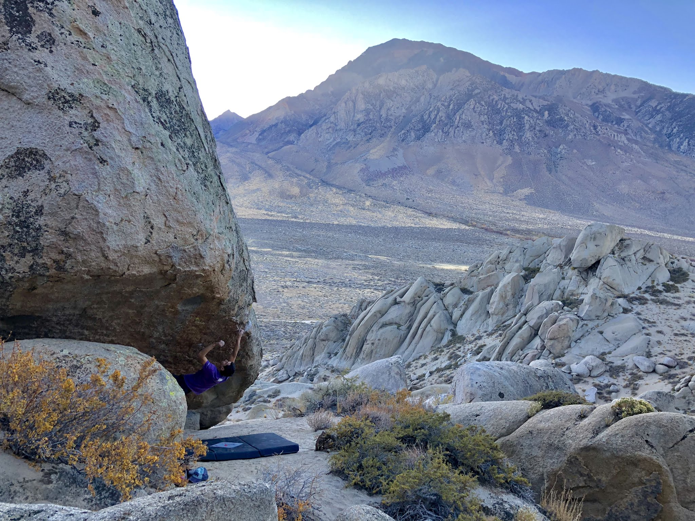

On Sunday morning Jovanna and I drove out to Bishop for a quick two day trip. It was the first of the season and we were both very excited to get out of the city and into the mountains. We met up with Cody and Wynne in the Buttermilks for a fun day of bouldering.

I got to open Mandala Sit (V13) as a potential project and Jovanna made quick work of her very first V5 - Perfectly Chicken! Later in the afternoon we headed over to the Secrets of the Beehive area so I could test my span on Dave Graham's Form Destroyer (V12). Here's a few photos from the day...

*Cody on Knobs (V5)*

*Jovanna climbing Perfectly Chicken (V5)!*

*Messing around on The Sharma Traverse (V10) at sunset*

*Trying to piece together the moves of Form Destroyer (V12)*

The second day felt considerably warmer but we managed some good sessions including Mandala Sit (V13) and Flyboy Arete (V5) before heading home in the afternoon. This trip definitely helped us get excited for the next one! 

*Spanned out on Mandala Sit (V13)*

*Taking a goodbye lap on The Rising (V4)*

See you out there! 

