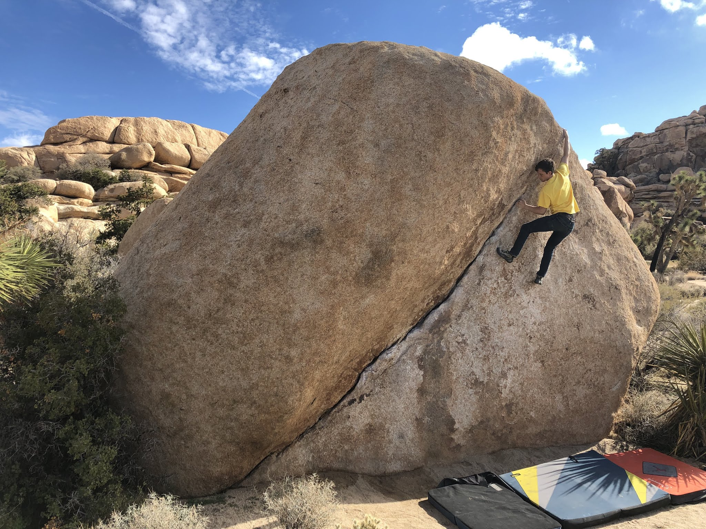
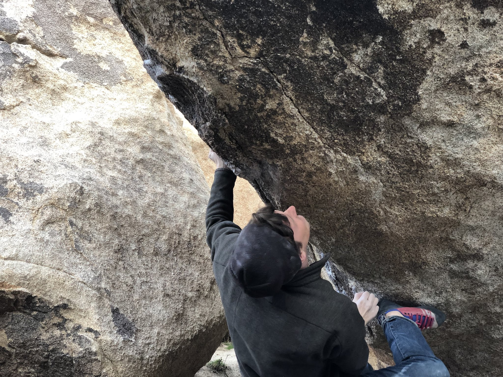

On Sunday Cody and I drove out to Joshua Tree for a quick day trip. It had rained the day before and some of the boulders were still a bit wet in the morning. However, they dried out after a few hours of intermittent sunshine. We started out in the Barker Dam area and made our way out to Planet X after lunch. We jumped on a few classic moderates and I opened up Iron Resolution as a potential project for the winter :) 

*Cody on The Chube (V2)*

*Me on the stem dyno of A Streecar Named Desire (V6)*

*Working Iron Resolution (V13)*

*Cody sending Strawberry Contraceptives (V7)*

It was nice to get back outdoors after a two month hiatus. See you out there! 

\- Eden

