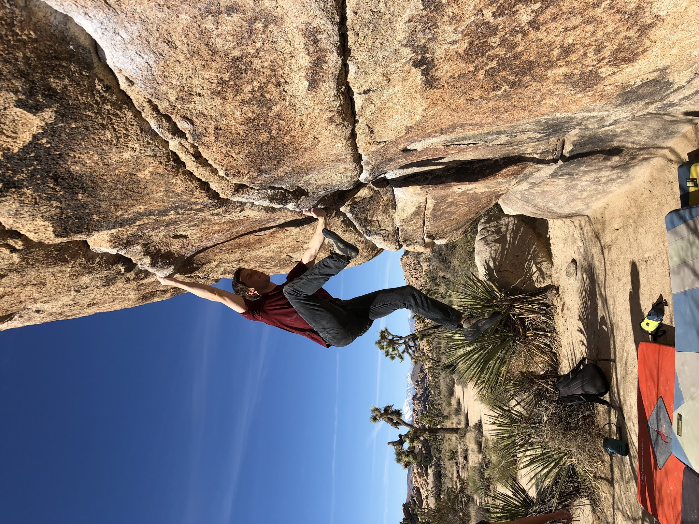

On Saturday I drove out with Jovanna to Joshua Tree for my second weekend in a row at the park. We met up with Cody and Wynne at Barker Damn where we warmed up and jumped on a few classics. It was pretty hot by mid day so we stopped for lunch and waited for the shade to creep across the JBMFP area - where we spent a good portion of the afternoon. After that I had a brief sunset session on the project (Iron Resolution) while the gang supported me and nursed beers. Can't wait for round three!

*Cody on High Noon (V5)*

*Me on JBMFP (V5)*

*Cody enjoying a fun slab*

*Slow progress on Iron Resolution (V13)*

*Jovanna taking in the beautiful desert sunset*

See you out there!

\- Eden
