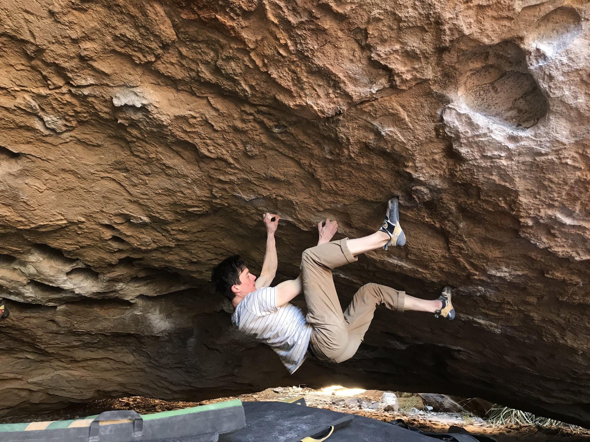
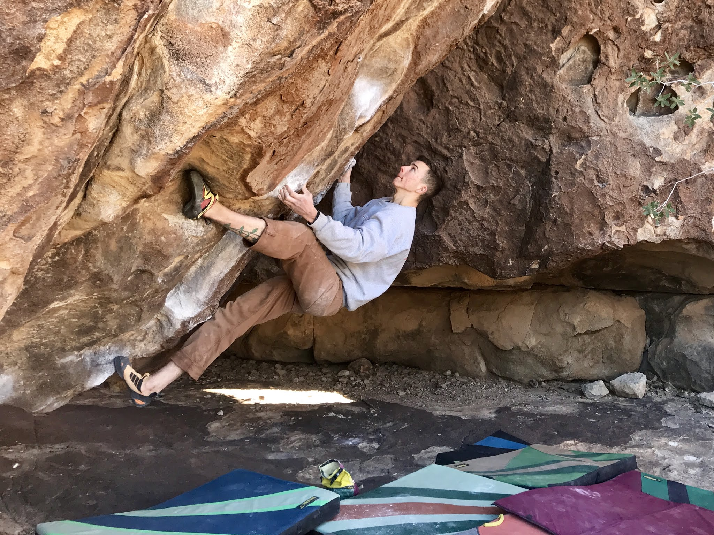
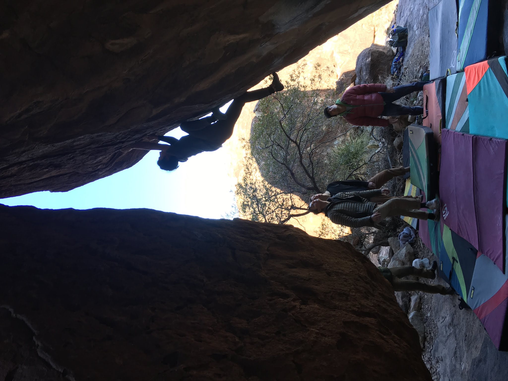

After a much-needed rest day, Alex and I tested our skills on the hardman/woman testpiece of Hueco, Esperanza (V14). We were able to do every move in the first session and just about get the climb in two parts. While the climb is an ambitious goal for this trip, it was fun to play around on and open up as a future project. After Derrick dispatched Left Martini (V10) we moved on towards the See Spot Run area.

*Alex, setting up for the crux on Esperanza (V14)*

Alex and I made quick work of Barefoot on Sacred Ground (V12), and I ticked off Dark Age (V11) first try to finish the day.

*Derrick, eyeing the undercling on Barefoot on Sacred Ground (V12)*

*Myself, finishing Dark Age (V11)*

We've earned ourselves some burritos and a rest day, so check in later this week for more!

\- Itai

