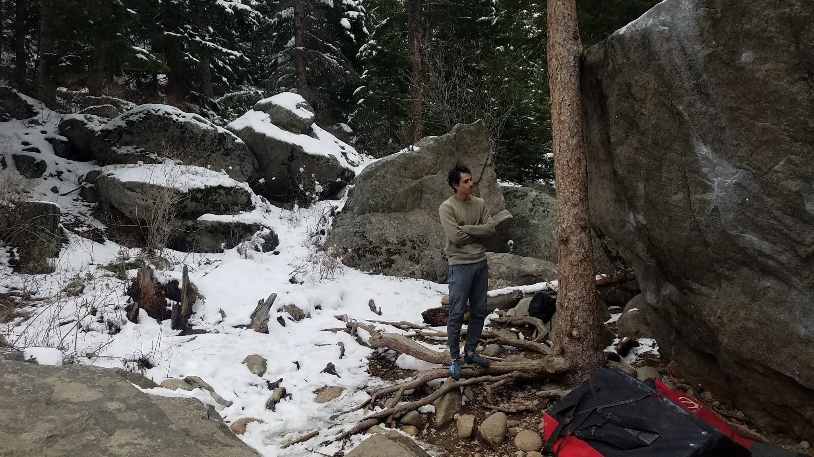

Perhaps it's time for a short update.

The past few months in Colorado have seen little climbing due to snow, injuries, work or general lack of psyche. Despite the excuses above, I've still managed to visit many local crags like Wild Basin, Boulder Canyon, Eleven Mile Canyon, Thunder Ridge, Eldorado Canyon, Clear Creek, Poudre Canyon, Horsetooth Reservoir, and Shelf Road (gross).

*Mostly staring at climbs and contemplating life*

This past weekend, after getting amped and sunburnt from spectating the Vail World Cup, Isaac showed us around Mt. Evans. I managed to flash The Dali and made quick work of the all-time classic No More Greener Grasses (uncut below). At the risk of dating myself, I had first seen a video of the climb in the Alpine Blocks section of Dosage 5 and have wanted to do it ever since.

I am excited to get back into the swing of things this summer!

\- Itai
