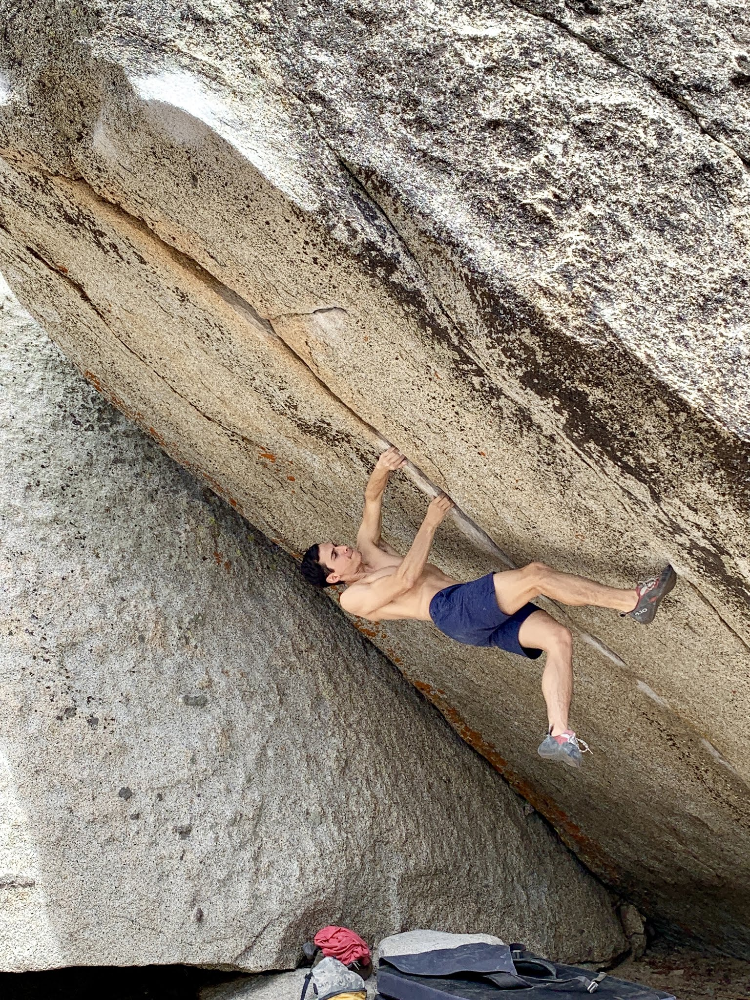
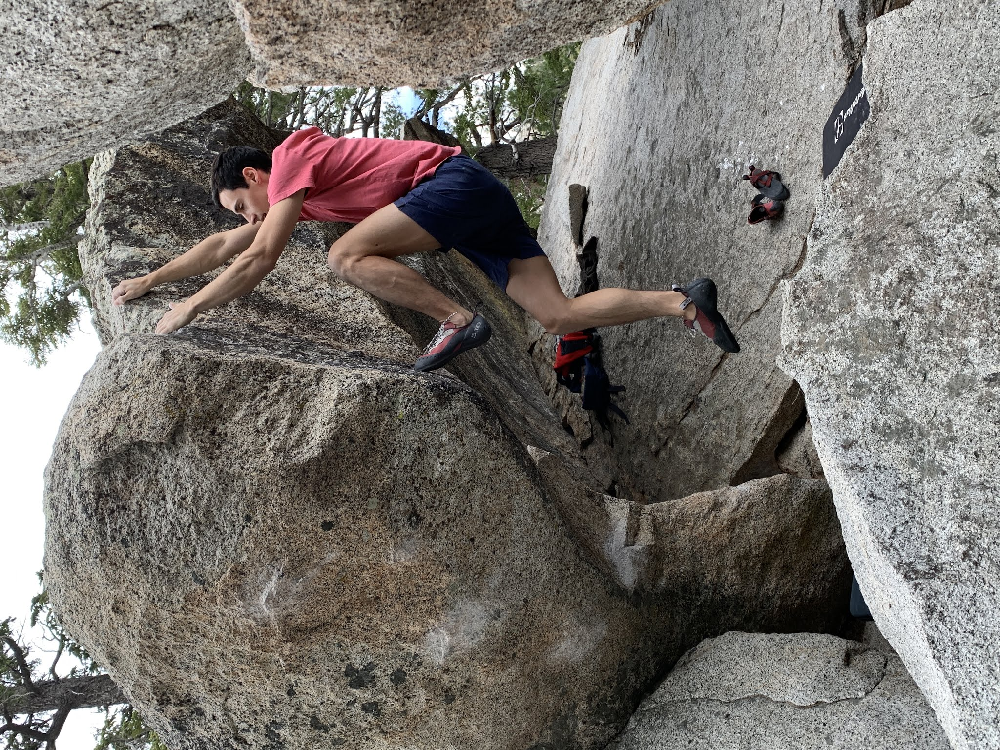
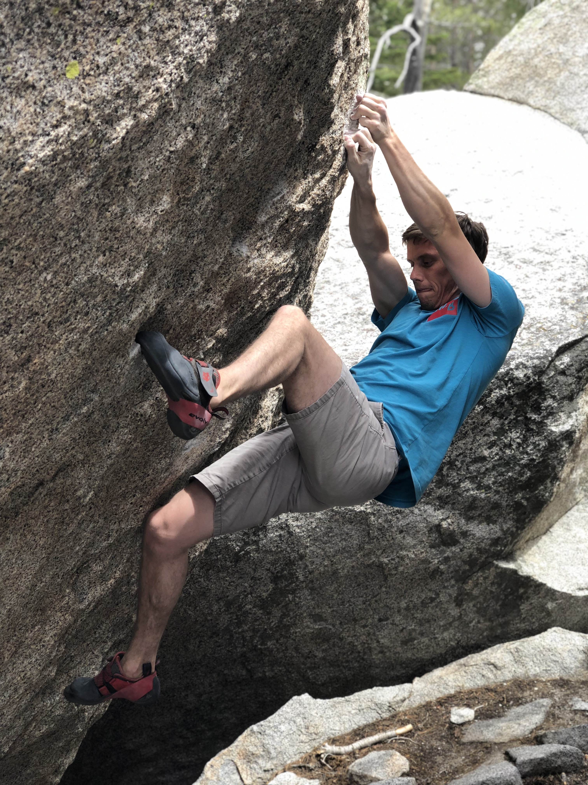
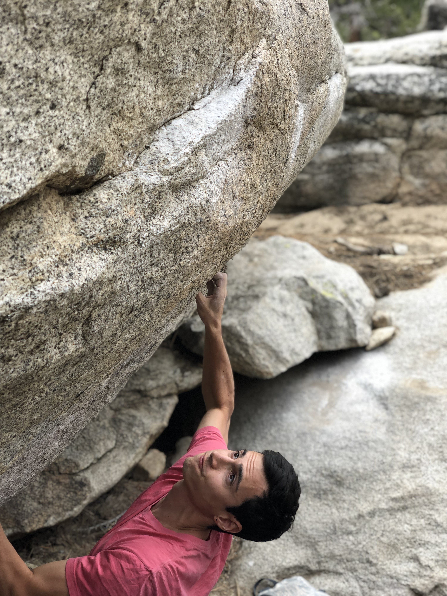

This Saturday I met up with Cody at Tramway for a fun day outdoors. We spent most of our time off the main sectors, chasing shade and trying to find a bit of energy. Thankfully the afternoon brought some much needed cloud coverage and wind. Here's a few pics from the day!

*Trying Somewhere in Time (V12) early in the day*

*Topping out Master Blaster (V9)*

*Cody sending Fly, Robin Fly (V6/7?)*

*Repeating Angus (V9)*

*Cody playing piano on the slopers of Malcom (V6)*

See you out there,

Eden
