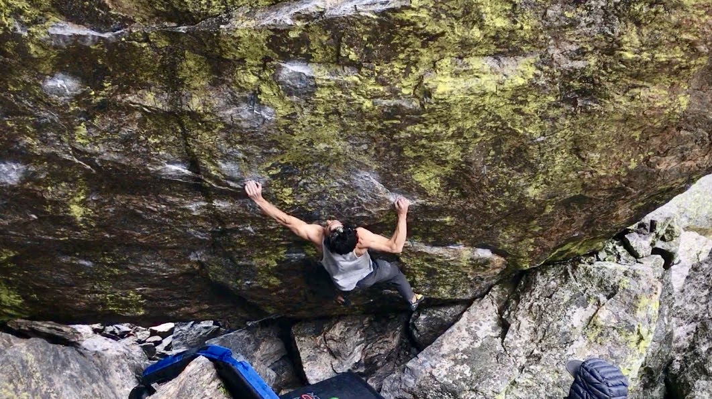
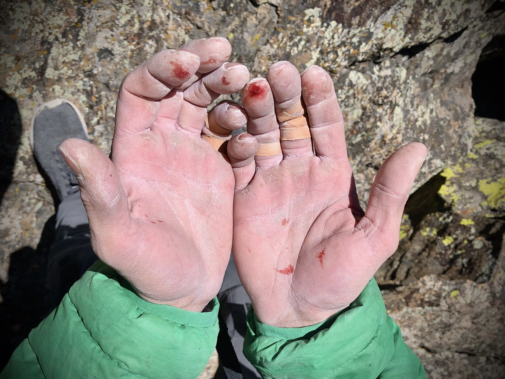
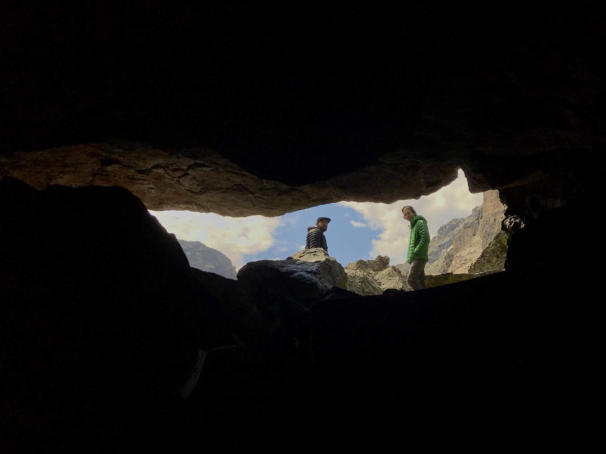

### Everyone Has Them

Tick certain test-pieces, reach a milestone of V somethings, do many things in a 24 hour window, do a one-arm, get out of bed, and so on. Goals are a great way to keep motivation afloat and narrow your focus. I’m typically a big fan of them, but one I keep avoiding.

I have never truly projected anything in my 14 years of climbing. I tell myself it’s because I prefer to get more mileage under my belt and try new problems. While that holds some truth, I know there is another reason. Projecting (read: prospect of failure) terrifies me.

As a result, I have been plateaued at the same grade for over 8 years - most of my climbing career. How can that be? I feel much more technical and experienced now but have nothing to show for it in terms of progress in difficulty. Sure, I have a better looking ‘pyramid’ but the tip is looking awfully dull.

### Enter The Project

When it comes to test-pieces of a generation, Jade stands out among the rest. In recent years, the climb has seen many quick ascents by the up and coming freaks including a flash by none other than Adam Ondra. While it’s no longer one of the hardest climbs around, it’s still iconic in my eyes.

_The Move_

My first day working the climb I surprised myself by sticking “the move” - the definitive crux move that perhaps warrants a V13 grade on it’s own. I quickly rehearsed the upper section and began trying it from the start with high hopes. While I had a few good attempts, the rain rolled in and chased us away. The next couple of sessions I either immediately split my tips or battled rain and gale force winds. The first snow fell last week, and with it my chances of completing the climb this season.

_Jade: 1 | Itai: 0_

### Uncertainty

My introduction to projecting went about as well as expected. Close but no cigar. Perhaps I got too anxious, nervous, excited, or weak. Did I have bad beta? Jade is a notoriously finicky climb requiring good skin and good conditions, so perhaps I just needed a few more days of effort for it all to align. Either way, it seems like that’s what the process is all about - uncertainty.

While projecting inherently requires perseverance, it would be easy with guaranteed success at the end. Thankfully, there’s plenty to keep my uncertain mind busy until The Park thaws out in the spring. When it does, I’ll be coming back with a vengeance.

_From darkness into light_

Till next time,

Itai
