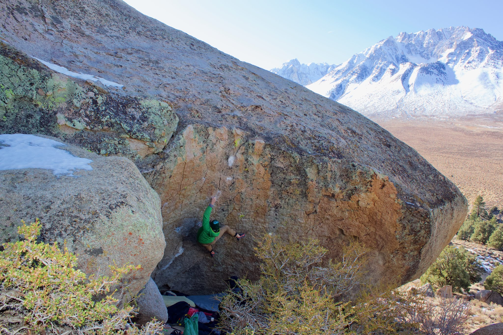
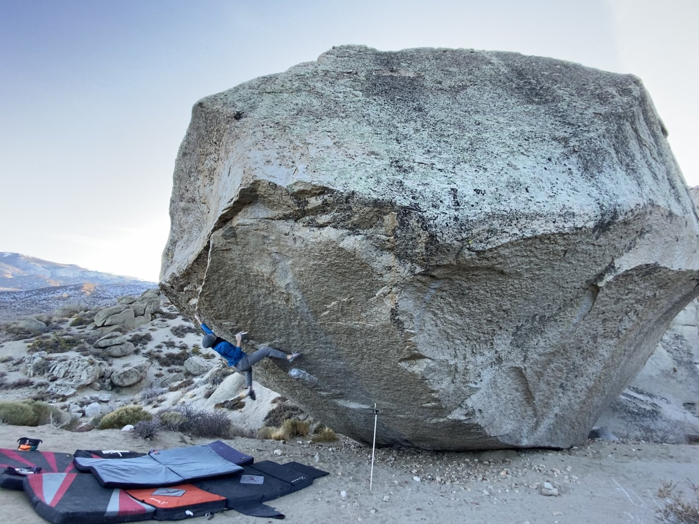
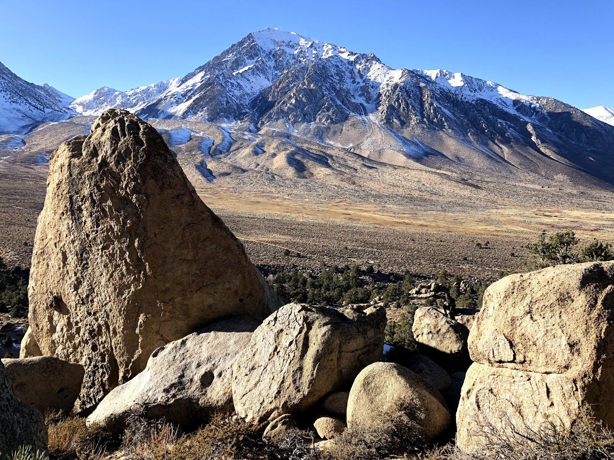
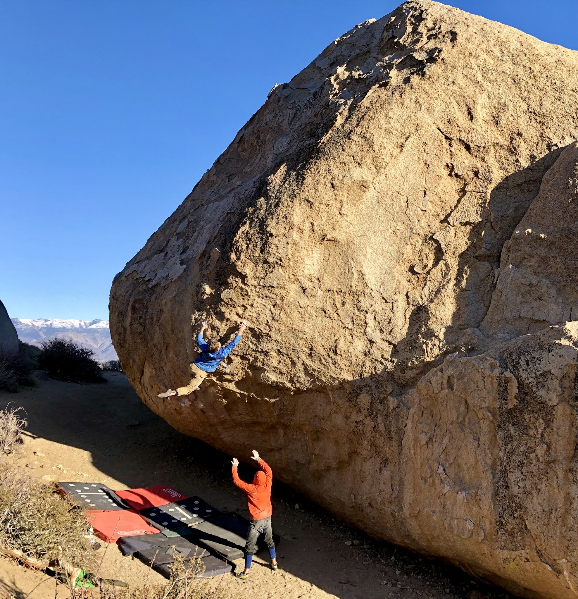
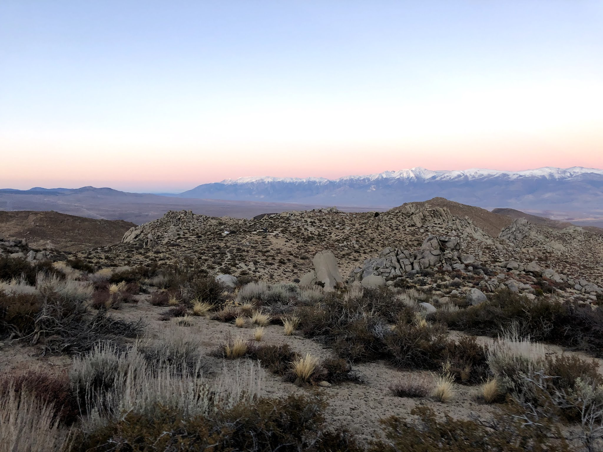

I met up with Alex and Ben on Sunday morning at the Bardini Boulders. Ben was visiting from out of state and had his eyes set on projecting A Maze of Death (V12) during his first time out in Bishop. With highs forecasted in the mid 30s, the weather was looking perfect for trying hard - ~~once~~ if you were able to get warm. Ben quickly unlocked all the moves but will have to come back for the full send. I'm sure it'll go quick next time!

After that session we headed over to the Pollen Grains where I jumped on Spectre (V13), and did my best to work through the beta and body positioning. I think I made some good progress! Unfortunately, the sun quickly dipped below the mountains bringing shade and a hefty temperature drop. We decided to call it a day and head back into town for some food and beer.

The next day we ran around the main Buttermilks area trying classics and projects before heading home. I'm excited to get back to Bishop this season and continue working Spectre, so I'll see you guys out there!

Here's a few photos from the trip...

*Ben working on A Maze of Death (V12)*

*Giving a burn on Spectre (V13)*

*Views from the Bardini Boulders*

*Ben sending High Plains Drifter (V7)*

*The walk back from the Pollen Grains*

