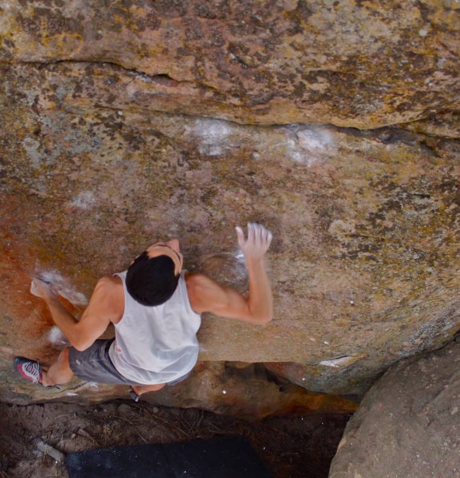

This Friday was my first time climbing in Pine Mountain. It has large sandstone boulders with interesting features. I wish I would have gotten up there sooner than this year. I headed up to the mountain at 8 on Friday morning with five other climbers from San Luis Obispo. We were all excited to get outside at the fist sign of fall temps.

Although this trip was more like training for the trip to Bishop next weekend, it was fun non the less. The climbers on the trip were all of different calibers so we got on many different problems. I tried many highball moderates as well as some tricky slabs.

I also snagged three V8's that day, but what I really came to Pine Mountain for was Whiplash (V11), possibly the hardest problem there. I sent it after an hour long session. The 10,000 flies and so-so weather made the send more difficult than it should have been. We all returned home content with our day. I can't wait to go to Bishop!

