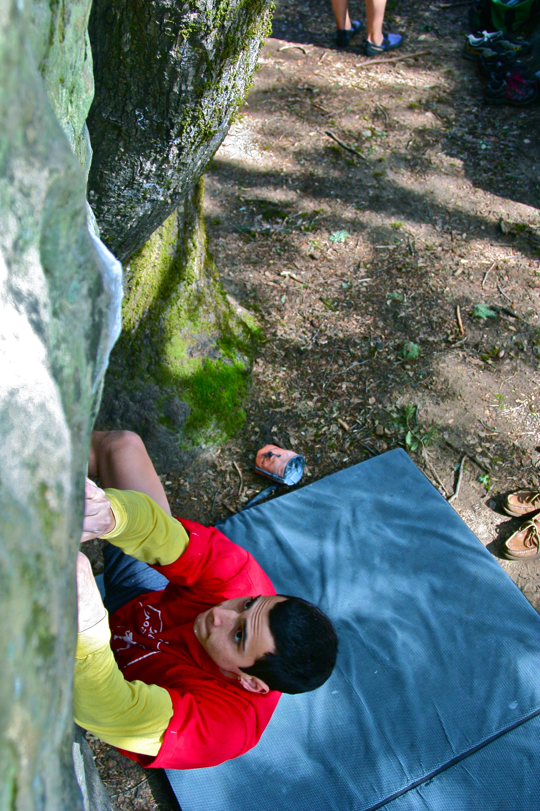
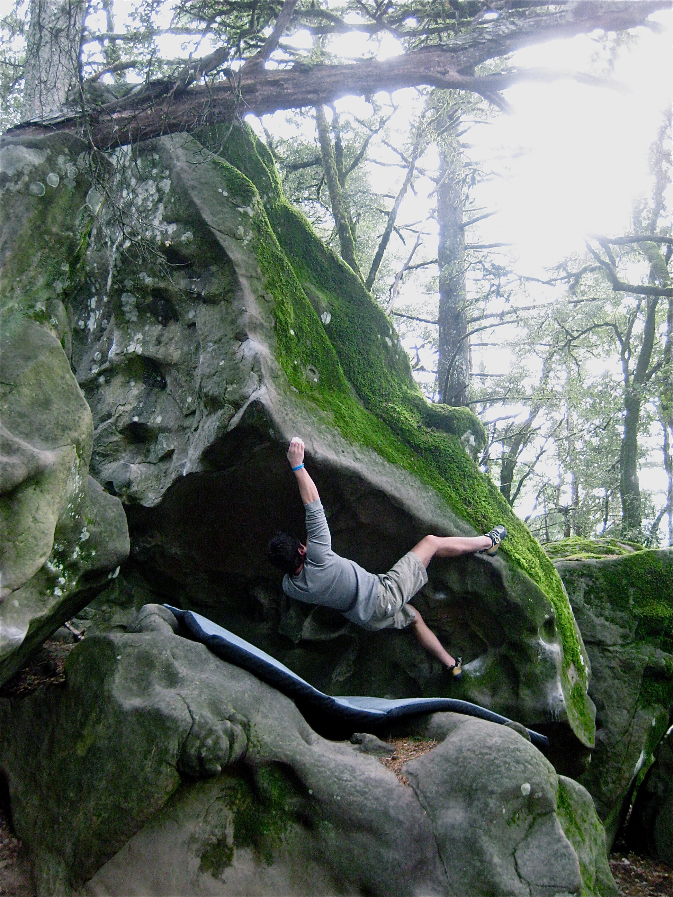
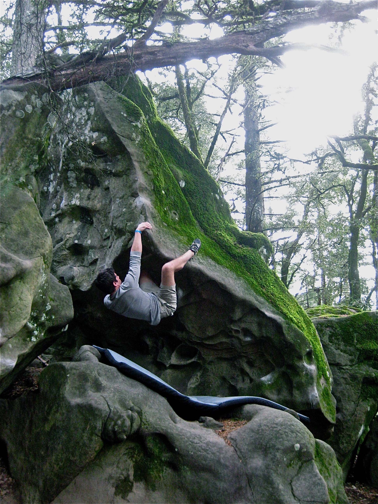

After a weekend at San Louis Obispo, Alex and I decided to stop at Castle Rock on the way back to Davis. It rained the previous night and we were worried that the rock would be too wet. While the ground was damp, the rock remained fairly dry and we were able to climb. After some aimless hiking through the overcast forest we managed to find one of the main boulder areas.

After I Sent the Bates Eliminate Sit, and we worked on some other moderates in the area we decide to scope the rest of the park. We headed down the hill to the Bates Arete, which Alex almost sent.

After this we went over to the classic Eco-Terrorist; and while I made some significant progress, I wasn't able to send. We have a three day weekend coming up, so if the weather permits we will head back to Castle Rock on Sunday. Looking forward to the return trip.
