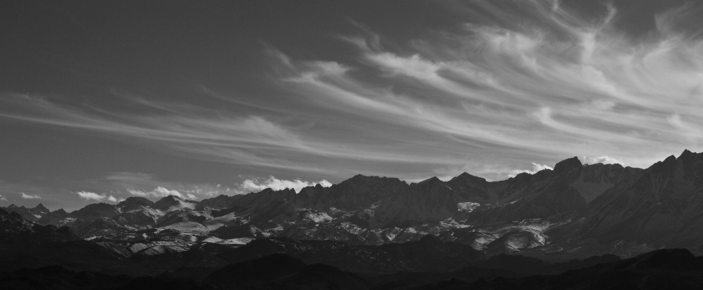

I met Alex, Joe, and the rest of the SLO crew at the Happy boulders for the first of my three days in Bishop. I had not been to the Happys in years so I had plenty to do. I climbed hard all day but unfortunately managed to send nothing. I opened plenty of projects though, all of which I felt very close to doing.

The second day we decided to climb in the Buttermilks. It was rather warm and everyone was feeling low on energy.

It was not until I spotted a likely first ascent, that I built up some psych. Alex and I began cleaning the holds on the project. It did not look like the most amazing line, but climbed surprisingly well. The movement was difficult but extremely fun. The project is located between the Dyno Problem and The Buttermilker in the cave area. It starts with a left hand on a thin in-cut horizontal crimp, and a similar vertical crimp for the right, and climbs directly upward.

High step right and pull to an undercling/gaston with your left then make your way up to the slopey crimp rail and finish. I sent the problem and speculated it to be V10, though I am not certain about the grade. (A possible name for the problem is "Crimps of Wrath")

The final day was slightly overcast. This was quite a relief considering how sunburnt everyone was and how hot it had been the previous two days. I warmed up for the first time that trip on a quick lap of the Sunshine Slab as well as Grandma’s southwest arête.

I then headed up towards The Mandala and began working the beginning moves with Alex and Joe. The sun was steadily creeping onto the holds. I knew my attempts were limited. I took a break and waited to give it a really good go. I stuck the first move and made it all the way to the last but fell off. My finger was bleeding and I was feeling pretty thrashed. I gave the problem another two goes with no success.

My time in Bishop was done, but I know I will be back soon.

\- Itai
