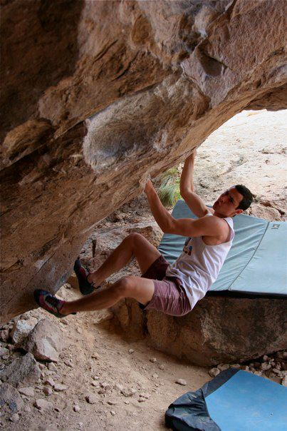

The Sunday after finals I headed for Bishop with fellow Davis climbers Alex and Fed. Due to the rest of the group's varying schedules our plan was to meet up with them slightly later in the week. After a ~~12 hour~~ quick detour through the Sierras we found ourselves in a rainy Bishop. We set up our tents and hoped that tomorrow would bring sun and dry rock.

It did, so we headed out for the Buttermilks. After a quick warm up I began working on Direction (V13) while Alex and Fed jumped on Go Granny Go. I managed to climb the sit into Thunderbird (the stand) several times.

I decided that all I needed was a rest, and that I would show the guys some more classics and then come back later in the day with good temps. I gave it one last go before heading out; which was a mistake, because I managed to split my tip on the Thunderbird crimp. I did my best to bury my frustration and sorrow. At this point we met up with our friend Damien, and so I spent the rest of the day showing the guys my favorite moderates - which they easily dispatched.

I took the next day off due to my finger and showed the guys the Happy boulders. Again they didn't disappoint and sent lots of classics. At the end of the day my finger was feeling better but I started getting sick with flu-like symptoms.

On Wednesday I felt sick but decided to climb anyways. With the help of pain killers and energy drinks I sent a few climbs including Acid Wash Right (V9) and Standing Kill Order (V11). (Below is sequence shot of the move into the undercling - photos by Alex Shimm)

The next day I felt much worse, and spent most of my time laying out on a pad in the Buttermilks. When Friday rolled around I still felt sick but worked out the moves to Kill On Sight with some Santa Cruz climbing friends. Saturday was very windy and the group's morale was fairly low. So around 2pm I headed back home with Damien and Teddy. What we thought would be an easy drive turned out to be an epic adventure through a Donner summit blizzard. I won't go in to details, but I'll leave you with a photo of us putting chains on the car before heading up the mountain.

Glad to be home

-Eden
