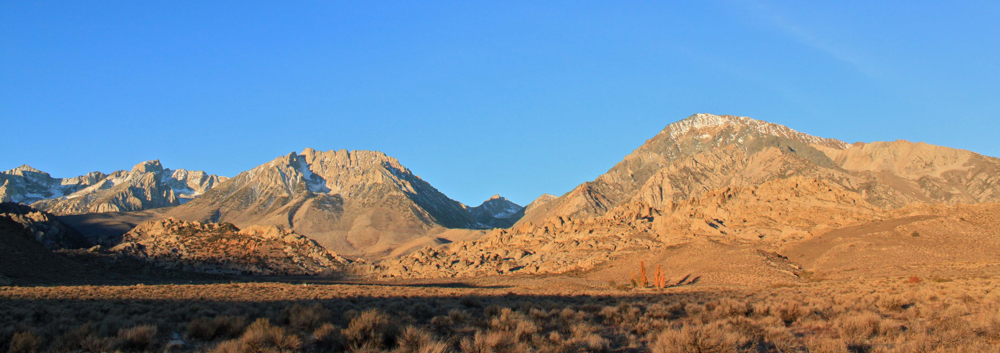

The first trip of the season had been on everyone’s mind for quite some time. The temperature was nice and school was manageable this weekend, so I took the opportunity to get out of San Luis Obispo and into the Sierras.

We drove up Friday afternoon and met up with some of Joe’s friends. The next morning we warmed up in the Buttermilks main area before making our way into the Pollen Grains.

It had been years since I climbed in the Pollen Grains, and I was excited to get on some of the beautiful lines it had to offer. First on the list was the classic highball, Suspended in Silence. With a dyno opening move and a scary finish, this climb is one of two that gets four stars in the Bishop Bouldering guidebook, (the other being The Hulk).

We had a fun session on the tricky Lydia’s Mouth, which took everyone more than a few goes to figure out. Then, after a few hopeful attempts on the stunning Specter, we moved to the equally impressive Jedi Mind Tricks.

We left the Pollen Grains and began our precarious search for The Swarm. It got dark before we could find the boulder, so we turned around. After narrowly escaping death several times trying to get back to the cars (I’m joking, mom), we decided to return to our campsite and call it a day.

Sunday was a hot and sendfull half-day at the Happy Boulders that included a pad-less flash of Grindrite Sit (V9), Dance the Night Away (V9), Redrum Sit (V10), the Tableland’s classic, The Hulk (V6) and a lap on Heavenly Path to finish it off.

It was a great start to the season. As always, I can't wait to be back.

The Swarm: 1 | Me: 0

Round 2: Thanksgiving

\- Itai
