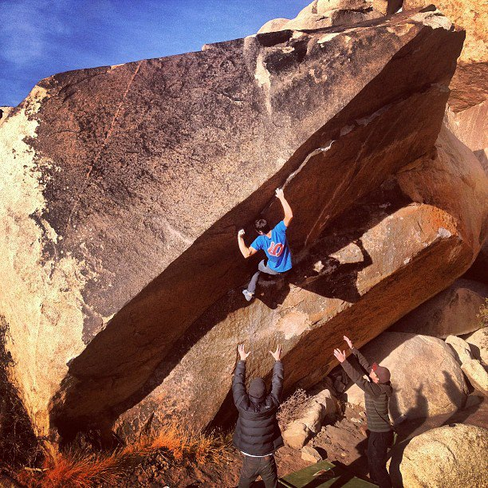

Cody, Marina, Jake and I left LA’s wet concrete for a short, but much needed, day trip to the sunny Joshua Tree. I had not been there in many years and was excited to get back on some of the classics at the Barker Dam area. We got our egos crushed by the impossible A Street Car Named Desire, sighted a rare bird(man), and climbed a really long traverse.

Hope everyone has/had a Happy Hanukah, Merry Christmas and Holy Kwanzaa!

\- Itai
